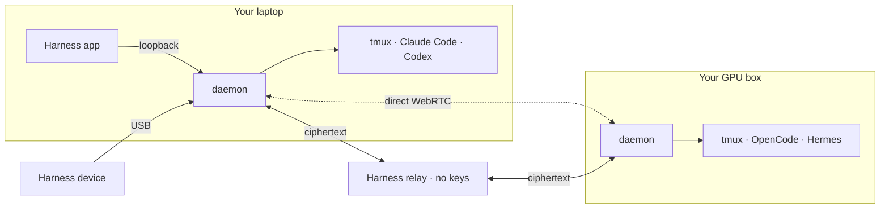

<p align="center">
  
</p>

<h1 align="center">Harness like a boss.</h1>

<p align="center">
  <b>The ultimate harness for coding agents and beyond.</b><br>
  Claude Code at work. Codex at home. Hermes in the cloud. One command center.<br>
  Start with code. Then follow your curiosity and build across disciplines: CAD, circuits, robots, games and music.
</p>

<p align="center">
  <a href="https://harness.autonomous.ai/desktop"><b>Download</b></a> ·
  <a href="#how-it-works">How it works</a> ·
  <a href="#beyond-code">Beyond code</a> ·
  <a href="#domain-specific-harnesses-dsh">Harnesses</a> ·
  <a href="#harness-device">Device</a> ·
  <a href="#this-fork-nixfredopenharness">This fork</a>
</p>

## This fork: nixfred/openharness

This is Fred Nix's fork of [autonomous-ai/openharness](https://github.com/autonomous-ai/openharness),
branch `nixfred/main`. It tracks upstream and adds features for running a fleet of agents on
Omarchy Linux across several machines. Everything upstream does still works the same way; the
additions are opt-in or quiet until something needs a person. Nothing here has been submitted
upstream. Full detail: [NIXFRED-CHANGELOG.md](NIXFRED-CHANGELOG.md),
[PLAN.md](PLAN.md), [nixfred/README.md](nixfred/README.md) (every command),
[nixfred/DESIGN.md](nixfred/DESIGN.md) (the visual system).

**Knowing what needs you**

- Every agent has a typed state (working, waiting, permission, failed, done, idle, offline) with a
  glyph and a word, served at `GET /api/attention` and pushed to the app. `harness attention
  [--kanban]` prints it.
- Desktop notification with a "Show me" action when an agent waits, needs permission or fails.
  On battery, only permission and failure interrupt.
- The desktop app draws a breathing border on a pane whose agent is waiting on you.
- **Harness Pulse**, an Omarchy bar widget: one animated ring per agent, a spend arc on its edge,
  your face inside the ring of an agent waiting on you, a collision badge, and hold-the-hexagon
  for two seconds to stop every agent.

**Your subscriptions, on one screen**

- Settings, Subscriptions in the app and `harness subs [--json]` show every AI plan on the machine
  (Claude, Codex, Grok, Kimi): the weekly percent used as an arc, the percent banked against an
  even pace (green when banked, amber or red when over), a burndown line, the reset countdown, a
  come-back timer when you are over pace, and which plan to use next. `GET /api/subscriptions`
  serves it and the attention payload carries a compact copy for the bar and the device.
- Works with no Burn Bar and no Omarchy, on Linux and macOS. A plan that is not on the machine
  says "not detected". The pace math and sources are ported from
  [Burn Bar](https://github.com/nixfred/burnbar); see [docs/nixfred-subscriptions.md](docs/nixfred-subscriptions.md).

**Brakes**

- Destructive-action gate (`harness gate`): a per-machine policy asks before `git push`, hard
  resets, `rm -rf`, `sudo`, `curl | sh`, writes under `~/.claude`, and refuses disk writes and
  secrets paths. Per-agent lanes: "the planner never pushes, the publisher asks before merging".
- Spend brake (`harness spend`): per-agent and per-day dollar and token caps that hold the pane.
- Panic stop (`harness stop-all`, or the bar).
- Loop policy: `/loop` jobs wait on battery, closed lid, busy GPU or quiet hours, and run on one
  machine at a time.

**The fleet**

- `harness adopt %N`: a tmux pane the daemon did not start becomes an agent without a restart.
- Every Hermes profile session appears, pane or not (Hermes Desktop bots, Bot Mode, gateway).
- `harness dispatch`: hand a bounded job to another linked machine and get the branch, diff and
  summary back.
- `harness clip push`: clipboard or a file to another machine, end to end encrypted.
- Machine capabilities and placement (`harness capabilities`, `harness placement`): GPU memory
  and load, power, heat, lid, toolchains.
- Drift alarm (`harness collisions`, `harness lock`): two agents on one file, folder or branch
  inside an hour, and branch locks.
- CI-failure wake: a failing check on an agent's branch is delivered into its pane once, with
  the log tail.

**Record and review**

- Append-only, secret-redacted audit journal and OpenTelemetry spans.
- Task checkpoints, review bundles, tmux recording with pinned moments and asciicast export.
- Hermes health (`harness hermes`): store writers, memory budget, profile isolation, doctor
  after updates.

**Omarchy side** ([nixfred/](nixfred/)): the bar widget, Claude Code hooks (turn breadcrumbs,
questions to iMessage), a second-opinion review tool, three domain harnesses
(Omarchy/Quickshell, Larry memory, PAI skills), a Hermes attention plugin, and an **Omarchy** palette in the app's
Settings, Appearance that follows your Omarchy theme.

**Fixes carried ahead of upstream**: the Hermes profile race after upstream #191 (a new
profile's first session could read the wrong store forever).

**Not yet**: device firmware changes (they wait on signed firmware), approval batching on the device.

### Every agent, side by side

Claude Code, Codex, Cursor, OpenCode, Devin, Amp, Copilot and seven more.

<p align="center"></p>

### Every machine, side by side

Your laptop, home server and GPU box in one window. Link each one with a password.
No SSH keys. No Tailscale. No port forwarding.

<p align="center"></p>

### Keyboard first

⌘P finds any harness on any machine. ⇧⌘I jumps to the harness waiting on you. ⌘D splits. Every key remaps.

<p align="center"></p>

### End-to-end encrypted

Code, keys and keystrokes are sealed on your machine. The relay forwards bytes it can't read.

<p align="center"></p>

### Fast and light

A native app, not Electron. Close it and your agents keep working.

Idle measurements on an M2 Max:

- **⌘N, ⌘O, ⌘T UI:** 11–13 ms median, 15–18 ms p95.
- **Local terminal echo:** 1.1 ms median, 7.2 ms p95, excluding UI rendering.
- **Desktop resources:** ~0.1% of one CPU core and 304 MiB, including terminal rendering and scrollback; agent CLIs and the daemon are excluded.

Desktop results use a Release fixture with 16 terminals and 1,000 scrollback lines each.
See the [workflow and resource benchmarks](docs/performance/2026-09-23-core-experiences.md)
and [remote P2P, TURN and relay results](docs/performance/2026-09-23-transport-routes.md)
for workloads, slow tails, connection failures and raw data.

### Built the way developers work

- **Real terminals.** Every agent runs in its own tmux pane. Scrollback, colors and keys just work.
- **Your CLIs, as they are.** Harness never wraps an agent. It reads transcripts and uses the vendor's own hooks.
- **A worktree per harness.** Start an agent on its own branch. Your working copy stays clean.
- **Remap every key.** One JSONC file, reloaded on save. Chords up to four strokes.
- **Local models.** Run open-weight models on your own machines with Grid, Ollama, MLX-LM and vLLM.
- **Bytes, not pixels.** Remote terminals stream text peer to peer. No remote desktop.
- **Open source, all of it.** App, CLI, daemon, relay and device, in this repo.

## How it works

In the workspace, a **harness** is one running session of an agent such as Codex
or Claude Code, with its own conversation and working context. A **swarm** groups
harnesses. Use **New Harness** to start one and **New Swarm** to group work.
Enable **Settings → Experimental → Swarm collaboration** to let their agents
consult peers in the same swarm; it is off by default.

The Store offers **harnesses** with instructions, tools, and optional viewers for
specific crafts. Install a harness, then start it in your workspace. See the
[terminology guide](docs/terminology.md) for the complete naming rules.

One daemon per machine runs your agents in tmux. It dials out, so no machine opens a port.



Every path is sealed end to end: ChaCha20-Poly1305, X25519 session keys, pinned Ed25519 identities.
Harness picks the best path on its own.

**Direct.** A WebRTC channel between your machines. No server in the path.

<p align="center"></p>

**Through Cloudflare.** When a firewall blocks the direct path, the same encrypted channel runs over
Cloudflare's TURN network. Harness keeps trying for a direct path.

<p align="center"></p>

**Through our relay.** A fallback while WebRTC negotiates. The relay holds no keys and forwards ciphertext.

<p align="center"></p>

The [architecture guide](docs/architecture.md) has the details.

<a id="run-it"></a>

## Get started

**[Download the app](https://harness.autonomous.ai/desktop)** for macOS or Linux.

Add a machine. Run this on it, then **Machines → Link Machine** in the app:

```bash
curl -fsSL https://harness.autonomous.ai/cli/install.sh | bash
harness login
harness remote-password set
harness start
```

**In a terminal:** the same line installs `hn` — tmux's keys and your `~/.tmux.conf`, with every
harness on every machine ([hn](tui/README.md)). The first time, `hn` signs in and connects the
computer:

```bash
curl -fsSL https://harness.autonomous.ai/cli/install.sh | bash
hn
```

<details>
<summary><b>Build from source</b></summary>

Needs Node.js 20+, tmux, Xcode and Flutter 3.47+ / Dart 3.13+:

```bash
git clone https://github.com/autonomous-ai/openharness.git
cd openharness
(cd cli && npm ci)
make install-cli
cd desktop
flutter config --enable-swift-package-manager
flutter pub get
flutter run -d macos
```

`make install-cli` installs this checkout's CLI and restarts the local daemon. See the
[development guide](docs/development.md).

</details>

<a id="beyond-code"></a>

## Beyond code: Build across disciplines

> “World-class entrepreneurs are polymaths.” — [Peter Thiel](https://www.youtube.com/watch?v=h10kXgTdhNU&t=811s)

Coding agents can build far more than software. Give one a harness and it works with the real
tools of a craft. You steer in a live viewer. Every clip below is a real session.

### Beyond code: Design

**[Blender](store/agents/blender/).** Ask for a lamp and the sliders that matter. Turn them and Blender rebuilds the geometry. Keep the versions you love.

<p align="center"></p>

### Beyond code: Circuits

**[CircuitJS](store/agents/circuitjs/).** Build a filter. Change one resistor. Overlay the new trace, measure the difference and keep both.

<p align="center"></p>

### Beyond code: Robotics

**[MuJoCo](store/agents/mujoco/).** Pin a moment in a robot's run. Shove it with 100 N. Watch two futures split.

<p align="center"></p>

### Beyond code: Games

**[Godogen](store/agents/godogen/).** Your agent makes a playable game. Miss a jump, rewind, try again. Pin the moment so the agent sees what you mean.

<p align="center"></p>

### Beyond code: Music

**[Strudel](store/agents/strudel/).** The track is code you can perform. Bring voices in and out, mark the good parts, keep the WAV. [Hear it](https://github.com/user-attachments/assets/a3d4381b-5f55-406c-9d68-330cd8792fc5).

<p align="center"></p>

### Beyond code: Chemistry

**[RDKit](store/agents/rdkit/).** Turn a bond and watch the molecule move. Follow the real energy curve. Keep the pose worth a closer look.

<p align="center"></p>

### Beyond code: Documents

**[Typst](store/agents/typst/).** Your agent writes a real PDF. Circle a detail, quote a line, leave a note. The next draft answers it.

<p align="center"></p>

### Beyond code: Data

**[Jev Sheets](store/agents/jev-sheets/).** Test a question on a few frozen rows before you ask the whole sheet. Compare two wordings side by side.

<p align="center"></p>

## Domain-specific harnesses (DSH)

Code is the common medium. Geometry scripts make parts. Netlists make boards. Animation code makes film.

A **domain-specific harness** turns a coding agent into a specialist. It brings the craft's
instructions and skills, a pinned toolchain, a project template, checks and a **live viewer**.
You chat on one side. The board, the part or the game takes shape on the other.

The agent does the reasoning. The harness supplies the tools and the view. It's a folder with a
`harness.json`, so adding a craft never touches the app.

<!-- store-catalog:start -->
### 49 harnesses in the Store

| Category | Agents and harnesses |
|---|---|
| **Coding** | [Claude Code, Codex, Cursor, OpenCode, Pi, Hermes, Command Code, Devin, Muse Code, Amp, Antigravity, GitHub Copilot, Grok Build, Kilo Code](docs/engines.md), [Harness Monitor](store/agents/harness-monitor/), [Machine Monitor](store/agents/machine-monitor/) |
| Design | [Autonomous Workshop](store/agents/autonomous-workshop/), [Blender](store/agents/blender/), [Bonsai MCP](store/agents/bonsai-mcp/), [Creative Direction](store/agents/creative-direction/), [Excalidraw](store/agents/excalidraw/), [FreeCAD](store/agents/freecad/), [Generative Art](store/agents/generative-art/), [OpenSCAD](store/agents/openscad/), [text-to-cad](store/agents/text-to-cad/) |
| Engineering | [Autonomous Circuit](store/agents/autonomous-circuit/), [CircuitJS](store/agents/circuitjs/), [Home Assistant](store/agents/home-assistant/), [KiCad](store/agents/kicad/), [Orca Slicer](store/agents/orca-slicer/), [Yosys](store/agents/yosys/) |
| Media | [Comfy MCP](store/agents/comfy-mcp/), [Manim](store/agents/manim/), [OpenMontage](store/agents/openmontage/), [Remotion](store/agents/remotion/) |
| Music | [Ableton AI](store/agents/ableton-ai/), [JUCE Agent Toolkit](store/agents/juce-agent-toolkit/), [Music Studio](store/agents/music-studio/), [Score](store/agents/score/), [Strudel](store/agents/strudel/) |
| Productivity | [Jev Sheets](store/agents/jev-sheets/), [Marp](store/agents/marp/), [Typst](store/agents/typst/) |
| Science & Data | [autoresearch-mlx](store/agents/autoresearch-mlx/), [Data Studio](store/agents/data-studio/), [Lab Bench](store/agents/lab-bench/), [marimo](store/agents/marimo/), [RDKit](store/agents/rdkit/) |
| Simulation | [DimOS](store/agents/dimos/), [Drone Pilot](store/agents/drone-pilot/), [Foam-Agent](store/agents/foam-agent/), [MuJoCo](store/agents/mujoco/), [SimSkill](store/agents/simskill/) |
| Games | [Game Master](store/agents/game-master/), [Godogen](store/agents/godogen/), [Phaser](store/agents/phaser/), [Voxel Worlds](store/agents/voxel-worlds/) |
| Research | [Jev Browser](store/agents/jev-browser/), [Roundtable](store/agents/roundtable/) |
| Local AI | [MLX-LM](store/agents/mlx-lm/), [Model Manager](store/agents/autonomous-grid/), [Ollama](store/agents/ollama/), [vLLM](store/agents/vllm/) |

Upstream open-source tools and original workflows. 10 [shared viewers](store/viewers/) install alongside
the harnesses that need them. Unlisted experiments are not shown.
<!-- store-catalog:end -->

### Build your own

The next harness is the one for your craft. Wrap a tool you love or your team's toolchain.
It can live here or in your own repo. From this repo:

```json
{
  "spec": 1,
  "id": "examples/hello-world",
  "name": "Hello World",
  "engine": "codex",
  "workspace": { "template": "template", "marker": "index.html" },
  "agent": { "instructions": "AGENTS.md" },
  "viewer": { "use": "autonomous/web-viewer" }
}
```

```bash
harness dsh install "$PWD/store/viewers/web-viewer" --link
cp -R store/examples/hello-world ../my-harness
harness dsh check ../my-harness
harness dsh install ../my-harness --link
```

Press **⌘N → Hello World** and say hello. The [authoring guide](store/README.md) covers the rest.

## Harness device

[**Get a Harness device**](https://www.autonomous.ai/harness-device), or build your own from the files below. The
[firmware guide](devices/harness-device/firmware/README.md) lists the supported boards and build
commands, and the [hardware guide](devices/harness-device/hardware/README.md) covers the design files.

<p align="center"></p>

The optional **Harness device** is a round, always-on display that sits beside
your keyboard and shows your agents at a glance: what each one is doing, which one has finished, and
which one is waiting on you. Read a question and answer it on the screen, or tap and speak a new task,
without switching windows.

It is open hardware, all the way down. This repository has everything it takes to build one:

| Layer | What's here |
|---|---|
| [Firmware](devices/harness-device/firmware/) | ESP32-S3, ESP-IDF, a 466 × 466 round AMOLED with touch, microphones and audio. Connects to the host's daemon over USB — no Wi-Fi setup, no account on the device. |
| [PCB](devices/harness-device/hardware/pcb/) | The EasyEDA Pro project, the schematic, Gerbers, the bill of materials, and pick-and-place data for assembly. |
| [Enclosure](devices/harness-device/hardware/3d/) | STEP for editing and STL for printing: the housing, an iron counterweight base, the USB clamp, and the button. |

## Contribute

Make a harness for a tool you love. Improve terminals, engines, the daemon or the relay. Port the
firmware. Start with the [contribution guide](CONTRIBUTING.md).

[Architecture](docs/architecture.md) · [Product direction (proposal)](docs/product-direction.md) ·
[Development](docs/development.md) · [Extending](docs/extending.md) · [CLI](docs/cli.md) ·
[Security](SECURITY.md) · [MIT license](LICENSE); upstream tools keep their own.
