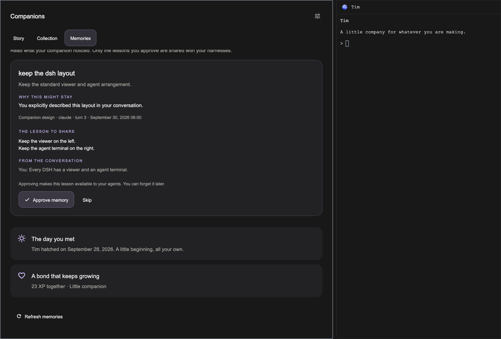
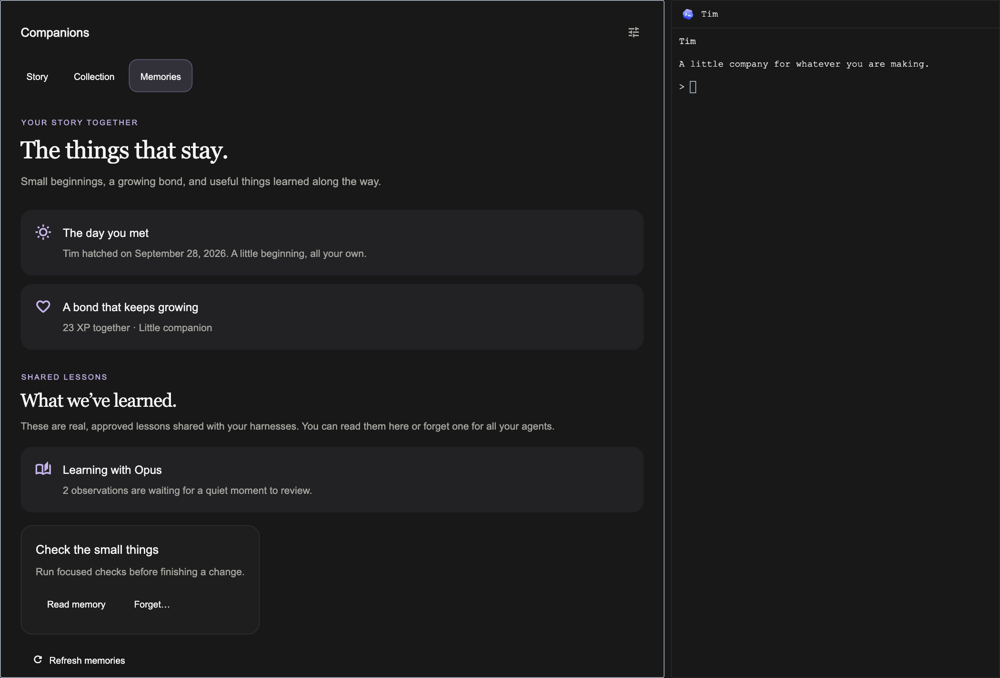

# The companion home

The owner requested a full DSH-style experience instead of an ASCII popup:
an illustrated, interactive viewer on the left and the normal agent terminal on the right.
This is the native viewer for the existing hidden `autonomous/pair` harness,
opened as one `companions` utility tab. It is not a second agent or a Store item.

The storybook treatment is a scoped exception to terminal workspace typography:
editorial serif titles, readable system-sans prose, softly tinted worlds, and
the established illustrated characters. Workspace chrome remains unchanged.
Colours follow the app palette. The shared DSH canvas owns the viewer-left,
terminal-right split, resizing, scrolling, keyboard focus and terminal zoom.
Narrow windows retain the standard canvas behaviour. Character animation respects Reduce
Motion, the motion setting, background windows, and inactive tabs.

Top-bar click and the Daemon command open the home. Talk to daemon focuses its
agent terminal. A ready first egg retains its direct hatch gesture. Settings opens
the existing guarded controls for consent, autonomy, notifications, and lesson
approval; those approval receipts and delays must not be bypassed by the viewer.

Story is authored fiction, explicitly separate from real-world history and the
individual's milestones. Growth comes from the roster's thresholds, not a
cosmetic timer. Collection cards select a viewing subject; only “Make my
companion” pairs it, through the existing zoo operation and device sync.
“Meet all ten” is a preview gallery and never unlocks or pairs anything.

The story's dial card can choose an owned companion on desktop and the addressed
device together. It uses `zoo.pair` and the existing `followCompanion` setting;
brightness and other device preferences are not overwritten. Sync status comes
from the device's acknowledgement, including the individual UID, growth stage,
seed, colour and markings. Offline, updating, and older firmware states remain
explicit. A collection preview cannot send an unowned companion to the dial.

Memories leads with a 24-hour lookback and the pending lesson inbox. Each suggestion
shows why it may be useful, its conversation sources, and an explicit Review / Approve /
Skip flow. The full lesson must have been visible while scrolling before approval arms;
large text can span several screenfuls. The existing person-only key check, one-use
capability and display delay still apply. A review never types in or remounts the terminal.
The collection's selected model does the extraction; progress, waiting and incomplete
local index coverage stay visible. Requested work survives daemon restarts and can be
stopped. Approved lessons, the actual hatch date and XP follow the inbox. Forget affects
all agents and retains the learner's revision history. Lessons remain local to this
computer; this is not cross-machine memory sync.

The header's **Powered by** menu chooses Codex or Claude Code for the collection.
A new collection asks the person to choose; there is no Claude-first default or
automatic fallback when usage runs out. Existing collections keep their agent.
The choice stays visible across Story, Collection and Memories, and moves below
the title in a narrow viewer. Selecting an uninstalled agent explains which one
is missing and keeps the current choice.

Opening the home starts or resumes the selected pair DSH through a UI-only local
socket request, without a prompt, pasted text or Enter key. The complete engine
conversation appears in the right pane. First-time login, folder trust and tool
permission prompts are visible and interactive there, like any other DSH. No
separate Pair tab or full-conversation button is needed. No trust prompt is
auto-accepted. The experiment being off, or a background restored tab, cannot
start an engine.

One selected DSH serves the owned collection. Each engine keeps its own
conversation; switching back resumes that engine's history. Saved lessons and the
pending review queue remain with the collection across engine changes. An explicit
switch clears the old provider's quota wait, but never bypasses the local hourly
review budget or restarts a cancelled review. A working turn must finish or be
stopped before switching. No synthetic prompt is sent to initialize an agent.

Switching companions keeps the same terminal, conversation, model and shared
lessons; the selected character's context updates on the next real user prompt.
Each individual retains its own name, story, appearance and growth. Existing
installations adopt the selected individual's conversation in place and preserve
the other saved conversations. Collections from different accounts remain
separate. Opening the collection after a package update preserves its live or
paused history. A companion change during startup refuses a stale result.
Disabling the experiment cancels an in-flight launch and detaches the derived
views. Closing a pane closes the companion tab; it never deletes the
conversation. Reopening reuses the same terminal session when another tab
already shows it.

The `say` tool remains available for short status-bar updates and compatible
older clients. Normal conversation answers are delivered directly by the engine
in its terminal. Chatting uses the person's model usage and grants no wider
autonomy. Consent, guarded tool permissions and shared-lesson approval remain in
force.

Keep this behind the existing Experimental companion gate. A restored tab with
the experiment off does not load the collection or start an agent.
The Focus-bar creature choice defaults to off and belongs to the signed-in
account, so enabling it on one computer also enables it on that account's other
computers. Other accounts retain their own choice. This opt-in is separate from
the server's optional account allowlist; the switch alone is not a private beta.
