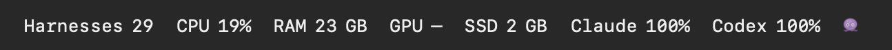
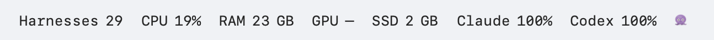
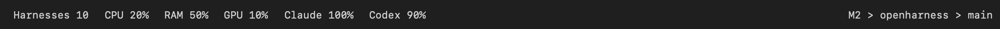
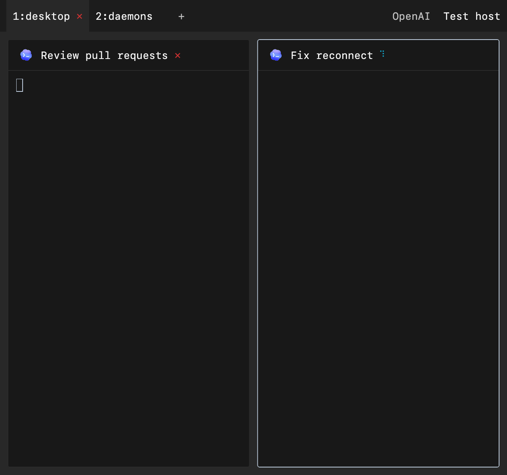
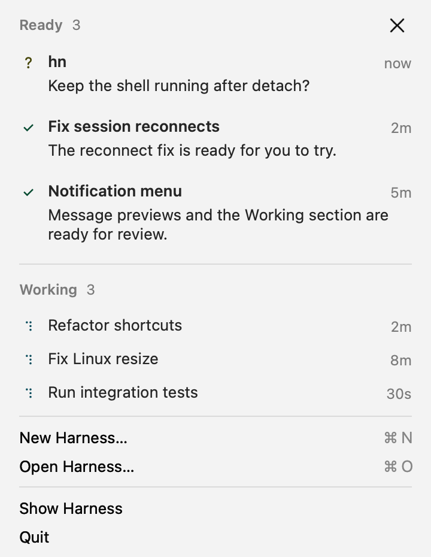
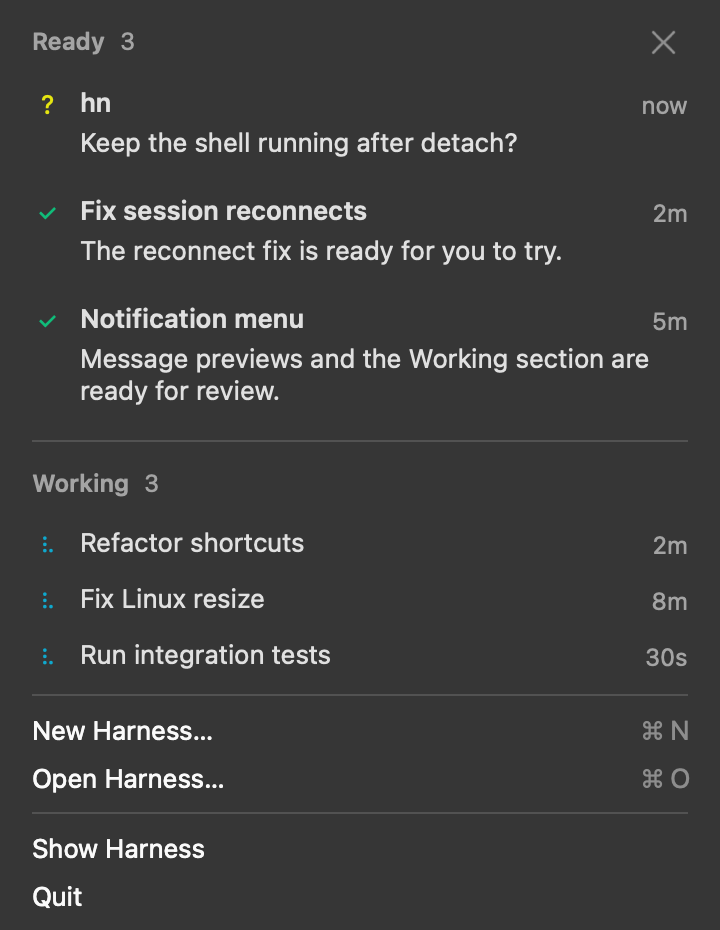
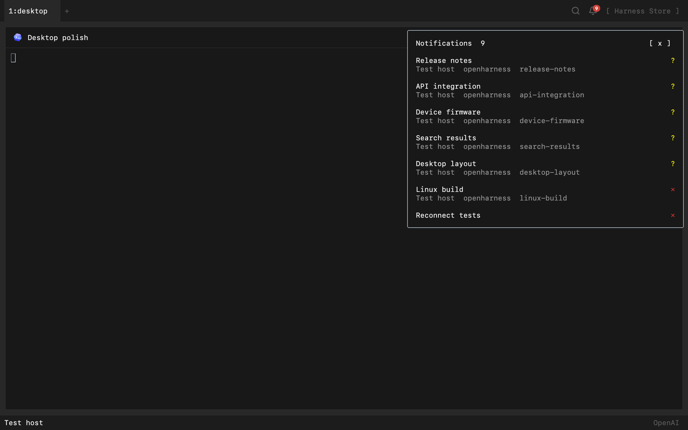
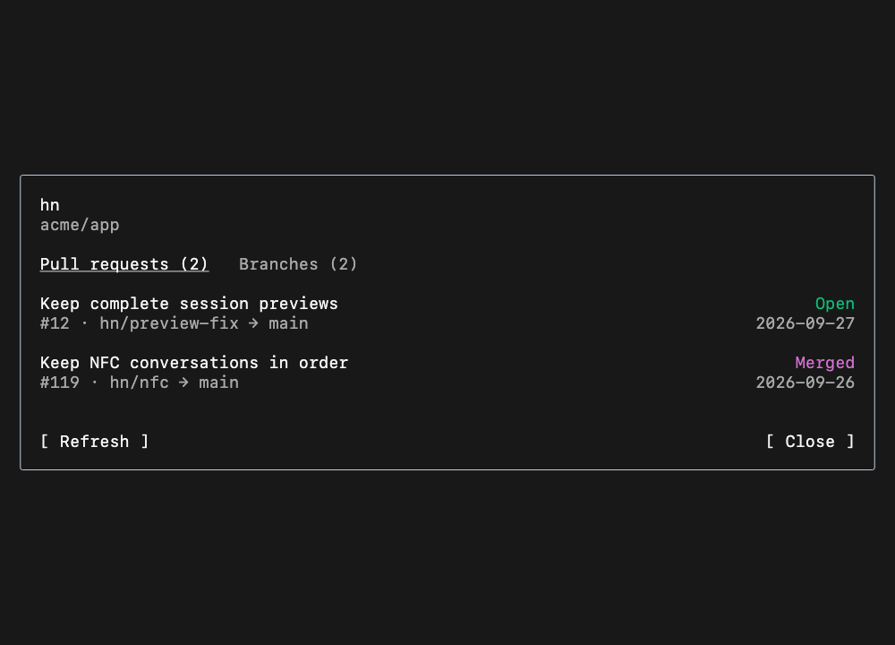
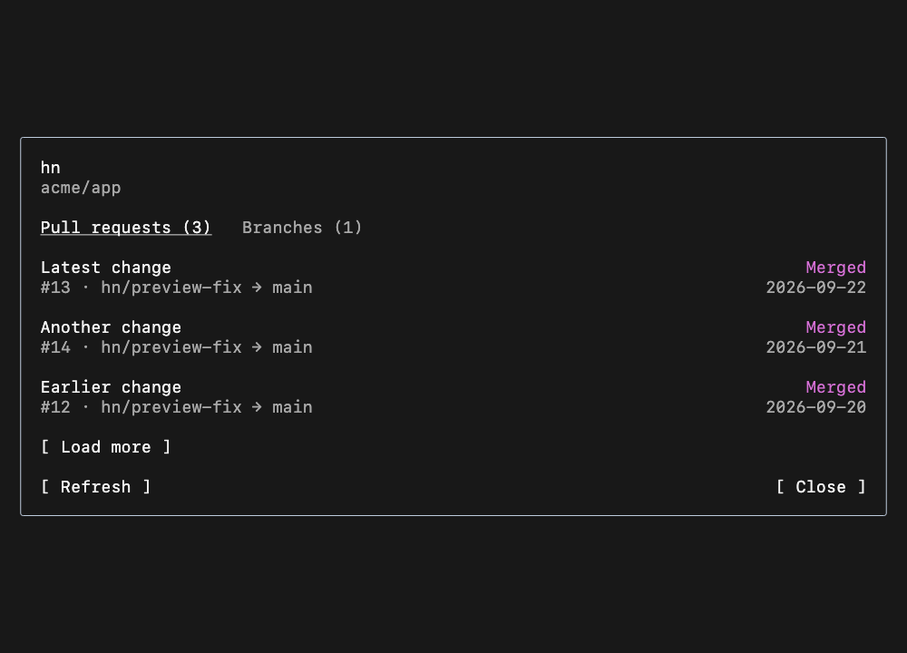
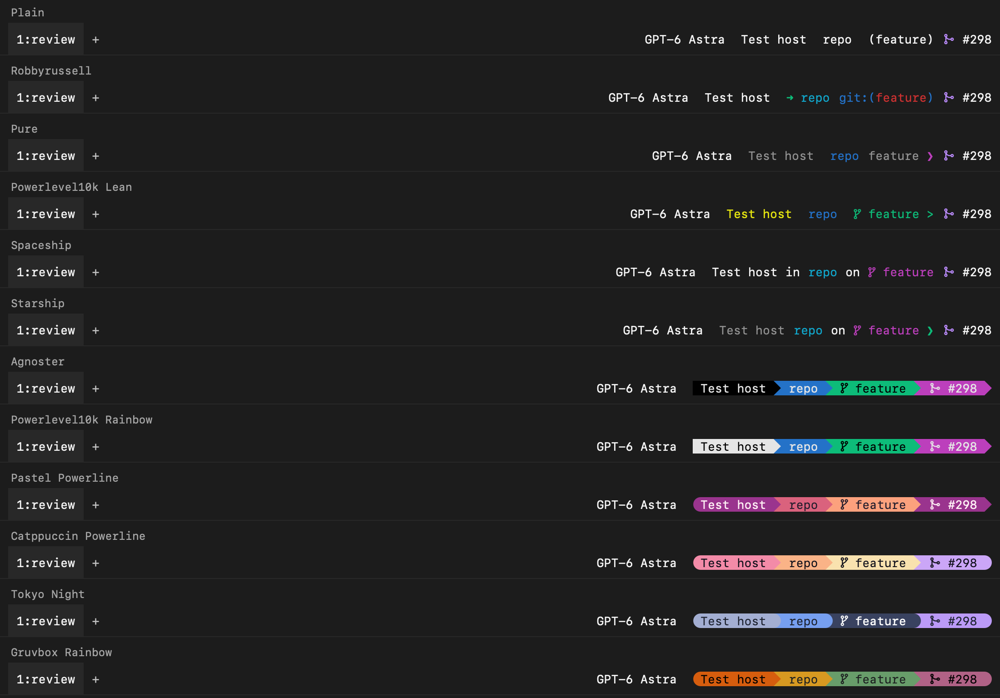

# Workspace status bar

Use the [product terminology](../../docs/terminology.md): a tab groups harnesses;
a harness is one running agent session.

A navigation row above the panes and a 37.5 pt status row below them. Tabs use
system type; status fields use the selected workspace monospace face.
Follow the [desktop design system](desktop-design-system.md) and
[terminal workspace boundaries](terminal-workspace.md). Historical captures below
illustrate data and interaction rules, not the current tab geometry.

```text
api ?    web ⠹    blender ✓  +                   Search  Bell  (✿ Harness Store)

                                 panes

Harnesses 118   CPU 20%   RAM 10 GB   GPU 10%   SSD 1 GB   Claude 100%   Codex 90%
                                                     M2 > project > branch > #439
```

The context follows the focused pane. The branch stays clickable in the
footer; pane headers do not repeat it. An empty New Tab keeps the footer when
there are live sessions to inspect.

The left side shows open harnesses (including idle and starting sessions) and their CPU, RAM, GPU and SSD consumption across connected
owned machines, followed by subscription allowance used per account. The focused-pane context
remains at the right. Count each live session even when no tab currently displays it.

Clicking Harnesses or any resource metric selects the existing Harness Monitor tab across all tabs
and machines. Create one only when absent. Clicking does not open a separate resource popover.
Saved sessions and open/resume actions belong in Open Harness (Cmd-P). The monitor itself starts
with only open sessions, sortable resource and AI metrics, an inspector and a visible × close
button on every row. Closing reviews one harness, ends its work and retains history and files.

Use spaces of 0.75 character cells within components and two cells between complete groups,
including the count. Adjacent controls contribute one cell of horizontal padding on each side;
before the fixed companion slot, omit the preceding control's trailing cell because the artwork
already has its own optical gutter. Do not add extra separation. The shared `workspaceBarValueGapCells`
and `workspaceBarGroupGapCells` keep Flutter and native views aligned. Use neutral
workspace ink at every usage level. Do not pad numbers or add dots, decimal figures or plus suffixes.

CPU is the sum of attributable process-tree interval use; 100% is one core, so multicore and fleet
totals can exceed 100%. RAM is process-tree resident memory. Nested harness roots are excluded from
the parent and shared Codex servers count once; shared memory pages may still overlap. GPU uses
process GPU time per interval on supported macOS drivers and process utilization on Linux NVIDIA.
Multiple contexts/devices can exceed 100%. First samples and unavailable counters show —;
whole-host GPU activity is not a substitute for attribution. Cloud inference is not local GPU use.

RAM and SSD use rounded whole MB/GB, such as `RAM 10 GB` and `SSD 1 GB` (10.4 rounds to 10).
SSD means allocated workspace disk space, including existing files. Shared and nested canonical
folders count once per machine. It is not free space, capacity or a claim that every host uses an
SSD. Stopping a process keeps its files. Directory sizes use bounded reads cached for one minute.

Unknown readings show —, with valid zero preserved. Partial totals show the available number without
a prefix. The tooltip explains partial coverage, scope, units and shared accounting. Samples expire
after 45 seconds. The count and resource totals cover the same connected owned sessions and never
substitute whole-machine utilization.

Sample connected owners every fifteen seconds while the app is foregrounded. Clear readings and
stop polling when hidden; refresh on return. Coalesce process samples in the owning daemon, verify
PID birth identity and keep telemetry off the terminal-input queue. The viewer samples local
inventory every four seconds and linked machines every fifteen seconds while visible. Reading
token usage uses the existing incremental ledger and does not trigger a new transcript scan.

Native and Flutter footers share data, tooltips and button behavior. At narrow widths remove SSD,
then GPU, then RAM as complete groups, keeping CPU and the full tooltip. Subscription usage remains
visible in wide windows and accessible through Models at every size. Preserve focused context.





The previous capture below documents spacing; its whole-machine percentages have been superseded:



Validation covers harness scope, shared/nested totals, unavailable/late responses, rounding, hidden
polling, tab reuse and native/Flutter clicks. Run `harness_resources_test.dart`,
`harness_monitor_test.dart` and `workspace_status_test.dart`. Set
`HARNESS_WORKSPACE_CONTROLS_CAPTURE_DIR` for Flutter fixtures and `HARNESS_RESOURCE_CAPTURE_DIR` for
native captures from `tool/check_swarm_titlebar.sh`. CLI ownership, telemetry and failure checks live
in `harnessResources.spec.ts` and `harnessTelemetry.spec.ts`.

The layout takes cues from [Stats' combined view](https://github.com/exelban/stats/blob/master/Stats/Views/CombinedView.swift)
and [Mini widget](https://github.com/exelban/stats/blob/master/Kit/Widgets/Mini.swift): compact modules
and whole figures. Metric definitions and process-monitor references are documented in the
[Harness Monitor README](../../store/agents/harness-monitor/README.md).

The optional Experimental creature sits after Store in a fixed 44pt slot.
Tim and eggs use bundled bitmap art; hovering opens a full-size preview without
changing focus. The slot reserves no space when disabled. See [daemons](daemons.md).

Each tab shows a compact name without a permanent number prefix. A user-entered name always wins:
once renamed, keep it across pane changes, closing/reopening, and saved layout
restores. Use automatic naming only when `nameIsCustom` is false. Custom-named
tabs do not vote in the automatic-name comparison. Count independent
harness panes once per agent; dependent viewers do not vote. Consider harness
type (`code`, `blender`, etc.), project name, and machine name. Choose the most
widely shared trait in that tab. Among equally shared traits, prefer the name
least repeated in other tabs; otherwise prefer type, then project, then machine.
Ties within one trait use pane order. Focus does not affect the name.

This keeps `blender` useful beside coding tabs, uses project names when all work
is code, and uses machine names for the same project on different computers.
Tabs with identical contents can still share a name; their positions distinguish
them, and holding Command reveals their actual shortcut hints. Preserve the full name for inspection when its visible label is truncated.

Center each name and its adjacent status as one group in compact, content-sized
tabs, capped at 240 points. An idle name centers on its own. Use the
shared 10-point upper corners, 8-point outward lower shoulders and 6-point top
inset. Keep space after `+` available for dragging the window. Scroll overflow
and reveal the selected tab on keyboard navigation. Narrow viewports can show
smaller tabs while preserving their controls.
The right accessory reveals × on hover. While Command is held, the actual
shortcut replaces the status beside the name without changing the tab width.
Hover never moves the title. Cmd-W, remapped shortcuts, native menu access,
and middle-click closing remain available.
Preserve reorder, rename, keyboard focus, and terminal sessions. Cmd-T opens a
tab. Cmd-O opens the shared picker with `#` for projects; Cmd-P opens it directly
on harnesses. Cmd-Shift-P opens commands (`>`). The projects list has
no New Project/Open Folder row. Projects with an open pane in any tab come first;
each group is alphabetical. Pane focus and navigation history do not change that
order. Cmd-Q retains its native Quit action.

Status fields, PRs, model labels and pane close actions share
`WorkspaceBarControl`: 28-point minimum click height, a hand cursor and emphasis
on hover, press and keyboard focus. Preserve selected status colors, backgrounds
and joins; reserve both text weights so labels never shift. Tabs use
`DesktopWorkspaceTab` and matching AppKit metrics, with a selected shape joining
the workspace. See the design system for their system type and surface colors.


Do not show a tooltip that repeats a visible tab name. Show a different underlying
name or the full label when it is truncated. Keep action hints on symbols and
status links.

The new-tab action uses the shared plus icon, with no resting box. Hover and
keyboard focus increase its emphasis without changing the glyph or its bounds.
Keep its New Tab tooltip and shortcut hint.

### Harness activity

Use hn's activity states in two existing places: after the tab name
(`web ⠹`), and after the title in a pane header (`[engine] Session name ⠹`).
Idle has no visible mark. Viewer headers show their owner's state. Shells, unknown agents, and
utility tabs have no harness activity mark. Keep the existing engine icon.
The mark replaces the native tab's old orange attention indicator; it adds no
new bar, counter, badge, or permanent legend. Hover and accessibility descriptions
explain each symbol.



| Mark | Meaning | Terminal color |
| --- | --- | --- |
| `?` | Needs your input | Yellow |
| `✗` | Last turn or launch failed | Red |
| `✓` | Finished and unread | Green |
| `⠋ ⠙ ⠹ ⠸ ⠼ ⠴ ⠦ ⠧ ⠇ ⠏` | Working, one frame per 100 ms | Cyan |
| `◌` | Starting | Yellow |
| None | Idle | — |
| `\|\|` | Paused | Muted foreground |
| `⊘` | Offline | Muted foreground |

A tab shows its most urgent member in the order above, counting a harness and
its viewers once. For an individual harness, offline/paused/launch state takes
precedence; a current question takes precedence over working. A new turn masks
old results. Seeing a completion clears its unread check, but viewing a failed
turn does not clear the failure. A pane hidden by zoom or an inactive/utility
tab is not seen. Existing unread storage remains an in-memory, bounded list;
these marks are not a durable event history.

Reserve one measured cell for the mark and one for the gap, including when idle
is blank, so state changes never move the names or adjacent tabs. Paused uses
two ASCII pipes at 65% font size with quarter-cell negative letter spacing:
short, thin strokes centered in the same cell. Keep native and Flutter metrics
in sync. The question mark stays plain yellow. Animate only the
mark, never the label, width, terminal, or method-channel payload. Long tabs
shorten their names and scroll; preserve room for the accessory and mark. SF Mono
does not contain Braille, so Flutter explicitly falls back to the platform's
symbol font inside that fixed cell. Native text uses CoreText fallback.

Flutter shares one clock; AppKit has one local clock. Both derive the same frame
from Unix time. No visible working mark means no timer. Hidden panes and
offscreen tabs do not animate; background/inactive apps and Reduce Motion stop
the clock. Reduce Motion keeps the first Braille frame with its Working label.
Colors follow the terminal palette and the Color preference.

State rules live in `lib/state/harness_activity.dart`, with the Flutter mark in
`lib/widgets/harness_activity_mark.dart`. `harness_activity_test.dart`,
`workspace_activity_test.dart`, and the native titlebar checks cover state,
acknowledgement, fixed geometry, visibility, and animation. Set
`HARNESS_ACTIVITY_CAPTURE_DIR` when running the workspace activity test to
capture synthetic Flutter screenshots and the native tab payload.

Tab names use the **13-point system face**. Status text, pane titles and model
selectors use **13 pt SF Mono, regular weight at rest** on macOS. Linux uses its platform monospace stack at the same
size. Use `workspaceBarTextStyle()` and `workspaceBarCellSizeOf(context)` from
`lib/shared/theme/workspace_bar_style.dart`; the native bar receives that same
font through `barStyle`. Keep this size independent of terminal zoom and avoid
an additional UI text-scale factor. Selection uses background color, not bold.
Terminal content keeps the user's selected terminal font and size. Desktop dialogs
use the shared system-type scale.


## Pane controls

Terminal pane headers end with agent, model and × at the right edge at every
width. Splitting lives at the pane edges; zoom remains available through menus
and shortcuts. Agent and model
share plain 13-point workspace text with no pill or chevron, and an 8-point gap
separates these selectors from close. The title truncates before the
model; the agent retains readable identity. Remove repeated coding-agent logos
on the left while retaining distinct domain-harness icons.
The 12-point close glyph has a 28-point target, with no resting fill or border.
Tab and pane close marks share a small regular glyph (12-point
Lucide, optically matched 10-point SF Symbol) and quiet 45% resting ink, with
full ink on hover/focus and the existing larger click
targets. The close control removes that pane view while keeping its harness
running. Its tooltip names Close Pane and the current shortcut. Long model names
truncate without moving or covering the close target. Clicking the model focuses
that pane and opens the same unified Models picker as Cmd-:, preserving the
existing target and availability guards.

The footer shows subscription allowance **used**, alongside harness resource totals.
Read the same deduplicated account rows as Models: each percentage uses the
limiting window and expires under the same rules. Compute used = 100 − remaining
and round to a whole percentage. Different accounts remain distinct. Unknown
usage shows `-`; exhausted allowance shows `100%`. Names and percentages use
the same neutral ink. Hover explains usage, account identity and reset windows;
click opens Subscriptions. Do not invent account or usage readings.

For the model label, prefer
its local model ID or the daemon's observed subscription model (`selectedModel`),
such as `GPT-6 Astra`, `Fable`, or `Opus`. Keep versions when reported; never infer
a version from a family alias. Older daemons fall back to the provider name.
Show only the model name in the header. The terminal presents its effort setting;
never infer effort or append subscription effort to a local model name.
Keep this label visible without requiring hover, including while disconnected;
disable switching when the pane is read-only. Agent and model use a hand cursor,
brighter regular-weight text on hover and keyboard focus, and matching targets
that never move. The model tooltip explains subscription/local switching.
Do not repeat the model name in that tooltip unless it is truncated or replaced
by `Switching…`. Preserve useful capability details and full truncated names
while offline, but do not advertise switching when it is disabled.
A model update must repaint the label without reopening or retargeting the pane.
The observed subscription model does not select a Local row in the picker.

Zoom and Stop remain keyboard/menu actions. Cmd-Shift-W closes the focused pane
view, Cmd-W closes the tab, and Cmd-Enter toggles pane zoom. Closing a view
keeps its harness running; Stop Harness remains a separate command with its
existing confirmation. Preserve explicit user keymap overrides.

Hovering the right or bottom edge reveals its split-right or split-down icon
inside the pane. Use one 32-point target centered on that edge, inset 8 points,
with the shared 16-point pane icon; do not use a plus. Hover leaves focus and
terminal state untouched. Hide these controls while dragging or zoomed and
leave the resize gaps clear. Split Right and Split Down also use keyboard
commands (Cmd-R and Cmd-D by default), File menu and command search. All open
New Harness directly with the source pane's defaults, without an existing-harness
search step.

Settings → Experimental → Share button is off by default on desktop and web.
The choice persists locally and updates the bar immediately; when off, no button
or space is reserved. [Settings reference](images/share-experimental.png).
When enabled, Share sits in the bottom bar before focused context, with a
flat accent fill, white text, and the same fixed font and control height as the
other bar actions. Reserve its width before allocating context. Web keeps
Download app as a secondary text action in the same footer.
Clicking Share or pressing Cmd-Shift-S (Alt-Shift-S on web) opens the existing
public/private link dialog for the focused agent. The tooltip and accessibility
label name that agent; the shortcut hint follows remaps. A dependent viewer
shares its owner. Empty tabs and view-only shared agents keep a disabled button.
Opening Share alone does not create a link or change access. Native macOS and
Flutter use the same command, labels, resolved colors, and availability.


Restart Harness and Share Harness also belong in File. Fork remains available in
command search. Viewer and message-composer toggles belong in View and command
search. These actions apply to the focused pane; sharing and viewer visibility
follow a dependent viewer's owner.

## Notifications

On macOS, the Harness menu bar uses the team's portrait symbol,
stored as vector paths and rendered as a monochrome template. A small circular
count badge sits at the bottom-right corner when notifications are unread.
At zero, only the portrait icon is shown, with no number or badge circle. The badge
sits slightly outside the mark so both remain legible. The combined template
adapts to the menu bar's light, dark, and selected appearances. It keeps a fixed size, showing `99+`
above 99 with the exact count in its tooltip and accessibility
value. The native menu has one Notifications section, with questions first,
then failures and completed results, newest first within each kind. Each row
shows a semibold harness name, up to two lines of the actual question or notified
recap, and a quiet timestamp. Status uses the same `?`, `✗`, `✓` activity marks
and theme colors as tabs and panes, without a second status caption or unread
dot. Its age is when this app received the notification.
The recap stays bound to that unread receipt; later transcript text cannot
replace it. Show at most five notifications and a View all route to the full
inbox. A session in multiple tabs appears once, preferring the active tab,
then the first containing it. Machine profiles do not hide notifications.
Tab, machine, project and full status descriptions remain in tooltips and
accessibility text. Unavailable
rows remain visible and disabled. An empty inbox says “No unread notifications.”

Working starts expanded and disappears when empty. It shows active, known sessions that
are not already in Notifications, with elapsed time only when the app observed
their turn start. Exclude idle shells, paused/offline sessions, and waiting
questions. Show five compact name/elapsed rows, with additional sessions in a
submenu. Reuse the tab's native activity renderer and 100ms Braille clock;
the menu clock stops when closed or collapsed, and with Reduce Motion.
Working never adds to the badge. Both sections keep their snapshot while open;
opening the disclosure must not insert new notifications under the pointer.
Keyboard Left/Right and Return/Space toggle the disclosure. Rows use native
selection, type-select, accessibility, and existing navigation receipts.

Mark all read is the close icon beside the Notifications heading, with a
32-point target, explicit tooltip and accessibility label. New Harness and Open
Harness use the existing creation/session pickers and effective shortcut hints.
Show Harness and Quit finish the menu; Settings stays in the application menu.
Show Harness stays available while workspace actions are disabled. The window's
titlebar has Search and Store without a duplicate bell. GitHub merge tracking
is deferred; this first version does not invent merge events from focused PR state.





Mark all read acknowledges only the notifications in the opening snapshot. Newer
results and replacement questions stay unread. Opening a conversation restores
its existing pane in the displayed tab before bringing the window forward. If
that view moved or closed, navigation resolves the session's current location.
Reading a question clears its notification, while the question itself remains
pending until answered.
The menu uses AppKit's standard keyboard navigation and accessibility.

On Linux and the web, a small bell sits in the top row between the search icon
and the Harness Store button. Reserve four bar cells in Flutter; counts
never move the other controls. Put the count at the bell's upper-right corner,
hide it at zero, show `99+` above 99, and keep the exact count in accessibility text.
The bell has no background or button well, including on hover and keyboard
focus; emphasize the glyph itself.

Clicking the bell opens a flat, terminal-themed list below the right edge of the
toolbar. The first line is the session name with a status glyph on the right:
yellow `?` for needs input, red `✗` for failed, or green `✓` for finished.
The second line shows `machine  repo  branch`, aligned with the name, using the
same project and branch context as the workspace. Omit missing fields.
Keep full status descriptions in tooltips and accessibility text.
The list starts newest first, keeps rows still while open, and appends arrivals. Up/Down selects,
Enter opens, and Escape or an outside click closes. There is no automatic tour
or advance to another session.

Opening the list does not acknowledge anything. Opening a result reuses its
existing pane when possible and acknowledges it after successful navigation.
Questions remain until answered. Unavailable sessions keep their place with an
`⊘` glyph and the reason in its tooltip and accessibility text; starting or
failed launches use their existing `◌` or `✗` marks.
The existing Needs input shortcut stays available.

This reuses the in-memory unread marks, one per harness, and live questions from
known harnesses. It is not a durable event history. Desktop retains up to 256
unread harnesses; the dial still receives its newest eight.

Notification eligibility belongs to the daemon's shared `AgentNotifications`
policy, fed by `CommanderMirror` and `QuestionWatcher`. Desktop consumes the
notification attached to `turn_summary`; raw turn endings, errors, tools and
commentary do not create inbox entries. The same decision controls whether the
device's recap rings or updates silently. Questions stay until the matching
request is answered. Replays, cancelled turns, subagents, empty results and
duplicate completions stay silent. Without a device, the daemon derives the
result locally and does not start a paid summary call. Existing device live
cards and streaming are unchanged. Completion alerts require the updated daemon;
older daemons still supply questions but lack the verified completion marker.



## Focused context in the bottom bar

Center the 28 pt controls within the full space from the pane's bottom edge to
the window bottom. The former 9.5 pt pane gutter is part of the status row,
rather than extra padding only above it. Native and Flutter reserve 37.5 pt and
keep the same pane height, with equal space above and below the footer content.

Show `machine  project`, then `(branch)` and PR when known at the right. Put the
harness count, local resources and subscription usage at the left. The status row has one-cell outer gutters and no background fill or divider;
its controls sit directly on the workspace surface. The right side follows the
focused pane; usage at the left covers all subscriptions independently of focus.
Each context field preserves its existing action.
The optional companion and Share control sit between these groups. At narrow widths,
truncate labels inside their allocated space rather than overlap controls.
The model control in each pane header keeps its click target when themes change.
A focus change invalidates its selection target; stale callbacks and delayed
model selections cannot retarget a different harness.
Use the shared `AgentProject.label` rule: at a Git root, prefer the remote repo's
name, falling back to the local repo name; in a repo subfolder, use that folder's
name; outside Git, use the ordinary folder name. A worktree follows exactly the
same rule. Its generated path and `[worktree]` marker do not belong in the bar.
Keep the full actual path in the tooltip and accessibility detail.

A focused viewer shows its owning harness's context. Show only named branches;
omit detached commit hashes and absent project or Git metadata. Clear it for an
empty tab.


Each field is independently clickable, with the same bold hover/keyboard-focus
text and hand cursor as the status symbols. Machine opens the shared picker scoped by machine
identity; project opens its harnesses across matching remote checkouts; branch
opens the focused session's branches and PRs when the daemon supplies `gitContext`.
When recent successful work identifies one Git branch, show its name followed
by the count of other checked-out branches, for example `ship-hn +3`. The
tooltip explains that this is recent confirmed work and gives its observation
time. Git remains the source of branch names for every engine. When several
branches have equal recent evidence, show the count instead of selecting one.

Details use two plain tabs: **Pull requests** and **Branches**. The heading is
the harness name and shared repository; do not append “Work” or “Recent work.”
Pull requests is the default, with one row per PR regardless of branch reuse.
Put the title on the left and the state on the right. Below it, show the PR number,
head/base branches and GitHub date. Use terminal green for Open, magenta for
Merged, red for Closed and muted text for Draft/Unknown. State text remains
readable without relying on color. Keep selection to the title line.

Open/draft PRs come first; merged and closed PRs stay visible in the same list.
Order them by actual GitHub update/merge/close time, never lookup time. The
Branches tab contains the branch inventory, with checked-out branches labeled.
Both lists retain their scroll positions. Left/Right on the tab controls switches
views. Narrow windows use the shorter “PRs” tab label and wrap the tabs without
shrinking text. Size the dialog to its contents with bounded scrolling. Escape
returns focus to the terminal.
Older daemons keep exact-branch project search, with Escape returning through its
scopes. Names never establish identity. Branch navigation does not check out or
create a branch. Unknown/multiple/unavailable work uses plain muted context text,
without a Git branch symbol when no single branch is displayed; the same action
remains inspectable.






Render these fixtures with `HARNESS_GIT_CONTEXT_CAPTURE_DIR=/tmp/work-dialog
flutter test test/session_work_dialog_test.dart`. Local macOS captures load the
system SF Mono face at 18 pt; the dialog itself follows the selected terminal
font, size and palette. The same suite checks narrow windows, enlarged text,
alternate palettes, and retained keyboard focus when appearance changes.

Customize Harness → Status offers twelve saved themes, grouped into Minimal
and Powerline, with a preview of the same sample pane beneath each choice.
Selection covers only the name row. Tab and Shift-Tab move between choices;
Enter or Space selects, scrolls the choice into view, and saves it. The selected
theme also previews PR status. The individual examples inherit the terminal font
and cell size; the combined bar preview uses the actual fixed 13 pt workspace
font. Controls keep the plain terminal design.

| Theme | Treatment |
| --- | --- |
| Plain (default) | Monochrome `machine  project  (branch)` with a colored PR state icon |
| Robbyrussell | Green arrow, cyan project, blue `git:(` with red branch |
| Pure | Blue project, muted machine/branch, magenta prompt mark |
| Powerlevel10k Lean | Unboxed yellow machine, blue project, green branch symbol and ASCII `>` |
| Spaceship | Cyan project and magenta branch symbol, with `in` / `on` separators |
| Starship | Muted machine, cyan project, `on` and a magenta branch symbol, green prompt mark |
| Agnoster | Joined black context, blue project, and green branch segments |
| Powerlevel10k Rainbow | Light context, blue project, green branch, angular joins |
| Pastel Powerline | Plum, rose, and peach segments, rounded leading cap and angular joins |
| Catppuccin Powerline | Mocha red, peach, and yellow segments, rounded outside caps |
| Tokyo Night | Cool gray, blue, and indigo segments, rounded joins and outside caps |
| Gruvbox Rainbow | Warm orange, gold, and moss segments, rounded outside caps |



These are one-line visual adaptations, not installed shell themes or a ranking.
The catalog covers established Oh My Zsh themes plus Pure, Spaceship,
Powerlevel10k, and Starship's official presets. Starship is a separate prompt
engine that works with Zsh. Its named color presets are useful here because
they offer distinct palettes beyond changes to separators and spacing.

Powerline separators and branch symbols are drawn one-cell shapes and do not
require patched fonts. The branch symbol appears only with a real named branch;
it does not alter the branch's accessible name, tooltip, search, or click target.
At tight widths, segmented fields drop the decorative symbol and can fall back
to plain text. Prompt
marks and segment colors never invent dirty, ahead/behind, privilege, runtime,
clock, or exit-status readings. Plain retains familiar parenthesized branch
notation; Zsh's actual stock prompt is `%m%# ` (host and prompt character).

Minimal themes, Agnoster, and Powerlevel10k Rainbow use the terminal ANSI ramp.
Pastel Powerline, Catppuccin Powerline, Tokyo Night, and Gruvbox Rainbow carry
status-only palettes adapted from the linked Starship presets below. They do
not recolor terminal output or change the workspace palette. Keep these tokens
in the shared formatter, never duplicated in native code. Choose a readable
ink from the named palette (or black/white where necessary) so small text on
these filled segments has at least 4.5:1 contrast. Preserve the terminal font,
the existing bold-only hover cue, and stable field widths.

The rightmost PR link belongs to the focused harness, including when its viewer
has focus. Display the original GitHub Octicon and `#298`: green pull request
for Open, purple merge for Merged, red closed pull request for Closed, and gray
draft pull request for Draft. Use the shared SVG assets in `assets/octicons`,
with light/dark state colors resolved in Dart for both Flutter and AppKit.
In Plain and shell layouts, the number stays in ordinary foreground, with one
cell before the compact link. In Powerline layouts, the PR continues the branch
ribbon without a gap: its state color fills the final block, and the icon and
number use contrasting ink. Keep the outer cap and internal joins consistent
with the selected preset. The full state and link action remain available on
hover and through accessibility. The selected-theme preview shows the same control.
Color off makes both context and PR monochrome; the four shapes remain distinct.
Existing `standard`
settings resolve to Plain; existing `powerlevel10k` settings resolve to Lean.

Tabs take the available space after a compact context budget, instead of being
limited to 45% of the bar. Context reserves its measured width up to 40% of the
remaining space or 52 cells; unused tab space returns to context. With the
companion enabled, keep room for its message line. Shorten long branch names
in the middle before squeezing machine/project, retaining the full name in
the tooltip and navigation action. Tab labels measure the name, status gap,
and status cell separately so short names never acquire a false ellipsis.

References: [Oh My Zsh themes](https://github.com/ohmyzsh/ohmyzsh/wiki/Themes),
[Pure](https://github.com/sindresorhus/pure),
[Powerlevel10k Lean](https://github.com/romkatv/powerlevel10k/blob/master/config/p10k-lean-8colors.zsh),
[Powerlevel10k Rainbow](https://github.com/romkatv/powerlevel10k/blob/master/config/p10k-rainbow.zsh),
[Spaceship](https://github.com/spaceship-prompt/spaceship-prompt),
[Starship](https://starship.rs/),
[Pastel Powerline](https://starship.rs/presets/pastel-powerline),
[Catppuccin Powerline](https://starship.rs/presets/catppuccin-powerline),
[Tokyo Night](https://starship.rs/presets/tokyo-night), and
[Gruvbox Rainbow](https://starship.rs/presets/gruvbox-rainbow).
These are compact adaptations; machine/project/branch/PR remain real Harness data.

Read PR status through the owning machine's existing `git_pull_request` RPC.
Refresh once per minute while focused, reuse recent results across focus
switches, and discard stale replies after a pane, branch, or project change.
Unknown, absent, or inaccessible PRs have no label. Never display a previous
pane's PR while waiting for the newly focused one. Compact pane headers do not
also poll or display PR status.

References: [Zsh prompt parameters](https://zsh.sourceforge.io/Doc/Release/Parameters.html),
[Oh My Zsh themes](https://github.com/ohmyzsh/ohmyzsh/wiki/Themes),
[Robbyrussell source](https://github.com/ohmyzsh/ohmyzsh/blob/master/themes/robbyrussell.zsh-theme),
[Pure](https://github.com/sindresorhus/pure),
[Agnoster](https://github.com/agnoster/agnoster-zsh-theme), and
[Powerlevel10k](https://github.com/romkatv/powerlevel10k).

Pane headers keep task identity, model selection and an always-visible close action. The top bar
contains tabs, New Tab, a plain search icon, and the Harness Store button. Linux
and browser bars also retain the notification bell. Leave an 8-point control gap
before Store; macOS notifications live in the system menu bar.
Search opens the existing unified picker; Store opens the existing Store tab.
The Store restores its earlier rounded pill, colorful polymath mark, and quiet
tinted fill. Its label is `Harness Store`, without brackets. Keep the full name
in accessibility and truncate the visible text at narrow widths.
Both retain their keyboard commands and resolved shortcut hints. Context links
in the bottom row open the corresponding scope in the unified picker.

The picker's empty preview contains clickable `@ machines`, `# projects`,
`: models`, `* store`, and `> commands` hints. Each inserts its editable prefix
and returns typing focus to the search input. Machine and model management,
including API forms, stays inside the right pane. Store results open their
Store page. Cmd-O, Cmd-M, Cmd-I, and Cmd-Shift-P remain shortcuts into the same
picker; focused context links keep their scope.

Leave a window drag area between tabs and the top actions and prevent overlap in
narrow windows. Native menus and commands remain available.

Only while daemons are on (the account's `GET /api/zoo` answered 200, or a
person enabled Settings → Experimental → Focus-bar creature), the daemon sits
at the left of the footer before the optional Share control. Off, or before that is known, nothing is
reserved for it and the bar is exactly the one described above; when it turns
on, the slot waits for a quiet moment (no button held, the pointer off the
footer) so controls never move under a click. On:
the paired daemon's sprite, or the nest while the first egg incubates
(`\_(  )_/` `\_(/\)_/` `\_(*')_/` `\_(oo)_/`). Its one-cell inner gutters provide separation from neighboring controls. Use the same 13 pt workspace font as
the status line with ligatures off, and reserve eight character cells plus
one-cell gutters, the sprite centred on its version's base sprite, so moods,
work frames and a nap's `z` never move nearby text. It draws in the status
line's own text colour, never its daemon colour (those fail contrast on a
status bar). A shiny daemon's `*` sits in the left gutter. Show only the egg
or creature in this fixed slot: no completed-turn count, egg count, or label
beside it. Additional eggs, progress, and activity details belong in the panel.
The slot keeps the same width while work finishes, eggs arrive, and the pointer
enters or leaves, so neither the creature nor its neighbors move.
Its name and progress belong in the tooltip and panel, never beside the
sprite. Clicking a ready egg hatches it; otherwise a click boops the daemon and
opens its panel. When something needs you or failed, its one line replaces the
right context and PR in the terminal's yellow for 5.2 s, like tmux's message
line. The model stays available; a reply to a click is dim. Mood and frame updates repaint only the slot.
The contract is [daemons/README.md](../../daemons/README.md); the desktop's
choices are in [Daemons on the desktop](daemons.md).

Data rules live in `lib/state/workspace_status.dart`; prompt formatting lives in
`lib/shared/theme/status_line_style.dart`. Flutter draws both rows in `SwarmScreen`. On macOS, `SwarmTabStrip` keeps native
tabs/actions in the titlebar and its native footer attaches to the content
bottom; Flutter reserves matching footer height. See
`macos/Runner/SwarmTitlebar.swift`.
Both use the same names, formatted context, resolved text/color segments, and
preferences. `WorkspacePullRequest` owns focused PR state; the native and Flutter
bars receive the same validated label and URL. Checks live in
`workspace_status_test.dart`, `workspace_pull_request_test.dart`,
`status_line_test.dart`, and `tool/swarm_titlebar_checks.swift`.

To regenerate the synthetic native catalog image, set
`HARNESS_NATIVE_STATUS_CAPTURE_DIR` to a temporary directory when running
`flutter test test/workspace_status_test.dart`. With the same variable, run
`bash tool/check_swarm_titlebar.sh /path/to/flutter --status-preview`;
`native-themes.png` is drawn by the production AppKit controls from the real
Dart payloads. No live window, account data, or saved appearance is used.
