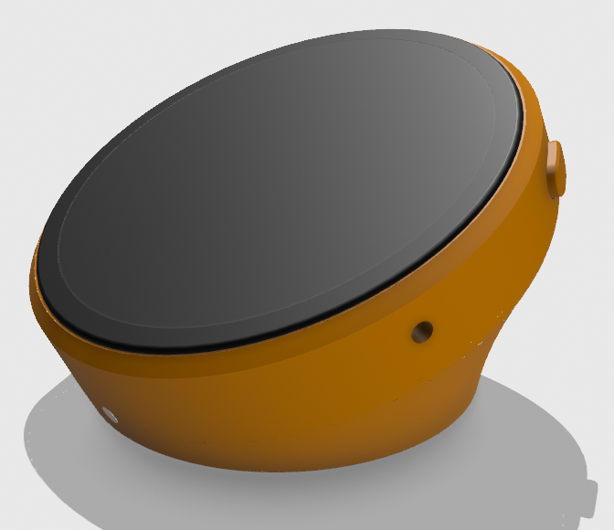
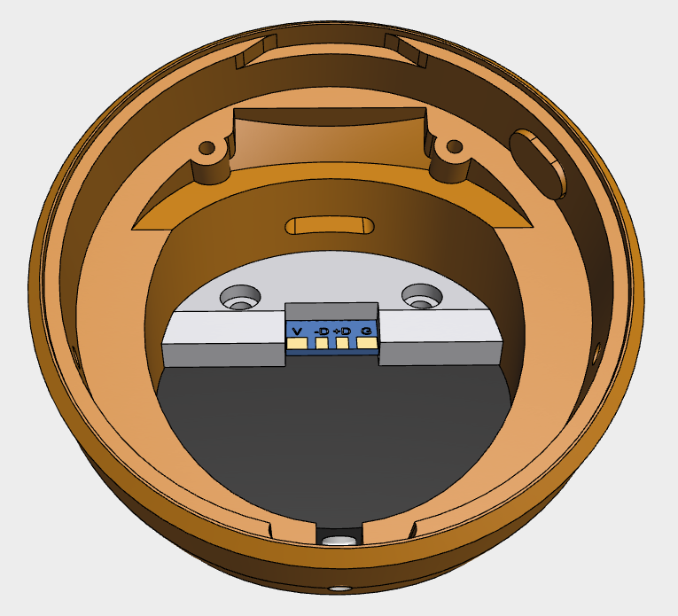
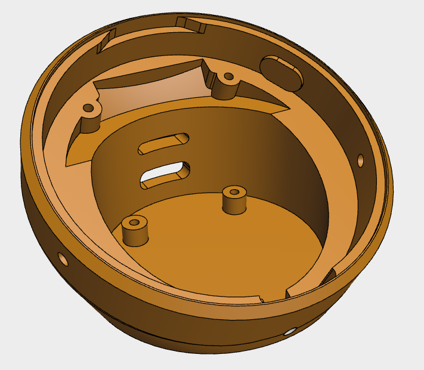
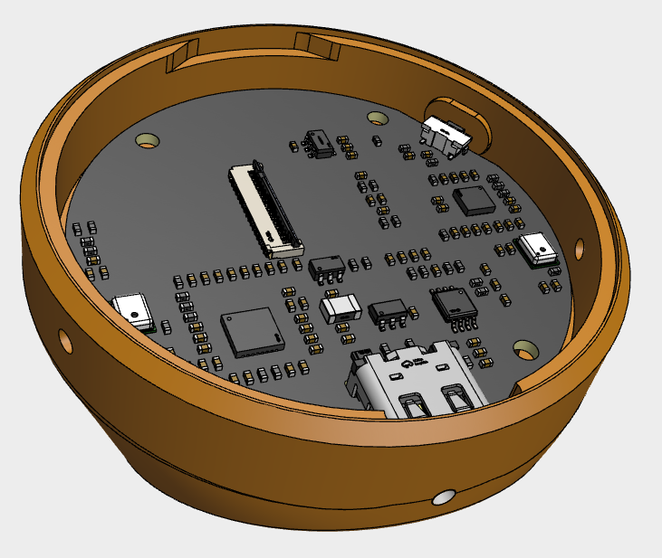
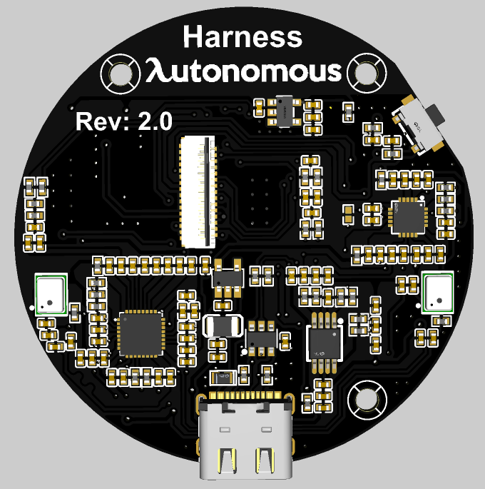
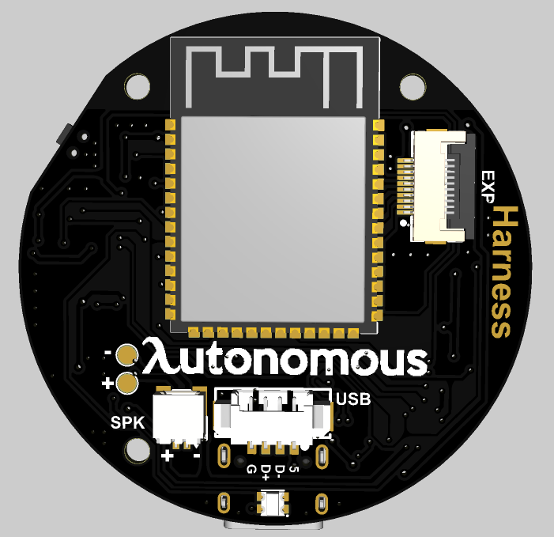

# Harness device hardware

Mechanical and electrical design files for the harness-device: a round USB companion with a
466×466 AMOLED touchscreen, dual microphones, and a speaker, built around an ESP32-S3 and a
1.75″ round AMOLED touch display module.

## Photos

| | |
|---|---|
|  **Assembled device — front** The round AMOLED display sits flush in the housing; the side button is visible on the right edge. |  **Assembled device — rear (cutaway)** Looking into the base: the USB-C clamp holds the port PCB in place, exposing the USB power/data pads (`V`, `-D`, `+D`, `G`). |
|  **Housing — empty shell** The 3D-printed housing on its own, before the board is installed: mounting bosses, screw holes, and the USB-C cutout. |  **Housing — with PCB installed** The main board seated in the housing: USB-C connector, display FPC connector, ESP32-S3 module, and supporting components. |
|  **PCB — front (top layer)** Rev 2.0 board render: display FPC connector, dual microphones (green outlines), USB-C connector, and the audio codec ICs. The ESP32-S3 module is on the back — see next. |  **PCB — back (bottom layer)** ESP32-S3-WROOM module (with printed antenna trace), speaker connector (`SPK`), USB connector (`USB`), and the expansion FPC connector (`EXP`). |

## Bill of Materials

[`BOM.csv`](BOM.csv) lists every part needed to build one complete device — bought components and
3D/laser-cut parts alike — each with a sourcing link or a pointer to the design file that makes it.
This is the **full product BOM**; for just the PCB's own SMD components, see
`pcb/production/BOM_Harness_1.75_AMOLED_PCB_Harness_1.75.xlsx` below.

The live source is this [Google Sheet](https://docs.google.com/spreadsheets/d/1MMOfGeKkNdsgSDawAIyIZwCaAqGHyCPNr3bwAXBrkfU/edit?gid=0#gid=0) —
`BOM.csv` is a snapshot of it; if the two disagree, treat the sheet as current and refresh the CSV.

| # | Component | Qty | Source |
|---|---|---|---|
| 1 | Speaker, 2415 8Ω 1W (2-pin SH1.0 connector) | 1 | [AliExpress](https://www.aliexpress.us/item/3256813022741238.html) |
| 2 | MX1.25 4-pin connector cable | 1 | [AliExpress](https://www.aliexpress.us/item/3256812670096395.html) |
| 3 | 1.75″ 466×466 round AMOLED display (DXQ0175Y003AMT003) | 1 | [Alibaba](https://www.alibaba.com/product-detail/DXQ-1-75-Inch-466-466_1601834013691.html) |
| 4 | USB Type-C female PCB connector | 1 | [AliExpress](https://www.aliexpress.us/item/3256809703885548.html) |
| 5 | PCBA — Harness_1.75_AMOLED (main board, assembled) | 1 | [JLCPCB](https://jlcpcb.com/) — build from `pcb/` |
| 6 | Solid round adhesive-backed rubber pad, 35 mm × 1.5 mm thick | 1 | [AliExpress](https://www.aliexpress.us/item/3256806493767498.html) |
| 7 | M2×5 screw | 4 | [AliExpress](https://www.aliexpress.us/item/3256808488953951.html) |
| 8 | Housing — 3D printed | 1 | `3d/step/Housing.step` |
| 9 | Button — 3D printed | 1 | `3d/step/Button.step` |
| 10 | USB clamp — 3D printed | 1 | `3d/step/USB_clamp.step` |
| 11 | Iron base — laser-cut, 3 mm steel | 1 | `3d/step/Iron_base.step` |

> The display module's silkscreen/BOM calls out a CST9217 touch controller, but the units actually
> sourced under this listing carry a CST816S instead (same footprint/form factor, different
> touch IC). The firmware auto-detects both — see the variant table in
> [`../firmware/README.md`](../firmware/README.md#supported-hardware) if you're bringing up a new
> board and the touchscreen doesn't respond.

## PCB (`pcb/`)

Designed in EasyEDA Pro.

| File | Contents |
|---|---|
| `ProPrj_Harness_1.75_AMOLED.epro2` | EasyEDA Pro project (schematic + PCB layout source) |
| `SCH_SCH_Harness_1.75.pdf` | Schematic export (PDF) |
| `production/Gerber_PCB_Harness/` | Gerbers + drill files for fabrication (RS-274X / Excellon) |
| `production/BOM_Harness_1.75_AMOLED_PCB_Harness_1.75.xlsx` | PCB assembly BOM (SMD components only) |
| `production/PickAndPlace_PCB_Harness.xlsx` | Pick-and-place (CPL) data for assembly |

Open the `.epro2` project in [EasyEDA Pro](https://pro.easyeda.com/) to edit the schematic/layout.

## 3D (`3d/`)

Each part is provided in two formats, one per subfolder:

- `3d/step/` — STEP (`.step`), parametric CAD source; import into FreeCAD, SolidWorks,
  Fusion 360, etc. to edit.
- `3d/stl/` — STL (`.stl`), mesh export ready for slicing/3D printing.

| Part | STEP | STL |
|---|---|---|
| Full assembled harness | `step/Harness_assembly.step` | `stl/Harness_assembly.stl` |
| Main enclosure housing | `step/Housing.step` | `stl/Housing.stl` |
| Iron counterweight block (keeps the device from tipping/sliding on a desk) — laser-cut from 3 mm iron sheet | `step/Iron_base.step` | `stl/Iron_base.stl` |
| Clamp that holds the USB-C port PCB in place | `step/USB_clamp.step` | `stl/USB_clamp.stl` |
| Physical button cap/actuator | `step/Button.step` | `stl/Button.stl` |
