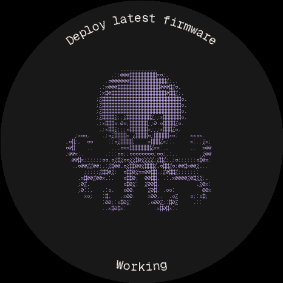
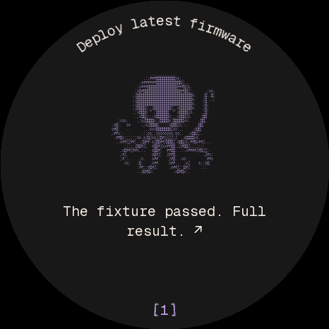

# Habitat: the round Harness companion

An opt-in native C interface for the 466 × 466 ESP32-S3 dial. It uses precomputed
monospaced glyphs, bounded scenes, curved text caches and partial RGB565 updates.
There is no runtime image decoder, font rasterizer, scripting engine or LVGL
object/timer runtime in the Habitat application.

The session name follows the upper edge. Current work uses a large animated ASCII
octopus and the engine's own activity on the lower edge. A completed turn switches
to a smaller companion and readable recap; a new turn hides the previous result.
Recaps come from the engine's final text, with local Markdown cleanup and as many
complete opening sentences as fit the 180-character budget. No summary model or
additional prompt is used.

The [design system](DESIGN_SYSTEM.md) uses the desktop pane's charcoal, one lilac
accent and one interface font size. `[1]` indicates unread messages and retains
a wide bottom touch target. Opening an inbox message focuses its pane, acknowledges
it and returns to the large companion without showing the same recap again.

## Rendered preview

These 466 × 466 images come from the actual C compositor with synthetic session
messages, replayed from the built bridge. They are not photographs of the panel.

| Working | Completed |
| --- | --- |
|  |  |

## Controls

- Tap the octopus to speak; tap again to finish.
- Drag vertically to scroll the selected desktop pane; swipe horizontally to
  switch panes. A drag cannot also start the microphone.
- Hold for the directional menu: up for panes, left for tabs, right for inbox,
  down for controls. Slide and release; return to the center to cancel.
- Optional experiments add passage selection/carry, spoken search, voice draft
  review, New Harness and reviewed question answers. These require matching host
  capabilities; unavailable commands are hidden or return a useful error.

## Build

Use ESP-IDF 5.5 and an isolated build directory. From `firmware/`, with the SDK
environment active:

```sh
idf.py -B build-habitat -DSDKCONFIG=build-habitat/sdkconfig \
  -DDEVICE_HABITAT=1 -DDEVICE_FORCE_PROD=1 \
  -DDEVICE_CREATURE_GALLERY=0 -DDEVICE_PERF_BENCH=0 \
  -DDEVICE_OCTOPUS_BENCH=0 -DDEVICE_LAYOUT_BENCH=0 \
  -DDEVICE_TRANSPORT_BENCH=0 -DDEVICE_RENDER_FAULT=0 \
  -DDEVICE_RENDER_STRESS=0 -DPROJECT_VER=0.0.87-habitat build
```

The shipped LVGL path remains selectable with `DEVICE_HABITAT=0`; this experiment
does not change the stock default or the partition layout. Preserve NVS when
installing. Benchmark and fault-injection flags must be off for daily use.

## Verification

Run `devices/harness-device/firmware/test/run.sh` from the repository root. With
`SANITIZERS=address,undefined` and `IDF_PATH`, it includes memory checks, real SDK
JSON parsing, transport fragmentation, animation bounds, exact pixel comparisons,
voice races, touch cancellation, sleep/wake, and simulated OTA failures.

The [release check](RELIABILITY.md) also tests an exact built bridge and replays
its encoded turn messages through the C renderer. It records artifact hashes and
rejects changes to its inputs during a run. Hardware touch, microphone, desktop
focus and physical display checks remain separate; no test count establishes
100% coverage of all possible failures.

On the same ESP32-S3, a controlled 4,800-update A/B comparison against the archived
original octopus renderer reduced full-size animation CPU time by 47.5% and
scene-through-final-DMA time by 21.4%. Final pixels matched. Those measurements
exclude sensor sampling, event queues, USB/app delivery, panel scanout and STT;
they are not end-to-end interaction latency. Test reference sources are retained
under `firmware/test/reference48` so identical-content comparisons remain possible.

Artwork sources are retained for reproducible generation; see the
[creature references](CREATURE_REFERENCES.md), [gallery study](CREATURE_GALLERY.md),
[animation study](CREATURE_GALLERY_02.md), and [font licenses](FONTS.md).
Historical deployment logs and user session data are not part of this change.
