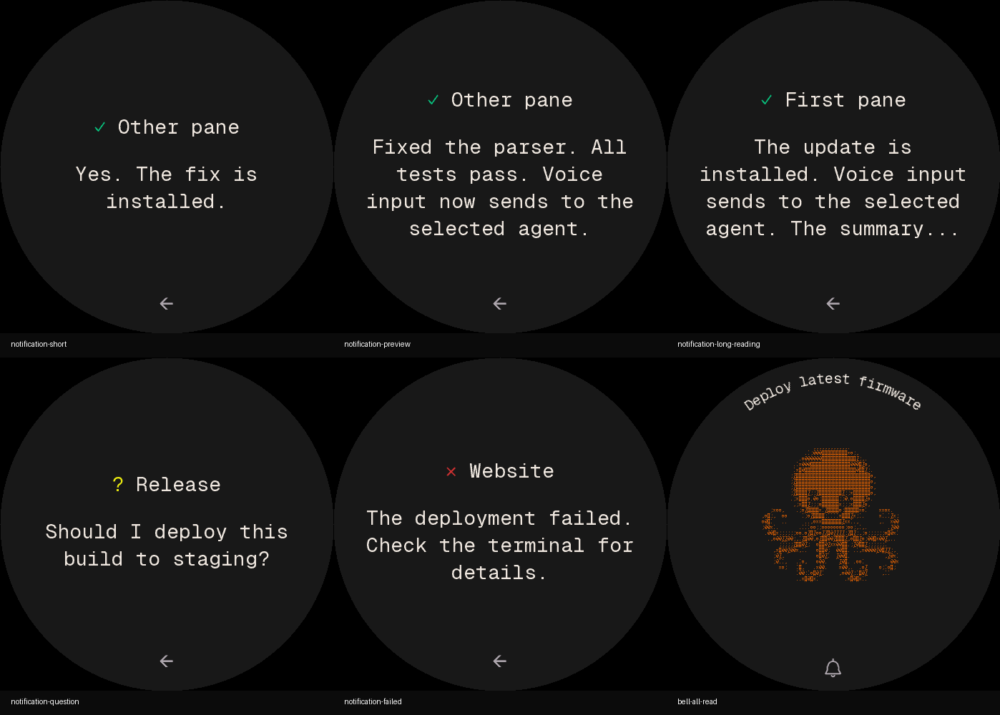
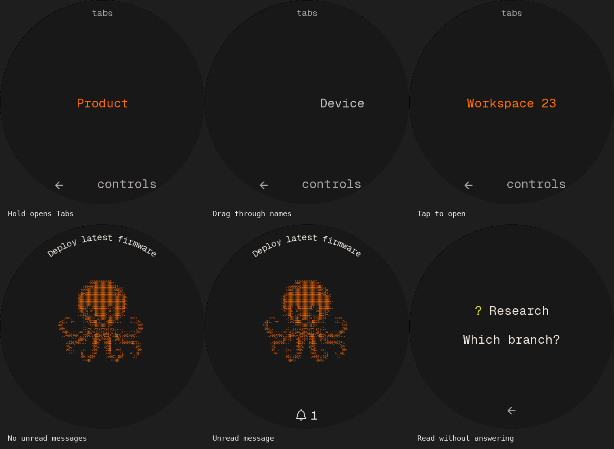
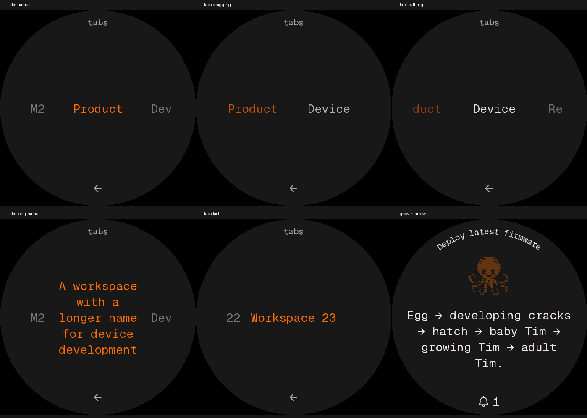
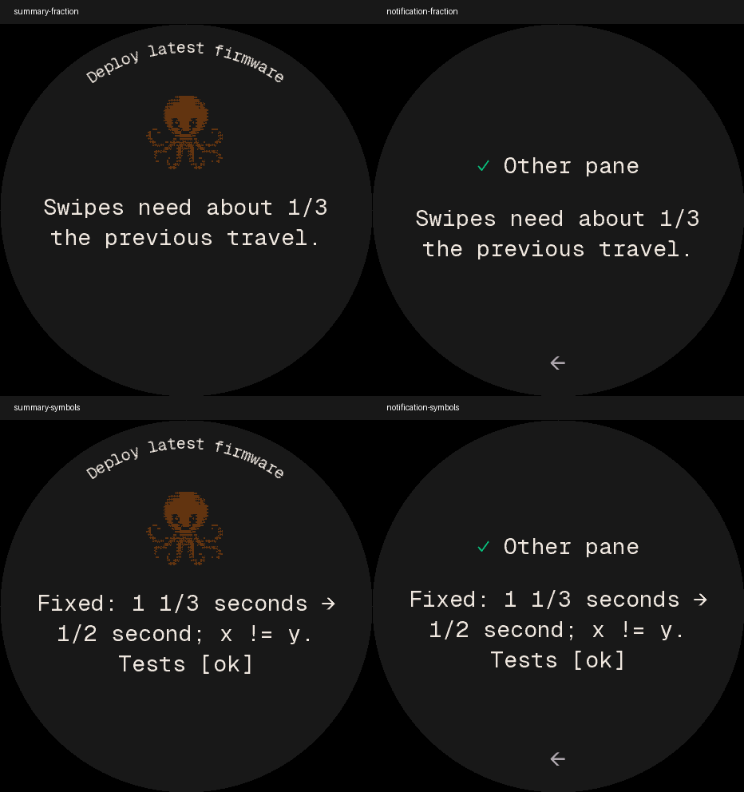

# Characters in Habitat

Tim and Tux run the same Habitat application. Tap the character to talk; hold
to open Tabs. The simplified picker has no Controls entry. The existing character
preference is saved on the dial and survives a restart. Swapping artwork keeps
the current pane, voice session, unread results, preferences and navigation.

`firmware/main/ui/habitat/character.h` is the application interface. Characters
implement the same eight moods: idle, working, attention, done, offline, asleep,
booped and listening. `character_motion.c` owns touch gaze, blinking, microphone
levels, pause/resume, quiet mode and the animation clock. `character_layout.c`
owns title/status text, recaps and portrait size. The character registry selects
the art adapter; artwork never dispatches application actions.

The main screen uses two portrait sizes: full without a summary, and small with
any summary. Summary length never changes the creature size or position. All
summaries use a fixed 28 px font, up to four rows, and at most 90 characters
including any trailing ellipsis. Clipping prefers a whole-word boundary and
counts UTF-8 characters rather than bytes. Complete summaries end naturally.
The small portrait starts at y=82 and the summary at y=208. The tighter
title/portrait/prose spacing leaves room above the bottom bell. The regular home
portrait uses the compact atlas (Tim: 216 × 216 px instead of 270 × 270 px). Lower rows narrow to
stay inside the circle; four rows retain the 90-character maximum.
The inbox is deliberately a different surface: no creature, a straight pane
name in up to two rows, preceded by the desktop/TUI status glyph, and the
message in one vertically centered block. Title and prose have a fixed 28 px
gap; unused rows reserve no space. The type remains 28 px throughout. There
is no divider. The status glyph uses the desktop terminal palette: `✓` green
`#0dbc79`, `?` yellow `#e5e510`, `✗` red `#cd3131`. Text and Back stay neutral.
`✓` means a completed turn, `?` means input needed, and `✗` requires explicit `failed: true`
notification metadata. Questions take priority over failure when both are set.
Older hosts still send only completed turns and questions; the firmware never
guesses failure from message wording or creates a new source of notifications. It keeps the same 28 px font and 90-character budget.
Swipes move between messages without changing desktop focus. Tapping the pane
name or message opens that exact desktop pane; a single bottom **←** returns
home. Questions still require their existing explicit answer flow. Opening a
result suppresses its duplicate home recap. A card becomes read only after its
pixels reach the panel, or when explicitly tapped Open. Reading clears its bell
count immediately but leaves the card available. Reading a question never
answers it. Host acknowledgements still remove completed cards; removing the
last card returns home automatically.

The top curve names the selected pane. While working, it alternates the name
and native activity every three seconds, with a 240 ms fade out and in at each change.
**Working** remains the fallback if a native activity word is unavailable.
Activity retains the existing 2.048-second highlight cycle: 20 steps at 64 ms
and a 768 ms rest. A completed result replaces the full-size creature with the
fixed small portrait and recap. Old results never appear during live work.
A held caption stays still through a phase boundary, keeping its curved end
letters tappable. Both phases open the pane picker. Holding the creature opens Tabs directly. Quiet mode, sleeping and touches stop the highlight sweep.
Curved glyph masks remain cached between caption changes, including during
colour fades; highlight updates redraw only the affected bands.

The orange trial uses `-DDEVICE_DEFAULT_CHARACTER=tim -DDEVICE_HABITAT_ORANGE=1`.
Tim and text actions use saturated orange `#ff6d00` on the existing charcoal, with
neutral text and a matching monochrome bell. This is a compile-time palette;
normal builds keep purple.

Notifications use a separate bottom bell with a broad 300 × 84 px target,
starting below the central voice target. When empty, the bell is absent and has
no hit target. New unread messages make it visible with the unread count
alongside. Tapping it opens the inbox, which retains cards that were already
read until the host removes them. Opening the inbox
chooses its first unread message. Completed and question messages use the same
read-count rule, separate from whether a question remains unresolved. Tim and Tux no longer hold an envelope on any daily screen.
The old letter art stays available to historical experiment renders.

The bell is a round, authored outline glyph with the terminal font’s stroke
weight. Its own 26 × 38 px cell keeps the dome round, alongside a 28 px count.
It starts at y=414, with visible ink about 20 px from the rim, matching the top
caption. The new bell and two status glyphs use 571 immutable pixel bytes.
The earlier narrow bell cells remain for historical renderer comparisons. There is no emoji renderer, icon library,
allocation or per-frame bell animation. Listening temporarily owns the bottom
curve; the bell returns after the voice flow closes.

The central tap always starts voice, including over a summary.
It never requires a first tap to dismiss the summary. During capture, the pane
name stays on the top curve and animated `Listening` follows the bottom curve.
The timer is hidden. Listening uses a 1.024-second sweep cycle, twice the speed
of the working/status sweep. Tim keeps moving at the gentle idle pace, with microphone
reactions layered over his body motion. One tap on the creature stops and sends; the recording screen has no Discard button.
Once recording stops, `Listening` disappears. There is no `Sending` label; the
companion keeps moving until the host accepts the message or returns an error.
Starting, Finding and Writing retain the normal status sweep during their voice states.
Removing the displayed timer leaves recording duration guards unchanged.
Cancelling capture through the existing host lifecycle restores the previous
result. There is no duplicate bottom label on the home screen.

To add a character, append a stable ID and registry entry, then supply its mood
clips and painter for the five portrait sizes. Keep frame and colour data
immutable: the compositor retains two scenes during incremental DMA redraws.
Existing IDs are persisted in NVS and must never be renumbered. The common
interaction suite should run with every supported character selected.

## Multiple USB dials

The desktop uses `CableFleet` to discover every matching USB serial number and
create one `CableSession` per dial. Each session owns its decoder, audio upload,
firmware transfer and reconnect state, while desktop events are sent to all of
them. The shared desktop connection is released only after the last dial leaves.
An offline Tim is intentionally still and gray; connecting another dial must
not leave Tim without a desktop session.

`HARNESS_DIAL_SERIALS` optionally limits discovery to a comma-separated list of
USB serial numbers. Each dial writes its own log under
`~/.harness/logs/usb-<serial>/dial-YYYYMMDD.log`. The fleet tests cover simultaneous
voice uploads, disconnecting during another dial's transcription, USB path
changes, shutdown during an open, and discovery errors.

## Tux artwork

The pumpkin-orange dial uses the selected gallery sample **1363**:
`tux -c midnight --bowtie`, with a blue gradient and pink bow tie.
Its exact gallery frames and traits are retained in
[assets/tux/sample.json](assets/tux/sample.json). The previous ice-blue sample
2138 remains in [assets/tux/ice.json](assets/tux/ice.json) for reference.
The exact source is `daemons/review/traits.html` and `daemons/plates/tux.mjs` at
`2fe1d35dfa31c79ec66a06692ab8c218678f4da1`
(`internal/experimental-creature-2fe1d35`), not current `main`.

[assets/tux/moods.json](assets/tux/moods.json) contains 36 frames derived from
that pinned model with the approved traits, registered eye/beak positions, and
source hashes. The original moods map as follows:

| Habitat | Tux model |
| --- | --- |
| idle | idle |
| working | work |
| attention | need |
| done | done |
| offline | fail |
| asleep | nap |
| booped | boop |
| listening | need + shared microphone expression |

Frames share a 52×24 crop and immutable RGB565 cell colours. Geist Mono atlases
cover the full, compact, brief, reading and shortcut portraits. The firmware
does not run the procedural model or decode images. Historical letter poses remain available to experiments; offline and sleeping
portraits dim. Shared reactions overlay the
registered face cells without changing application behaviour.

Regenerate from the source checkout and then bake firmware data:

```sh
node devices/harness-device/firmware/scripts/import_tux_moods.mjs /path/to/art-checkout 1363
python3 devices/harness-device/firmware/scripts/gen_tux_moods.py
python3 devices/harness-device/firmware/scripts/gen_character_fonts.py
```

The font generator needs Pillow. Geist Mono's OFL license is in
`firmware/fonts/GeistMono-OFL.txt`. The mood generator needs only Python's
standard library and supports `--check`.

Build normal Habitat with Tux as the initial character on an unconfigured dial:

```sh
idf.py -DIDF_TARGET=esp32s3 -DDEVICE_HABITAT=1 \
  -DDEVICE_DEFAULT_CHARACTER=tux -DDEVICE_CREATURE_GALLERY=0 \
  -DDEVICE_FORCE_PROD=1 -DDEVICE_PERF_BENCH=0 \
  -DPROJECT_VER=0.0.87-tux.1363.1 build
```

The default remains Tim when `DEVICE_DEFAULT_CHARACTER` is omitted. A saved
choice takes precedence over the build default. Both characters ship in every
Habitat image. This replaces the earlier standalone Tux animation build.

`test/run.sh` checks both adapters' clocks, moods, portrait sizes, circle bounds,
microphone reactions and colour-aware incremental redraws against full frames.
It also checks preference persistence and runs the production gesture, voice,
recap and notification tests once per character. Tim's original rendering
reference tests remain in place.

## Main integration and orange-dial trial — 2026-09-28

Integrated the `88c0e5c4` handoff onto `main` at `621a2b8f`. Retained the
handoff's hold-and-slide menu and single bottom caption. Kept main's larger
interface font and four-row lists; corrected their question/draft scroll limits
and secondary-screen buttons so text remains reachable and action labels fit.
The form shows the current choice and detail, with errors replacing the detail.

Validation used ESP-IDF 5.5, separate Tim/Tux build directories, and the production
Habitat configuration above. Both images are 777,664 bytes. The complete device
gate passed: 19 built-bridge checks, 796 host tests, framed bridge-to-renderer
replay, and the native ASan/UBSan suite. The touch/notification soak exercises
200,000 updates per character. Rendered screenshots were reviewed for both
characters. These host checks do not establish physical display latency.

The orange trial dial received `0.0.87-tux.1363.4` by verified USB OTA and reported
that version after reboot. A user voice test reached the selected pane. Mute
remained enabled. The production reference dial was not flashed, and the installed
desktop app and CLI 0.3.25 were left unchanged. The multi-dial bridge is integrated
and tested in this checkout; a simultaneous two-dial hardware trial remains open.

Desktop notification placement above the creature and the relevance policy for
old-session/swarm-introduction notifications remain separate follow-up work.

## Orange Tim refinement — 2026-09-28

The orange trial dial (`90:70:69:F3:D8:54`, CST816S) rebooted and reconnected
on `0.0.87-tim.orange.2` after verified USB OTA. This revision uses saturated
`#ff6d00`, moves the summary portrait down 26 px and prose down 40 px, and adds
the terminal-style brightness sweep to the bottom activity curve. It retains
the three home states, curved voice status and filled letter described above.
The letter's touch behavior is unchanged pending the interaction discussion.

The application is 777,936 bytes, 1,328 bytes (0.17%) above orange.1. Its SHA-256
is `8d4477e638f1be00b21fd78cbc6be0370b5cc09c47b296be6e09b61b64c4884a`.
The sweep uses the unused byte beside the arc flag, 128 bytes of temporary
colour-table stack space and one phase byte in UI state; it allocates no heap.
It reuses the existing glyph masks and does not redraw the full screen.

Validation: 796 host tests; full native ASan/UBSan, real bridge replay and touch
soaks for both characters; original 64 arc pixel hashes unchanged; incremental
shimmer frames match fresh renders, including skipped frames and clock wrap.
Full 90-character summaries stay inside the round display. The installed CLI
and desktop executable hashes remained unchanged. The production reference
dial was not updated. Physical touch/audio and ESP32 timing for this revision
remain separate from these automated checks; no new hardware latency claim
is made.

Artifacts: `/private/tmp/harness-orange-tim-layout/` contains the exact image,
release report, actual renderer previews, host-only sweep benchmark and OTA
receipt. A previous full check caught the old summary-bottom bound (380 px);
it was updated to keep at least 16 px above the inbox controls at y=400, and
the complete check passed on the final inputs.


## Listening and sending motion — 2026-09-28

Orange trial revision `0.0.87-tim.orange.3` shows only `Listening`, with the
same cached brightness sweep as `Working`. `Sending` has the sweep and no
trailing dots. Tim keeps the idle body pace while recording, with independent
microphone reactions. Quiet mode and touches still pause motion. Recording
duration limits and dispatch behavior are unchanged.

The image is 777,968 bytes, 32 bytes larger than orange.2. The full bridge,
796 host tests, native ASan/UBSan and both-character touch/replay checks passed.
The listening traffic limit now includes idle body motion: native simulation
transfers 25,772,160 pixel bytes/minute versus idle's 25,499,360. This is a
render-traffic measure, not ESP32 timing. The existing extra 2.5 MB/minute
allowance for microphone reactions is now applied above idle body traffic.

USB OTA verified the image, but the updater stalled closing USB and the dial
did not answer after reboot or USB reset. The updater was stopped, its lease
removed and the existing host restored. A user power cycle recovered the dial;
it reported orange.3 at 15:51:20Z. Desktop/CLI hashes stayed unchanged.
Artifacts and the full recovery receipt: `/private/tmp/harness-orange-tim-voice/`.
Inbox gestures and layout remain under discussion; this revision does not
change them.


## Connection and update wordmark — 2026-09-28

Boot/loading, the disconnected home surface, remote-offline/unpaired prompts,
firmware transfer and restart use one centered `Harness` wordmark on the
existing charcoal canvas. There is no companion, footer, hint or tap target on
that surface. The scene is static, and hidden character animation pauses.
A handshake alone keeps the wordmark visible; the companion returns once the
pane roster has loaded. Pairing codes and actionable error screens retain
their own content.

This replaces the disconnected face whose bottom status and controls hint
could overlap. The final orange.4 image is 777,280 bytes. It also removes the normal
voice `Sending` label and doubles the `Listening` sweep speed; Working and
other activity labels retain their existing pace. Existing fonts and colours are reused with no new assets.


The orange trial dial received the final orange.4 image by verified USB OTA
and reconnected on that version at 16:08:38Z. The installer now closes USB
before the device's delayed reboot and bounds that close; this update completed
without a manual power cycle. The existing desktop and CLI hashes match.
The production reference was not updated.

Validation: 796 host tests, full native ASan/UBSan, framed bridge replay and
both-character touch tests passed. The tests cover the static wordmark through
loading, offline and OTA, returning after the roster arrives, inactive touch
targets, a 32 ms Listening step versus 64 ms Working step, clock wrap, removal
of Listening as soon as capture stops, and continued companion motion.
Artifacts: `/private/tmp/harness-orange-tim-listening/`; image SHA-256
`920f40bc252dda2c7311ae303492abd8fa5e17fc7a3aaa01699dacaa6f3ffe32`.


## Empty-transcription retry — 2026-09-28

When ordinary pane speech returns `Didn't catch that`, the firmware returns to
the full companion with `Try again` on the bottom curve for three seconds. A
central tap starts a fresh recording immediately; the hint expires without a
dismissal tap and the previous summary/status returns. The summary is kept,
not marked read or cleared. Pane changes, a new recording and disconnect clear
the hint. This reuses an unused deadline field and adds no heap allocation.

This only handles the host's known empty-transcription error. Other errors
retain their details, and question/form/draft/search voice failures remain in
their own context. No speech is replayed or sent automatically. After the hint
expires, the normal bottom bell returns.


## Bell and text-only inbox — 2026-09-28

Orange trial revision `0.0.87-tim.orange.5` implements the bell/count, alternating
top caption and text-only inbox described above. It also includes the brief
empty-transcription retry hint. Tim stays unadorned. The inbox has no character
clock running, and the home bell redraws only when its count or colour changes.
The main voice region ends at y=382; the bell begins there, so a dim or changing
bell cannot fall through to voice.

The application image is 778,000 bytes: 720 bytes (0.093%) above orange.4.
Artifacts: `/private/tmp/harness-orange-tim-bell/`. Source changes and test
results belong to this revision; historical notes below earlier headings
describe their own installed versions, not the current layout.

Validation passed on unchanged final inputs: 796 host tests, the built bridge,
framed bridge-to-C-parser-to-renderer replay, ASan/UBSan, both-character touch
checks and 200,000 mixed pane/inbox operations per character. New checks cover
dim/active/count bell raster transitions, every curved bell rotation, upper and
lower shimmer damage, arrivals/clears during contact, a held long caption across
its phase boundary, inbox title/message taps, and the empty-transcription retry.
Image SHA-256: `a9a97e5c55ed6bedfddd5ce7865911c27c40028b5a1443a3f7aeb68afb200513`.
The release report covers native and bridge behavior, not physical USB/touch
latency. The separate deployment receipt records the actual dial handshake.

## Bell and reading polish — 2026-09-28

Orange revision `.orange.6` widens the live bell, moves it 15 px toward the rim,
and gives it a separately centered count. The thumb target stays 300 × 84 px
and remains separate from voice. Home uses the smaller existing portrait atlas;
the fixed summary portrait and prose move up 10 px and 22 px respectively.
The inbox replaces its dashed divider with space and prefixes the straight
pane title with the matching desktop/TUI status symbol. No host app is replaced.

The checks exercise the round bell and count changes against full-frame renders,
check the rim bounds, and verify that status glyphs cannot become fallback `?`
characters. Protocol tests cover explicit failure metadata and legacy snapshots;
touch replays cover both characters, notification arrivals/removals under a
finger, pane focus, question safety, and voice restoration.

## Read acknowledgements and inbox rhythm — 2026-09-28

Orange revision `.orange.7` counts unread messages rather than retained cards.
The renderer acknowledges a card only after the panel DMA completes. The receipt
contains a display revision; an obsolete frame cannot acknowledge a newer message
from the same pane, including one with identical words. Sleeping, locked and
background cards remain unread. Open is idempotent with that display receipt.

A fixed 24-entry cache stores exact pane IDs, normalized message text and kind
in PSRAM; there is no hashing ambiguity, allocation, flash write or network call.
It keeps repeated/reconnect snapshots read and distinguishes updated text or kind.
Fresh live notifications invalidate that pane's prior read receipt. The cache is
local to this dial and resets on reboot; the unchanged host protocol does not
yet accept a read-only acknowledgement from the dial. The device never focuses a
desktop pane merely to clear the bell.

The title and up to four message rows form one centered block in y=72…382,
with a 28 px gap and the existing 90-character budget. Only the status glyph
has semantic color, matching `desktop/lib/widgets/harness_activity_mark.dart`
and `desktop/lib/terminal/terminal_theme.dart`. Back uses secondary neutral ink.
Native tests cover short/long layouts, exact partial redraws, rim bounds, post-DMA
ordering, locked/sleeping frames, stale replacements, counter rollover, read/Open
idempotence, questions, bounded receipts and muted/active bell transitions.

### Renderer reference

Actual native-renderer output for the centered inbox cards and empty bell in
`.orange.7`; these are test fixtures, not customer conversations. A quieter empty
bell is planned as a separate follow-up.



## Hold to switch tabs — 2026-09-28

Orange revision `.orange.8` removes the four-direction hold menu. A stationary
650 ms hold on the home creature opens Tabs immediately. That opening contact is
consumed through release; it never also selects, starts voice or scrolls the app.
Movement is classified before the hold deadline, including a delayed final sample.

Tabs is a horizontal name carousel: drag with the finger, flick to advance, then
tap the centered name to open. It has no row numbers, pane counts or list boxes.
Long names wrap in the center. The active desktop tab uses the companion accent;
other names use neutral text. Back and controls remain in a separate bottom row.
The top home caption still opens panes, and the bell still opens unread messages.

A 360 px page follows the finger directly, with soft bounded ends and a 224 ms
integer ease on release. Fling projection is bounded. A contact during settling
only brakes; a later stationary tap confirms. The 16 ms animation wake stops once
settled. No floating point, heap allocation or extra framebuffer is introduced.
Roster changes cancel stale contacts and preserve the centered tab by ID where
possible; pane-count-only updates do not disturb browsing. All 24 tabs are
reachable, independent of the desktop vertical-scroll direction preference.

The bell is absent when there are no unread messages. An unread bell and its
number keep their existing foreground and separate lower touch target. The pane
name and activity remain visible even when Harness is behind another app.

### Read once, clear everywhere

The desktop assigns an opaque `readToken` to each new notification, including a
new turn with identical text. `app_unread` and `notif.replace` carry it unchanged.
After a card actually finishes rendering, the dial sends `notif.read` with its
agent ID and that exact token through the existing background USB worker. The
host validates against the latest unread list and emits `dial_notification_read`
locally; the app checks the token again, clears its unread mark and withdraws its
banner/system notification. It publishes the updated list to every connected
machine and dial. Desktop reads/explicit dismissals use the same state.

`agent_seen` / `notif.seen` also carry the token. A stale receipt cannot clear a
new occurrence. Reading a question does not answer it or change focus. The card
stays visible on the dial while being read, even after the app confirms removal;
leaving the inbox drops that retained card on the next snapshot. Automatic
expiry of a desktop banner is not a read. Pending question state remains separate.

The dial holds at most 24 receipts in RAM, retries each at most every two seconds (one enqueue per tick),
and reserves the last action slot for touch/audio. It writes neither flash nor
extra frames when idle. Reconnect snapshots recover a lost receipt. This protocol
requires the matching desktop and CLI update; older hosts keep local-only reads.

The desktop also remembers which pending question notification was explicitly
read. A reconnect can restore the question without bringing back its bell entry;
a matching answer or a new question resets that receipt. Both the native and
Flutter desktop inbox acknowledge a successful Open the same way as a device
read, while stale navigation and read tokens leave a newer message unread.

Actual native renderer output, using test fixture content:




## Short swipes and neighboring tabs — 2026-09-28

Orange revision `.orange.9` brings the previous and next names into view on
either side of the centered tab. Neighboring names are dimmer and clipped to
the safe central viewport. Short names align toward the visible edge of their
page, moving smoothly into centered alignment as they approach the middle.
Names wrap in a 12-cell column with up to six rows. Each visible name owns its
tap, so tapping a neighbor opens that tab. There is no Controls entry; only a
single centered Back arrow below the names.

Page spacing is 228 px with 2:1 drag tracking. A slow 58 px swipe reliably
advances one tab in either direction, down from 180–181 px. Flick projection
is capped at half a page and release settles in 192 ms. Touching during a settle
still only brakes it; roster changes still cancel stale contacts. Browsing sends
no desktop requests. The previous hold, voice, scrolling and read-sync rules stay
in place.

The renderer now supports authored `→` in both normal recap text and curved
labels. The recap-size `↗` also has its own correctly sized atlas instead of
using the smaller title glyph. The three new glyphs occupy 408 pixel bytes,
plus four bytes of curved ink bounds; no font engine, heap or framebuffer is
added. The exact example `Egg → developing cracks → hatch → baby Tim → growing
Tim → adult Tim.` is part of the native rendering fixtures.




## Readable Unicode fallbacks — 2026-09-28

Orange revision `.orange.10` normalizes display text before measuring, wrapping
and centering it. Existing supported glyphs keep their pixels; fractions use
readable ASCII, so `⅓` becomes `1/3` and `1⅓` becomes `1 1/3`. Unsupported
compatibility letters, ligatures, math operators, arrows and common emoji get
text equivalents. Negation is preserved: `≠` becomes `!=`, never `=`.

A scalar without an equivalent displays its explicit `[U+XXXX]` identifier
instead of a misleading question mark. Malformed UTF-8 uses `[U+FFFD]`. This
is a bounded display fallback, not a full Unicode font or language renderer.
The source message, pane IDs and notification receipts stay untouched. Approval
labels retain strict native-glyph and complete-fit checks; a transliteration
does not make an unsupported question safe to answer from the dial.

The shared path covers summaries, inbox cards, ordinary labels and curved text.
The existing 90-character recap budget applies after expansion. The table holds
2,080 equivalents in 49 ranges, 1,152 packed entries and 1,718 string bytes
(about 6.8 KiB of flash data). It adds no heap allocation, framebuffer or runtime
Unicode library. Creature artwork keeps its direct ASCII path. Regenerate with
Python 3.14 / Unicode 16.0.0 using
`firmware/scripts/gen_display_fallbacks.py`; `--check` verifies the committed table.
Ordinary builds do not require that Python version.

Validation covers every valid Unicode scalar, 3,000 randomized byte strings,
bounded copies, mixed fractions, math meaning, raw-versus-normalized wrap/arc
pixels, incremental redraws and unmodified notification text. The exact `⅓`
report is exercised in both home and inbox layouts for both characters.


