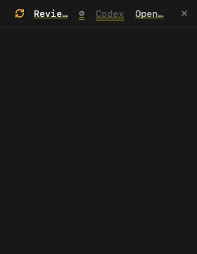
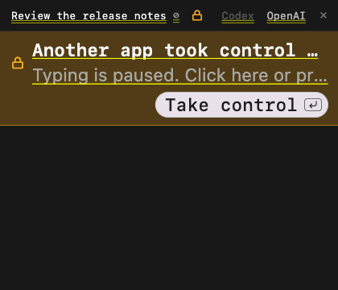

# Desktop baseline repair

Desktop 1.2.54's [release PR #620](https://github.com/autonomous-ai/openharness/pull/620)
recorded 44 existing assertion failures and four stalled cases. That made every
broad release check spend time separating old failures from new ones. #627 fixed
the four stalls and two assertions. This change repairs the remaining baseline,
plus a browser shortcut collision found during platform validation.

## What changed

- Launch fixtures follow the documented [fresh-form contract](../../desktop/design/new-harness-entry-rules.md#fresh-forms-and-launch-recovery): ordinary dismissal discards edits; uncertain receipts retain exact launch choices. Pending-start, duplicate-start, retry, placement and focus assertions remain.
- Installation fixtures explicitly select an engine supported by their manifests. Fresh installations now default to OpenCode; these synthetic manifests support Claude/Codex.
- Split tests deliver the scheduled focus frame before Escape. Management tests wait for navigation through their existing command helper instead of waiting for a deliberately loading monitor to stop animating.
- Stale copy, category and compact-header expectations match the current interface. Header callback replacement is still checked; split controls are exercised at workspace edges.
- Machine-recovery dismissal now happens after workspace listeners/catalogs detach. Opening Models starts its shared catalog refresh after layout. Both changes fix real rebuild-during-layout/unmount errors.
- Compact terminal headers budget space for activity, status and identity beside their title. Model/agent selectors yield before the title collapses or the row overflows.
- Browser companion conversation uses Alt-Shift-A. Mapping its old Cmd-Alt-T to Alt-T replaced New Tab's binding, so the existing browser tab-creation assertion failed. Alt-T now resolves to New Tab; Linux already used Alt-Shift-A for the companion.

## Validation

[Machine-readable evidence](2026-10-02-desktop-baseline-repair.json) includes source
identity, per-file VM completion, toolchain, checks, timestamps and log hashes.
The host is **Intel x86_64, macOS 26.6.2, 16 logical CPUs and 64 GiB RAM** with
Flutter 3.47.2 / Dart 3.13.2. An earlier continuation note incorrectly described
it as ARM; hardware and executable inspection corrected that before sign-off.

| Check | Result |
| --- | --- |
| All 526 Desktop VM test files | 5,751 passing cases; 16 existing skips; complete coverage across the recorded runs |
| All nine browser test files, Chrome 154 | 49 passing cases, including real browser New Tab dispatch |
| Affected keymap checks after the browser-only correction | 94 passing cases in eight files |
| Changed Dart analysis | Pass; final added keymap/browser files checked separately |
| Isolated Intel macOS app, Skia | Six passing lifecycle, navigation, focus and header checks; 74.9 seconds including incremental build/startup |

The [recorded native entry point](2026-10-02-desktop-baseline-repair/native-fixture.dart)
was copied into `integration_test/baseline_repair_native_test.dart` in the disposable
package. It ran with `FLUTTER_TEST=1`, `BASELINE_NATIVE_OUTPUT` pointing to its
artifact directory, `DEVELOPER_DIR=/Applications/Xcode.app/Contents/Developer`, and
`flutter test -d macos --no-pub --no-enable-impeller --name
"offline unlinked remote|Search unifies categories|Cmd-P and Cmd-N replace|Return on Close search restores|native narrow headers"`.
The copied native host used the isolated bundle identifier
`ai.autonomous.harness.baselinecheck`.

The native fixture uses memory-only app/transports and an isolated app identifier.
It checks recovery teardown, Models navigation in both menu modes, two dialog
focus journeys, and narrow headers at 240/280/420 pixels across four connection
states with 1.7× text. Keys are injected; this is not physical keyboard/IME or
native ARM/Linux/Windows execution coverage. Native Skia previews were inspected:

| 240 px, controlling | 280 px, opening | 420 px, taken over |
| --- | --- | --- |
|  |  |  |

The final production change after the broad VM run is guarded by `kIsWeb`: the
companion key mapping. Browser coverage and the affected keymap checks were run
on that final code. The four lifecycle/header files match the native fixture's
copied source. #629 advanced main with CLI prompt/research changes only; those do
not invalidate this Desktop evidence. Documentation and these previews add no
executable changes. The exact final code hashes are in the evidence.

## Runtime and incomplete runs

The first full run used two workers. After 13m12s, 377 files were complete. On
this host that cap left capacity unused, so the owned run was stopped and only
its 149 incomplete/loader-failed files were resumed with eight workers. That
check took 2m36.5s. Counts were reconciled against every file's registered cases;
partially executed files contributed no completed-file evidence.

Three files hit Flutter's startup `Invalid WebSocket upgrade request` error
before their cases could run: `devices_screen_test`, `setup_review_render_test`
and `swarm_state_test`. Each was retried once and completed; the final isolated
24-case retry took 6.2s. The first two runs are **not uninterrupted passing full
suites**. Their failures, cancellation and the successful file results are kept
in the evidence. No assertion failure was converted into a pass by retrying it.
The loader failure's external trigger remains unresolved.

The initial native attempt failed before compilation because the host selected
command-line tools; the retry selected the installed Xcode for that process.
An Impeller run passed native geometry checks but returned transparent image
buffers. Final native checks and previews used Intel's release renderer, Skia.
The browser reporter also omitted its assertion detail; a copied diagnostic
fixture exposed the actual keyboard-tab count failure. No diagnostic handler or
extra focus pump is included in the final browser test.

The process guide now treats two workers as a starting point for scoped checks,
with explicit host-appropriate concurrency for broad runs. The 149-file result
is not a controlled whole-suite speedup measurement. This maintenance run does
not establish a new merge-to-release time; measure that on the next product task.
No product release was triggered by this change.
