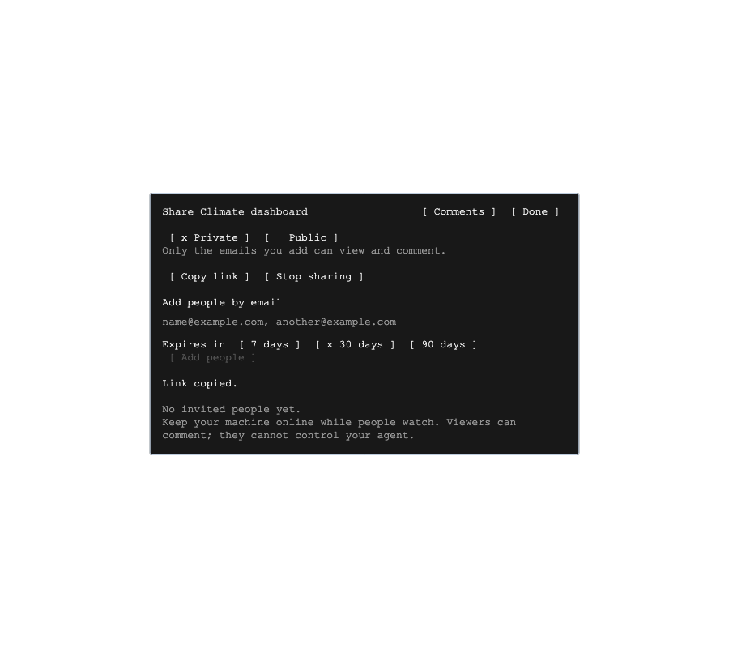
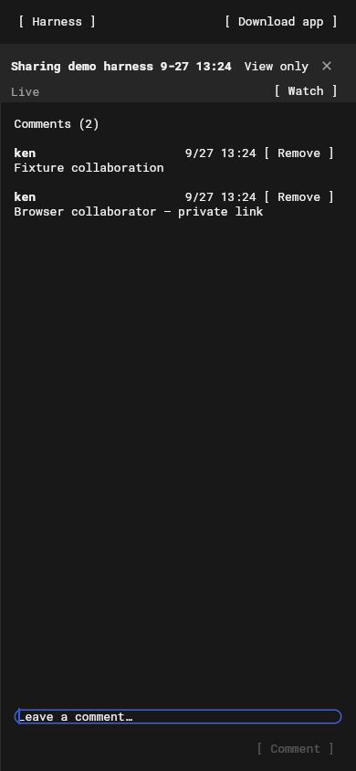

# Share links and comments

Release versions and final verification: [September 28 release record](2026-09-28-010-sharing-release.md).

Requested: share an agent from desktop or web, copy a public or private link, let recipients view in a browser, and add simple collaboration through comments.

Build on existing owner-authorized E2EE observer sharing. Keep terminal input, control leases, resizing, arbitrary files, and other agents out of the observer protocol.

- One stable HTTPS link per agent, with public/private visibility and Stop sharing. Private is the default. Existing email invitations remain the private allow-list and retain their expiry/revocation behavior; no invitation email service is needed.
- The owner daemon persists link settings and remains the authority on every observer connection. Backend metadata and admission mirror that policy. Private links require an invited account; public viewing requires no login. Visibility changes and revocation disconnect unauthorized viewers.
- Browser links open a dedicated shared-agent view, including while signed out, using the existing shared terminal/viewer renderer. Private sign-in returns to the requested link. Include a clear read-only label and Download app.
- Comments are a small durable thread per agent, stored on the owner machine and transported through the encrypted sharing channel. Viewing works anonymously for public links; posting requires sign-in. Authors can remove their own comments, owners can moderate. Bound text length, history size, message rate, and deduplicate retried submissions.
- Reuse the desktop/web Share control and keep its flow compact: access setting, invited emails when private, Copy link, Stop sharing, and comments. Do not introduce a separate editor, team administration, or terminal co-control.

Verify daemon and backend authorization (public/private/expiry/revocation/cross-account/cross-agent), reconnect and persistence, E2EE boundaries, comments ownership and retry behavior, desktop dialog and browser recipient routes, OAuth return routing, and owner/recipient flows with isolated fixtures. Ship backend, CLI, web/desktop support in the appropriate release order; older daemons must show update guidance.

## Implemented flow

Open **Share** on an agent in desktop or web. Choose **Private** or **Public**, add emails when private, and **Copy link**. The URL remains stable across access changes. Adding an email grants access; the owner sends the copied link themselves. No notification email is sent.

`https://harness.autonomous.ai/s/<link-id>#key=<owner-public-key>` opens a dedicated browser view with **View only**, **Comments**, and **Download app**. The fragment pins the owner's identity before the encrypted handshake. It survives sign-in, refresh, and responsive layout changes. Flutter's automatic hash routing is disabled because this URL is owned by the sharing and sign-in adapters, not workspace dialogs.

Public readers need no account. Private readers sign in with an invited email; another account gets an access message and can switch accounts. Commenting requires sign-in. Threads appear beside live output on wide screens and as a separate view on narrow screens. Readers can select/copy text, delete their own comments, and retry a failed submission without losing the draft or posting it twice. The owner can remove any comment. Changing a public link to private removes uninvited viewers; **Stop sharing** disables the link and revokes the agent's invitations.





The daemon persists authority and comments in `harness-collaboration.json` with atomic writes and private file permissions. Backend `HarnessLink` records contain admission metadata only. Comment payloads travel inside the existing encrypted observer channel and are excluded from frame logs. The daemon checks access for every observer request and output. Guest clients cannot supply their own account identity or send terminal input, resize commands, unrelated agent IDs, or generic owner RPCs.

Limits: 4,000 characters per comment, 200 comments / 1 MiB encoded per thread, and 10 posts per minute per account on a machine. Authors can remove comments to make room. This release is live collaboration: the owner daemon must be online. It does not publish offline snapshots, send emails, or grant terminal control.

## Validation — September 27, 2026

- CLI sharing: 45 tests; 100% statements, branches, functions, and lines. Covers durable settings/comments, retry deduplication, size/rate limits, author/owner moderation, strict observer permissions, and publication recovery.
- Backend sharing: 28 tests; 100% statements, branches, functions, and lines. Full backend suite: 573 passed, 11 skipped. Both TypeScript projects typecheck.
- Desktop/web: 57 targeted tests passed across sharing, comments, pinned identity, offline recovery, OAuth return paths, observer encryption, and WebSocket lifecycle. Focused Flutter analysis is clean. Flutter web release and macOS debug builds succeed.
- Full stack: real backend, disposable MongoDB replica set/Redis, three isolated daemons, tmux, and Chrome. Verified anonymous public viewing, private sign-in return, uninvited-account rejection, browser posting, URL preservation on resize/reload, encrypted terminal/viewer output, forbidden controls, revocation, owner restart persistence, and Stop sharing. Only SSO and the model process are fixtures. No real account credentials or real Harness/Codex home directories are used.
- Visual review: shared dialog and recipient view, including a 390-pixel browser. Comments are readable in the browser accessibility tree.
- Hosting: `/s/:id` rewrite, no-store/no-referrer entry headers, cached assets, callback/download routes, and installer redirects pass against the production Next.js build locally.

Reproduce the daemon/backend coverage gates with `npm run test:sharing` in each folder. From `desktop`, run:

```sh
flutter test --no-pub test/share_harness_test.dart test/shared_harness_panel_test.dart test/harness_comments_test.dart test/shared_agent_page_test.dart test/browser_login_test.dart test/observer_codec_test.dart test/observer_transport_test.dart test/ws_conn_test.dart test/ws_readiness_test.dart
flutter build macos --debug --no-pub --target lib/main.dart
```

For browser E2E, prepare disposable **loopback-only** MongoDB replica-set and Redis services and a JSON file with `mongo` and `redis` URLs. Install Playwright in a test tool directory, with Chrome available. Build/serve the fixture browser from `desktop`:

```sh
flutter build web --release --no-pub --no-wasm-dry-run --no-web-resources-cdn --dart-define=HARNESS_API_URL=http://127.0.0.1:54861 --dart-define=HARNESS_TEST=true --dart-define=HARNESS_CLEAN_PREVIEW=true
python3 scripts/serve-web.py --port 54862
```

In another shell, from `cli`:

```sh
HARNESS_SHARE_E2E_SERVICES=/path/to/disposable-services.json \
HARNESS_SHARE_BACKEND_PORT=54861 \
HARNESS_SHARE_BROWSER_ORIGIN=http://127.0.0.1:54862 \
HARNESS_SHARE_BROWSER_CHECK="$PWD/../desktop/scripts/check-sharing.cjs" \
HARNESS_PLAYWRIGHT_MODULE=/path/to/node_modules/playwright \
HARNESS_SHARE_KEEP=1 npm run test:sharing-e2e
```

The fixture cleans up its daemons, terminals, and browsers. With `HARNESS_SHARE_KEEP=1`, it retains logs and screenshots in the printed temporary directory. The caller owns and discards the disposable database services (including the synthetic databases) and stops the web preview.

## Release dependencies

Release the backend first (Prisma client generation and the existing startup schema/index step), then the owner CLI, then desktop/web. The website hosting repository also needs the `/s/:id` Flutter entry rewrite and the new web-bundle manifest. Keep the usual cache policy: HTML/share/callback entry points are no-store, static assets revalidate. Older daemons keep invitation sharing and show update guidance for browser links/comments.

These validation results describe the local implementation; they do not assert a production release.
