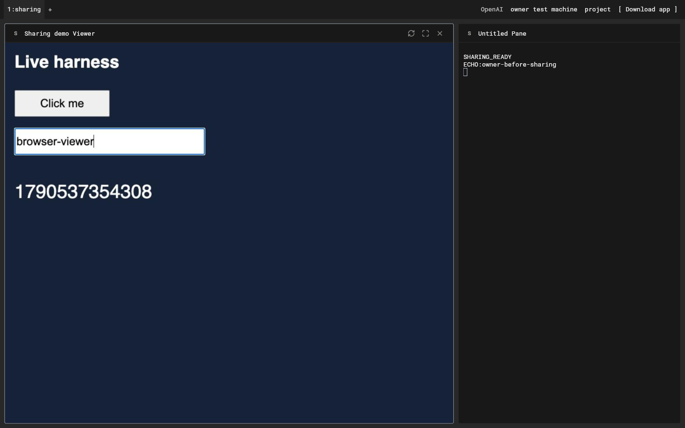

# Web release readiness

This development record is followed by the [September 28 release record](2026-09-28-010-sharing-release.md), including the final combined validation and publication versions.

User objective: bring the latest desktop features to the web, test the complete browser experience, and prepare the website for a public release. Continue using the shared Flutter source; do not replace feature parity with a separate, reduced web interface.

## Current source and evidence

- Fetched `origin/main` on September 27: `93f148d6`, including the latest desktop welcome/new-tab work (`767c1e07`) and phone setup (`244cfe71`).
- Sharing links/comments are complete in PR #394, with hosting support in autonomous-code PR #5. This readiness branch builds on those commits; it has not shipped them.
- Chrome regression run: 48 tests pass for workspace/pickers, login, persistent credentials/machine keys, concurrent refresh/logout, password stretching, encrypted observers and binary terminal framing. This is a starting gate, not evidence for every product workflow.
- The initial full desktop suite exposed 35 stale expectations after recent desktop changes. Corrected those fixtures and expectations. The final complete rerun passed **3,785 tests, 12 existing skips** (`/private/tmp/harness-web-readiness-native-complete.jsonl`), including all browser-machine control changes.
- The final Chrome workspace/machine-control run passed **12 tests**, including Alt-Enter orchestration launch. CLI TypeScript checking passed. Full Flutter analysis has no errors or new findings; its 16 existing findings are one unused test import and 15 test/vendor lint notices.

## Release audit

The completion audit must contain current code and runtime evidence for each of these areas:

1. Latest welcome screen/new tab, working visible actions, keyboard hints, responsive layouts and Download app.
2. Sign-in/callback, private-link return, sign-out/account changes, refresh, browser restart and multiple tabs.
3. Machine discovery, password linking, saved pins, connection errors/retry, settings, rename/remove and offline/reconnect behavior.
4. Agent creation/opening, project selection, engine/model configuration, terminal input/clipboard, control ownership, stop/resume/restart, rename/fork/clone where supported by the engine.
5. Tabs and panes, layouts/zoom/focus, persisted workspace and account desk synchronization, search/commands and browser shortcuts.
6. Store installation, previews/viewers, customization, local models on connected machines and API connections.
7. Public/private sharing, comments, identity verification, revocation and browser reload (full-stack evidence in the sharing plan).
8. Settings, notifications, keyboard practice, usage and phone handoff. Native OS or hardware operations need an explicit functioning browser route or handoff, not a visible dead control.
9. Production hosting routes, asset/cache behavior, startup speed, production build and deployment readiness. Evidence must distinguish local implementation, merged code and the deployed website.

## Implemented and verified

- Fixed the welcome command gate: keyboard practice, quick start, and Work from your phone are available in the browser. Phone setup freezes the selected linked machine and pairs through an authenticated, encrypted owner RPC. Phone widget/transport tests (18) and CLI pairing/crypto tests (41) pass. The real browser welcome action exposed `NO_INTENT` being mislabeled as offline; preserve `WsRequestFailure.code` through the relay adapter. The QR now stays ready to scan, with dedicated regression coverage.
- Added `desktop/scripts/check-workspace.cjs`, run by the isolated backend/daemon fixture. The final expanded run passed in `harness-share-e2e-keODGG`: real browser sign-in, password linking, saved machine identity, phone QR, API-key persistence on the daemon, orchestrator screen, agent selection, ordinary and accessibility terminal typing, interactive viewer clicks/typing, and reload. It then passed public/private/denied browser links and comments, followed by the daemon restart, moderation and revocation checks. The test records actual fixture PTY input rather than assuming keystrokes arrive in one output chunk. The SSO redirect/exchange and model are the only stand-ins; machine transport and encryption are real.
- Fixed browser terminal accessibility input by supplying one editable semantics node in the vendored input adapter. Disabling the enclosing Focus's duplicate semantics fixes switching between custom editors. Read-only terminals publish output semantics instead: the web engine otherwise creates a writable-looking textarea even with its semantic `readOnly` flag. The public-link regression now proves there is no editor. Real viewer-to-terminal typing and a fresh ordinary browser tab both pass; temporary production diagnostic logs have been removed.
- Implemented an owner-only encrypted interactive viewer using the existing isolated Chromium renderer. It is separate from read-only shared observers, scoped to a managed agent viewer, bounded to four surfaces per connection/eight total, and released on disconnect or idle timeout. CLI permission/lifecycle/input tests (187 with existing backend/viewer tests) and Flutter controller/pane tests (17) pass. Real browser mouse and keyboard interaction pass. Chromium must be installed on the agent machine.
- Fixed REST-only browser expiry: invalid credentials return to sign-in even without an open machine WebSocket. Refresh-service outages stay retryable and preserve credentials. Auth/client tests (27) and workspace expiry tests (17) pass.
- API connections, model controls and orchestration now target the selected linked owner machine. Targets remain fixed while editing, disconnected mutations fail instead of queuing, and model controls select the current host when reopened. API metadata persists in UI state; secrets stay on the chosen daemon. Focused Flutter checks: 106 pass, followed by 77 after the panel-switching/learning changes. CLI owner permissions and viewer checks: 200 pass.
- Browser command decisions and task delivery now reuse the desktop services through sealed owner RPCs. The daemon bounds in-flight decisions and aborts them on disconnect; decisions never execute actions themselves. Flutter command/phone/connection checks: 69 pass. CLI command, permission and viewer checks: 189 pass. Chrome workspace/machine controls: 12 pass. The widget fixture initializes the generated Lucide icon library before building the deep widget tree to avoid a DDC module-initialization stack overflow. The production orchestrator dialog also passes the real release-build browser check.
- Reviewed native-only workspace commands and settings against the scope below. Browser controls use a connected-machine route or the existing desktop handoff. Native OS operations and untested engine/provider integrations are listed explicitly instead of being counted as browser runtime coverage.

## Reproducible fixture

The current local fixture uses backend port `54861` and a Flutter preview on
`54862`. Mongo/Redis are disposable fixture services described by
`/private/tmp/harness-sharing-services/services.json`; they are not production
services. Build with `HARNESS_API_URL=http://127.0.0.1:54861`, `HARNESS_TEST=true`,
`HARNESS_CURRENT_WORKSPACE=true`, and `HARNESS_CLEAN_PREVIEW=true`. Run
`cli/scripts/share-harness-e2e.ts` with both browser-check script paths, the
preview origin, and `HARNESS_SHARE_E2E_SERVICES` pointing to that service file.
The fixture redirects each daemon's data/runtime/auth/project paths into its
own temporary directory and blocks external traffic. It does not alter HOME,
CODEX_HOME, the installed daemon, or real account credentials.

Production remains on the previously released web build. Sharing PR #394,
hosting PR #5 and this readiness branch have not been deployed.

## Platform scope and evidence

| Area | Browser implementation and verification |
| --- | --- |
| Welcome, tabs, panes, pickers and shortcuts | Shared desktop widgets; Chrome workspace tests plus the real new-tab, machines, models, agents and command-picker flows. Browser bindings use Alt/Option, including orchestration's Alt-Enter. |
| Auth and persistence | Real fixture sign-in/reload/new tab; Chrome storage, concurrent refresh/logout, private-link return and owner-key tests. REST expiry/outage regressions also pass without a machine socket. |
| Agent lifecycle and workspace state | Shared controllers and daemon RPCs; full native unit/widget suite, encrypted browser transport tests and real managed-agent terminal/viewer connection. Individual engine integrations retain their existing daemon coverage; this audit does not claim a live model run for every engine. |
| Models, APIs, Store and orchestration | Machine-scoped owner RPCs; explicit frozen host in editors; model lifecycle/controller tests and real browser API persistence/orchestration screen. The fixture installs its managed harness locally and opens its real viewer. It does not download multi-GB models or install paid third-party tools. |
| Sharing and comments | Actual anonymous, invited and denied browser accounts; encrypted output/comments, responsive layout, reload, moderation, restart persistence, revocation and rejected observer controls. |
| Settings and phone | Shared preferences, learning/practice, browser activity and remote account usage. Real welcome phone QR, protocol-error regression and cryptographic phone pairing tests. |
| Native platform operations | Local daemon installation, firmware, OS notifications, native image clipboard, keyboard dotfiles and local transcript ledgers stay in desktop; browser settings already omit or explain these controls, with Download app as the handoff. Managed-viewer streaming does not forward native dialogs, downloads or audio. |
| Hosting and release | Existing public preview and hosting pipeline remain unchanged. Shared-link hosting is PR #5 against `deploy/flutter-web`; source is PR #394 plus this branch. The committed production web archive, native debug app and CLI release bundle all build successfully. |

## Final build record

Source: `a84e6c6b27b3b4298d601ed8ba08c32ede6dfd84`. The code and test tree were clean before packaging.

- Production web: `FLUTTER_BIN=/Users/ab/development/flutter-3.47.2/bin/flutter bash scripts/build-web-release.sh 0.1.4` from `desktop/`. Built with the real API default, `/harness-web/` asset base and local CanvasKit resources, with no fixture defines. Archive content, embedded source commit and SHA-256 were verified.
- Local archive: `desktop/build/web-dist/harness-web-0.1.4.tar.gz`, 33,085,657 bytes, 250 files. SHA-256: `0e4b92fc0642fc09af9cc99cfe04465a4e04e35c86e1a063c07cc470c11c1d9c`.
- Native compatibility: `flutter build macos --debug --no-pub --target lib/main.dart` passed. The installed app was not replaced or launched.
- Daemon packaging: `npm run bundle` from `cli/` passed, producing the self-contained CLI and notification hook.

Version `0.1.4` above labels a local verification artifact. No tag, GitHub release, website bundle or daemon deployment was published. Release the sharing backend and updated owner daemon before the desktop/web bundle, and merge the hosting route change when publishing that bundle. The final source and hosting changes still require review and release.
