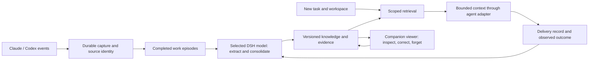

# Coding memory across agent frameworks

Current delivery milestone: the user explicitly scoped a
[two-hour personal-memory MVP](2026-10-03-personal-memory-mvp.md) on October 3.
The broader research and rollout gates below remain a later roadmap, rather than
prerequisites for that bounded review milestone. Its evidence and consent rules
still apply; deferred checks must not be described as completed.

Status: experimental implementation available for review, 2026-10-01; quality validation remains incomplete. The memory core, native transcript reader, durable learning loop, restricted inference adapters, worker isolation and owner library have executable tests. Opt-in host capture, scoped collection recall, native prompt adapters and the desktop Memories viewer are connected. Synthetic native probes cover next-user-prompt delivery after resume, manual compaction and a model change in Claude 2.1.286/2.1.287 and trusted interactive Codex 0.159.3. The older Codex 0.159.0 prompt certificate remains. Local synthetic recall performance has been measured; real extraction quality, full native lifecycles and production integration remain unverified. The [sequential review log](2026-09-30-coding-memory-review-log.md) records findings, fixes, and remaining completion evidence.

Codex **0.159.3 prompt delivery and background extraction have separate status**. Its trusted prompt
hook can receive existing memory, but its restricted extraction command remains uncertified. Local
mock checks observed native startup error items for both an old model label with missing metadata and
a current model with code-mode hosting disabled. The adapter continues to reject those error items;
it does not switch models or enable execution to make the check pass. See the
[native lifecycle and extraction evidence](../research/2026-10-01-memory-native-lifecycle.json).

The executable [six-case extraction diagnostic](../research/2026-09-30-memory-extraction-cases.json) now exercises the actual learner, admission and recall. Its [first native attempt](../research/2026-09-30-memory-extraction-baseline.json) stopped with native login unavailable. That result was traced to missing OS login names in the restricted adapter environment and fixed. The [latest attempt](../research/2026-10-01-memory-native-quality-blocked.json) then stopped at the selected Claude account’s weekly usage limit: **zero completed extractions**, no quality score. This is separate from the 64 design scenarios and from the required held-out evaluation.

The review build now exposes the local opt-in in **Settings → Experimental → Coding memory**.
It defaults off per account on this computer; the existing environment flag supplies only an unsaved
default. The companion and watching gates still apply. A saved off stops coding-memory capture,
learning and recall without deleting records. The [later native diagnostic](../research/2026-10-01-memory-native-quality-blocked.json)
corrected the login-environment defect but stopped on the selected provider's weekly usage limit,
again with zero completed extractions. Neither the setting nor the UI review satisfies the model-quality gates.

Companion experience: a coding agent understands how the developer works, the project's engineering decisions, and the state of the current task. Tim can explain what he remembers, where it came from, and when it may no longer apply. Switching Claude Code to Codex, or Tim to GNU, should preserve that knowledge.

Scope: coding work on one machine across agent frameworks, beginning with Claude Code and Codex. The [coding product model](2026-09-30-coding-memory-product.md) defines developer work contexts, preferences, design taste, technical knowledge, and their boundaries. General DSH domains, cross-machine transport, merge resolution, and account synchronization are outside this release. [Research and source comparison](../research/2026-09-30-cross-framework-memory.md). [Evaluation cases](2026-09-30-tim-memory-cases.json).

The [design council](2026-09-30-coding-memory-council.md) explains the source-grounded engineering principles behind this design and its pairing contract. [Synthetic records](2026-09-30-coding-memory-examples.json) make conditional style, decision rationale, and evidence limits concrete.

The [modern practitioner study](../research/2026-09-30-modern-coding-memory.md) adds workspace guidance, task-specific feedback loops, reusable working examples, experiment history, and a maintained coding notebook. These are design inputs from public work, not preferences seeded into users' profiles.

## 1. Product contract

Memory belongs to the user's Harness profile and its permitted coding projects. The collection DSH remains the existing host for the companion and supplies the intelligence; DSH is not the memory's domain taxonomy. Companions are personalities over this knowledge, not ten disconnected knowledge stores. Preserve one collection DSH, the viewer on the left, and its real agent terminal on the right.

Learning begins with the first eligible interaction after companion learning is enabled. The user need not chat with Tim or ask for a history scan. Existing experimental and watching controls remain effective. Onboarding should make learning available from day zero and explain its scope once. The 24-hour review remains an explicit migration/testing tool, not the steady-state design.

When the DSH model is unavailable, authorized observations remain queued. Tim says learning is waiting for the selected model; he does not report that nothing useful happened. Capture, consolidation, and recall have separate status. Existing knowledge can still be recalled while inference is deferred, unless recall or the experiment is disabled.

The product succeeds when the next coding task needs fewer repeated corrections, avoids a previously diagnosed trap, preserves a decision's intent, or resumes an investigation without losing evidence. Model developer defaults, project knowledge, and temporary working state separately. A fixed programmer personality, memory counts, XP, and the number of summaries are not success measures.

## 2. What is worth remembering

Require an answer to: **What specific future decision would change because we saved this?** A valid automatic candidate also needs evidence, scope, a retrieval cue, and an explanation of what it adds beyond current instructions and inexpensive repository inspection. Saving nothing is a normal successful result.

| Kind | Useful example | Boundary |
| --- | --- | --- |
| Working preference | A user explicitly prefers small, reviewable changes and concise explanations of tradeoffs. | Record the stated scope. One emergency patch does not establish a permanent change-size preference. |
| Project decision | A service keeps one transactional database because operations must stay manageable for its small team. | Preserve the reason and source. If authoritative project instructions already cover it, link there and avoid duplicate injection. |
| Verified pitfall | A particular test failed under parallel execution because two fixtures shared a port; isolation was tested successfully. | Include the failure signature, applicable version/environment, and evidence of the fix. Repeating a failed command is not verification. |
| Reference | The source of truth for a team's release decision is a particular document or issue. | Remember where to verify, not a permanent copy of changing external facts. |
| Working continuity | A task is waiting for the user to reconnect a USB device; no firmware was written. | Temporary task state, closed when resolved. It must not become a permanent deployment rule. |

Reject generic advice, transcript recaps, trivial codebase summaries, and unaccepted assistant suggestions. Do not infer personality traits or sensitive personal attributes from working behavior. A useful project-specific shortcut may be retained when rediscovery is expensive; it must have a measurable retrieval benefit and a validity check.

Classify coding knowledge by facet, independently of memory kind: engineering priorities, reasoning and feedback, code style, architecture, stack/storage, visual design, interaction design, verification, collaboration, topic-specific familiarity, project/domain decisions, and working continuity. Distinguish stated preference, observed usage, project constraint, accepted decision, verified finding, learning goal, and temporary state. Using a database in one repository does not establish a personal database preference. A question about a language does not establish overall skill level. The product model supplies examples and admission boundaries.

Preserve useful negative knowledge: an approach that failed under known conditions, why an alternative was rejected, and what would justify reconsidering it. Such a record may be active knowledge; it is different from a memory candidate rejected for poor evidence. External engineering references never become personal preferences without user evidence. The working project model and developer profile are projections of records, not independent generated biographies.

First release does not automatically turn remembered commands into executable skills. Keep existing approved skills available. Promotion to a reusable procedure needs verified preconditions, outcome evidence, and explicit publication review.

## 3. The learning and recall loop



### Capture

Reuse Harness's admitted native transcript paths and engine formats for permitted coding work. Live normalized events can wake capture, but their shortened tool-output previews are not complete evidence. A conversation in a coding CLI can concern another domain, so engine identity alone is not sufficient inclusion evidence. Use the authorized project's coding context and the actual task; exclude unrelated conversations rather than assigning them developer-profile traits. Keep role, engine/session/turn identifiers, tool call/result pairing, timestamps, workspace identity, and parent/subagent relationships. Do not split shell script bodies into independent successful commands. A quoted user message inside tool output remains tool-output data.

Persist an ingestion cursor and normalized event before acknowledging capture. Deduplicate by native session/event identity plus revision, not just text: the same words in two independent conversations can be legitimate supporting evidence. Preserve source-root lineage through replays, forks, imports, and memory injections so echoed content cannot reinforce itself.

Build episodes around a completed user request and its work, not arbitrary groups of eight truncated turns. An episode records intent, relevant correction/decision, attempted actions, verification, and unresolved questions. Retrieve only the evidence spans needed for a candidate. Long episodes can be chunked, but each extraction knows the missing boundaries and cannot claim an unseen outcome.

The capture implementation now marks intact segments of long turns as **bounded context** instead
of source-incomplete. Oversized or unreadable records remain in separate incomplete episodes.
Extraction from bounded context is limited to self-contained explicit user preferences, constraints,
decisions and learning goals; the publication transaction rejects inferred knowledge, outcome claims
and non-user evidence from those segments. Context survives restart and is reset at the next native
turn boundary. This is a structural limit, not proof that the model's paraphrase is faithful.

The queue context requires store schema 2. Opening a schema-1 store adds the metadata and preserves
records, evidence, controls and privacy settings in one transaction. Existing memory records keep
their version-1 format. Older runtimes refuse the upgraded store rather than misreading bounded
segments as complete work; rolling back the app therefore makes coding memory unavailable until a
compatible runtime is used. The wider migration/rollback rollout gate remains open. No production
store was upgraded during the private replay.

When present, preserve the considered alternatives, explicit rationale, expected result, observed result, and reasons to revisit a choice. Do not invent missing alternatives or request private model reasoning traces. User-facing explanations, reviewable artifacts, and observable work are sufficient sources. Capture a benchmark's conditions and a test's coverage rather than promoting a success message into a universal technical conclusion.

Use existing authorized transcript storage as the primary archive. The memory database holds locators, small redacted evidence spans, and hashes rather than a second complete history. Apply redaction before sending evidence to inference, before persistence, and before export. Retention gaps are explicit; a missing source cannot silently become confirmed evidence.

### Extract and consolidate

After a completed turn, enqueue an episode for background review. Explicit corrections and decisions get priority. Quiet-period batching handles routine work; idle session closure handles unfinished episodes. Stop hooks enqueue and return—they never start another foreground conversation or keep the user's terminal running to perform memory work.

The implemented scheduler waits 15 seconds after a fresh local root-agent turn starts and yields while the selected collection companion is busy. Streamed output, tool results, compaction, completion, replay/resume and subagent work do not continually restart that timer. Other coding agents and remote machines may keep working while a completed local episode is reviewed. A new local request interrupts review; its source is requeued for the next quiet window, with the attempted call still counted against the existing six-per-hour budget. Account, privacy and model changes retain their independent cancellation/publication checks. This priority policy does not establish zero latency or quota impact on other agents sharing the provider account; that needs real-model measurement before rollout.

Use `CompanionIntelligence` with the collection's observed engine, account, model, and effort. Extraction is a bounded, tool-free request returning a schema-validated proposal. It cannot execute remembered commands or mutate the store. Profile generation and collection identity are checked again before commit; a stale result is discarded and requeued under the current profile. No hidden fallback provider or cheaper model.

The extraction request carries the original lease's selected context. Cancellation is registered before asynchronous account lookup. After the native version probe, the adapter rechecks native account metadata, then synchronously checks the host owner, consent, Learn preference and selected runtime immediately before process launch. A changed context leaves source work pending rather than recording a successful abstention. These checks close host startup gaps; they cannot atomically lock a native CLI's credential lookup against an external login change after launch. The post-result and transactional publication checks still apply.

The request contains the episode, matching existing memories, and relevant known instructions. Output contains candidates or a typed no-change reason. For every candidate, the service checks referenced evidence IDs, assertion type, coding facet, scope, novelty, applicability, conflicts, secrets, and injection attempts. Preserve why a choice was made, the conditions under which it applies, and accepted exceptions. Model-generated confidence alone cannot activate a memory.

Admission rules:

- An unambiguous user-stated preference or correction can become private active knowledge after one interaction, within its supported scope.
- A technical conclusion needs observable supporting evidence. Assistant claims alone leave it tentative.
- Inferred preferences stay tentative until independent evidence supports them; repeated replays or agent echoes do not count. A second occurrence is evidence to review, not automatic proof.
- A direct user correction can supersede the corresponding prior claim. An assistant proposal cannot override it. Ambiguous conflicts are withheld from behavioral guidance until resolved.
- A literal user request to remember something can be saved as a user note, subject to scope and secret handling. The service verifies the originating user event; a model cannot grant itself this authority by setting `explicit: true`.

Validate evidence at field level when a record combines a user decision with tool observations. The user may have chosen an option without establishing its technical success. A required invariant and a claim that code satisfies it must remain separate assertions. A reasoned argument without independent validation remains labeled as such; extraction cannot upgrade it to a verified proof.

Private knowledge becomes useful without an approval inbox for every note. Publishing team-facing instructions, changing repository policy, exporting skills, or enabling broader sharing remains a separate deliberate action. Approval for publication does not certify that a memory is factually correct forever.

### Recall

At a new prompt, query with the current request, project, active task, work stage, artifact type, relevant paths/symbols, and known environment. Retrieve only coding facets that can change this task: storage choices for an architecture decision, design references for a screen, or a prior reproduction and hypothesis for debugging. Session start supplies only a tiny project/user orientation if useful. Do not inject a history digest or a full developer biography on every turn.

Retrieval pipeline:

1. Enforce profile and project access before search. Remove forgotten, superseded, excluded, and conflicting records. Global preferences must be explicitly global; unknown scope is never treated as global.
2. Match lexical terms, identifiers, file/component cues, and applicability. Begin with SQLite FTS5 and indexed metadata. Search aliases can be produced during consolidation. Add semantic retrieval only if paraphrase cases show a meaningful gap; it must use the same access filters.
3. Rank by task match, evidence class, applicable scope, verification freshness, and independently demonstrated usefulness. Reading or injecting a memory does not increase belief strength.
4. Remove duplicates, including information already present in loaded instructions or the current context. Prefer source-of-truth references for facts cheaply verified from the workspace.
5. Return a compact packet with IDs/revisions, typed claims, applicable conditions, source labels, selection reasons, and cautions. Distinguish personal defaults, project requirements, observed results, and unresolved investigation leads. Preserve a failed approach's limits and reasons to reconsider it. Start with a combined orientation/recall cap of roughly 1,000 tokens and at most six items; these are proposed limits to tune in evaluation.

No relevant result means no injected memory. The agent can search for more through CLI/MCP and open evidence details on demand. A recall miss is not a reason to dump the entire collection.

Perform local checks on drift-prone facts where cheap: an instruction file revision, a relevant dependency version, or a configuration fingerprint. A changed repository HEAD alone does not invalidate every memory. Technical advice with unknown applicability is returned only as a lead to verify, not an instruction to act.

Extraction and explicit recall share a small context vocabulary: `taskType` names the activity and `productionIncident` is a known boolean; `language`, `framework` and `environment` preserve established constraints. The remaining condition map is extensible and matches exact typed values. Unknown context is omitted, not guessed or defaulted to false. Project identity is supplied by the host, not duplicated in inferred condition fields. The CLI exposes the same explicit conditions as MCP through `recall_memory <query> --conditions <JSON>`. This vocabulary is guidance, not a semantic matcher or a migration of old keys. Automatic prompt recall still has no task classifier and does not manufacture conditions.

The receiving LLM follows the current task and instruction hierarchy. A preferred reasoning sequence can change its first move; it cannot suppress a necessary check or make an unsuitable design correct. Surface a specific conflict between a preference and current evidence, then use an appropriate alternative within the current authorization. History does not require agreement with a past choice.

### Feedback

Separate `selected`, `delivered`, `read`, `agent_reported_applied`, `outcome_observed`, and `user_confirmed`. A hook successfully printing JSON proves only that it emitted a packet; a host trace/acknowledgement is needed to mark model-context delivery as verified. If a host lacks that signal, show delivery as unverified.

An agent's report of use can link to a diff/test result, but it is not independent proof of causation. Evaluate benefit using controlled tasks and explicit user feedback. Corrections reduce confidence or supersede a claim. Do not reward memory generation or encourage agents to announce every recollection.

Implementation checkpoint: the owner can inspect recent recall in a memory's detail view and mark one memory revision helpful or unhelpful, change the rating, or clear it. The rating is bound to an actual retained receipt and receiving engine/session/project, explicit task/branch scope and known conditions. Repeated recall across transport routes in that same context shares one rating. It is owner-reported usefulness, not a new source supporting the claim, proof of model-context delivery, or a causal task-outcome measurement. For a matching receiving project, explicit task/branch scope and exact known conditions, these labels now make a small, reversible adjustment to lexical ordering across Claude and Codex. The adjustment applies only to already eligible candidates at the rated revision; it cannot admit a hidden, expired, unrelated or overridden memory. Sparse ratings are shrunk toward neutral and their maximum influence is below 12.5% of the lexical score. This is an experimental policy, not a calibrated confidence or proven task improvement.

The owner history uses one-way session/context keys without copying native session IDs or prompt text into receipt metadata. It checks both source visibility and the receiving session/project before limiting results, including privacy changes written by an earlier daemon. Making a receiving session private or excluding its project removes its owner-visible activity and feedback; reinclusion starts new activity. Repeating an exclusion or reincluding a policy changed by an older writer also removes the old activity before returning. Corrected memory revisions do not inherit old ratings, and forgotten memories lose their feedback through deletion dependencies. Feedback expires with its receipt under the existing thirty-day/5,000-receipt retention bound. Legacy receipts without captured receiver authority remain unavailable for owner feedback rather than having their context guessed. Retained ratings from before the separate relevance key was captured stay inspectable but do not influence ranking. Missing or ambiguous multi-project relevance also stays neutral.

### Continuous learning and improvement

Every eligible coding session supplies an opportunity to learn from its first interaction. A session may add a new fact, corroborate an existing claim, expose a counterexample, narrow a condition, close unfinished work, or produce no useful change. Capture and assessment are continuous; manufacturing a new memory every session is not a success criterion. The collection's selected intelligence supplies extraction and consolidation, with durable waiting states when unavailable.

Separate three feedback loops:

1. **Knowledge:** update sourced claims, conditions, decisions, and task continuity. Preserve prior revisions. An independent user statement or verified native observation can corroborate the same meaning; replays and generated summaries cannot create independent support. A correction changes the meaning being supported and invalidates derived notes.
2. **Usefulness:** attach selection, verified delivery, reported use, outcomes, and direct user feedback to particular memory revisions and task contexts. An episode-wide success must not increase every recalled memory's standing. Irrelevant guidance can be correct yet unhelpful. A failed task can still contain a valid discovery. Keep truth support, contextual usefulness, and recency separate.
3. **System quality:** collect failure cases, propose a versioned extraction/retrieval change, evaluate it against a frozen baseline and held-out cases, then promote or roll back the configuration. The candidate may not rewrite its acceptance tests or promote itself using its own success narrative. Improvements must preserve scope isolation, correction, forgetting, no-recall behavior, budget, and task correctness before optimizing utility.

The initial reinforcement implementation keeps independent source/session counts as provenance, not a model-generated confidence percentage or an automatic ranking reward. Context-specific ranking uses explicit owner ratings attached to actual retained preparation receipts; native model-context delivery remains unverified unless separately established. Repeated recall alone creates no utility reward. Controlled task outcomes are still required to evaluate the provisional ranking policy. Shared skills or repository instructions remain explicit engineering changes within the existing authorization model; background learning is not a permanent permission to edit every workspace.

Research supports testing these distinctions, without proving this implementation. ACE studies incrementally curated context rather than repeated wholesale rewriting; our application is to retain granular claims and regenerate dependent views. [ACE, v3](https://arxiv.org/abs/2510.04618v3). RoMeRL identifies misleading credit assigned to irrelevant memories retrieved alongside useful ones; we therefore require feedback attribution rather than rewarding an entire packet. [RoMeRL, v3](https://arxiv.org/abs/2608.02508v3). EDV studies separating experience generation, distillation, and verification; our verification contract still requires native evidence or user confirmation, because agreement among models alone is not proof. [EDV, v1](https://arxiv.org/abs/2606.24428v1).

Evaluate improvement chronologically: learn only from earlier episodes, then test later tasks and updates. Include correct abstention, temporal changes, and multi-session evidence in addition to extraction accuracy. LongMemEval motivates these separate dimensions; its chat benchmark cannot substitute for our real coding and cross-framework acceptance tasks. [LongMemEval, v2](https://arxiv.org/abs/2410.10813v2).

## 4. Data and consistency model

Use a profile-local SQLite database under the Harness data directory. Reuse the managed Node/SQLite availability checks; unavailable memory storage must not prevent an agent launch. Keep indexed queries and writes short or off the daemon's latency-sensitive thread. JSON export is portable; Markdown projections are inspectable and regenerated. The database is authoritative for identity, scope, provenance, and revisions.

| Entity | Required information |
| --- | --- |
| Project | Opaque stable ID; local checkout/worktree aliases; component scopes; separately stored local paths. |
| Source event | Native engine/session/event ID, role/trust class, source-root lineage, observed time, authorized locator, redacted evidence digest. |
| Episode | Source range, user intent, work mode, acceptance criteria, remaining gaps, considered alternatives when known, expected and observed outcomes, verification limits, project/worktree/revision, incomplete/complete status. |
| Memory revision | ID, revision, kind, coding facet, assertion type, claim, rationale, future-action cue, scope, conditions/exceptions, evidence links, optional style/decision/experiment/reference detail, status, validity, extraction profile and prompt version. |
| Relationship | Supports, contradicts, supersedes, derived-from, references; endpoints and provenance. |
| Derived topic page | Scope, topic, page revision, structured claims and unresolved questions, supporting memory revisions, generation profile/version, dependency digest, valid/invalid state. Readable Markdown and viewer content are renderings. |
| Job | Source cursor/range, idempotency key, lease, attempts, retry time, profile generation, typed result. |
| Recall receipt | Session/turn, memory IDs and revisions, query/context digest, tokens, selection reasons, delivery route and verification level. |
| Feedback | Receipt ID, reporting actor, outcome evidence, observation class; no conflation with causal benefit. |
| Tombstone | Deleted identity/revisions and minimal suppression information; no forgotten claim text. |

A memory revision carries both when its claim applied and when Harness learned it. Evidence classes are `user_stated`, `observed_verified`, `inferred`, and `imported`; these are not probability estimates. A conflict key groups claims about the same scoped subject and property. Updating creates a new revision with evidence; broadening scope requires new support.

Optional `details.style` records a preferred feedback sequence and attribute-scoped example references. `details.decision` records the problem, alternatives, choice, expected and observed outcomes, and revisit conditions. `details.experiment` records a hypothesis, intervention, result, and limitations. They use the same envelope and admission rules as other records. Evidence links can specify JSON-pointer `paths` to the fields they support. Split claims with incompatible scope or validity instead of hiding disagreement in a long detail object.

Optional evidence `verification` metadata identifies a method (`test`, `benchmark`, `static_analysis`, `proof_review`, `visual_review`, `manual_check`, or `operational_observation`), result, artifact, environment/revision, coverage, assumptions, and limitations when known. Operational evidence also records the observed build/deployment identity and time window; it must not certify unrelated code or environments. A tool's successful exit verifies an observation, not every explanation or causal claim attached to it. Omitted metadata means unknown, not unrestricted validity. Recheck triggers belong in `validity.recheckWhen`; they are data evaluated through trusted checks, never executable source instructions.

### Workspace resources and experiment details

Use optional `details.reference` for canonical instructions, relevant documentation, tools, and working examples: resource type, locator, owner/authority classification, source revision or content digest, task triggers, capability demonstrated, dependencies, and verification limits where supported. Recompute inexpensive workspace inventories rather than admitting every file as a memory. A scoped reference points to current authority; it does not acquire that authority itself. A copied third-party rule file remains reference data unless adopted through an authorized workspace change.

Resource presence, host discovery, and actual loading are separate observations. Recheck a pointer when its content or location changes; do not preserve obsolete commands as overriding guidance. Remember adapter/model/tool versions with capability observations and revisit them after changes. The selected DSH model still controls consolidation; capability history cannot silently route learning to another provider.

Working examples need an accessible source revision, the capability actually exercised, dependency/environment requirements, and evidence. They can guide implementation; they do not authorize copying from excluded projects, executing remembered commands, or assuming compatibility with a new dependency version.

For measured comparisons, extend `details.experiment` with objective and direction, evaluator and dataset identities/revisions, baseline and candidate revisions, hardware/environment, budget and what it includes, observations, disposition, and limitations. Model run status (`completed`, `crashed`, `timed_out`, `invalid`) separately from disposition (`kept`, `discarded`, `pending`). Failed runs have no valid performance score; normalize any imported sentinel to a null score while preserving its source status. Distinguish a measured improvement from an accepted design change. Changed evaluators, workloads, hardware, or budgets invalidate an unqualified ranking. Preserve useful failed approaches with their conditions; do not admit every experiment as a durable preference.

Episode acceptance criteria describe what the current task needs, not a new authority system. Acceptance of a visual prototype does not establish tested integration or authorize deployment. Parallel branches retain their own observations and hypotheses until evidence supports a project-wide decision. Live task ownership and locks come from the runtime, never from a remembered statement that another agent was working.

### Maintained coding notebook

Compose short project/topic pages from authorized active records: the current explanation, important rationale, working examples, verification, and open questions. Each substantive statement retains supporting memory IDs and revisions; record metadata still distinguishes an accepted decision, a hypothesis, and an observed outcome. Unsupported connective claims are omitted or proposed as candidates, not smuggled into prose. An unresolved contradiction stays visible rather than becoming an invented consensus.

Use the selected collection DSH model through the same bounded, tool-free, schema-validated proposal flow. The service checks dependencies, profile generation, access, and current record revisions again when committing a page. Scope is no broader than all supporting records permit. A page or saved answer inherits source lineage and cannot independently corroborate its parents.

Corrections, supersession, exclusion, and forgetting synchronously invalidate dependent pages, indexes, cached packets, and managed projections before future delivery. Rebuild asynchronously from remaining valid support; do not serve an old complete page while regeneration waits. Use revision/digest checks and atomic publication to prevent stale jobs from restoring invalidated content. Purge forgotten text under the existing deletion policy. Ordinary queries can still retrieve valid source records while a topic page is unavailable.

The notebook is a derived view over SQLite, not a separately editable authority or a replacement for repository documentation. Viewer corrections go through the memory API. An export includes provenance and a generated-file marker; plain edits to an export do not become user instructions. Navigate a bounded topic index, then a relevant summary, then evidence on demand. Indexes obey the same access controls and recall budget as claims.

Illustrative coding record. This is a hypothetical developer preference, not an inference about the current user or a saved production memory:

```json
{
  "schemaVersion": 1,
  "id": "mem_storage_preference",
  "revision": 1,
  "kind": "working_preference",
  "facet": "stack_and_storage",
  "assertionType": "stated_preference",
  "scope": { "profileId": "profile_example" },
  "claim": "For new transactional web services, the user prefers PostgreSQL.",
  "rationale": "The user values familiar SQL tooling and few additional systems.",
  "futureAction": "Use this as a default candidate when selecting storage, subject to the current project's requirements.",
  "applicability": { "workload": "new_transactional_web_service", "topics": ["database selection", "persistence"] },
  "exceptions": [{ "when": { "deployment": "offline_single_user_client" }, "prefer": "SQLite" }],
  "evidenceClass": "user_stated",
  "evidence": [{ "sourceEventId": "example_user_storage_statement", "relation": "supports" }],
  "state": "active",
  "conflictKey": "profile_example:new_transactional_web_service:database_preference",
  "publication": "private",
  "validity": { "validFrom": null, "validUntil": null, "lastVerifiedAt": null },
  "supersedes": []
}
```

State progression: candidate → active, tentative, rejected, or merged. Active → superseded, needs-verification, archived, or forgotten. Tentative records do not enter ordinary behavioral recall. Explicit memory/history questions may expose them with their uncertainty. Age alone cannot erase a durable preference; retirement depends on applicability, contradictory evidence, or user choice. Temporary continuity has its own expiry/completion policy.

An active continuity record can accurately report that a hypothesis is still untested. Its active status confirms the recorded investigation state, not the hypothesis. Deliver these as labeled leads for that task, separately from facts or behavioral guidance. Derive the working project model from these records and accepted project knowledge; it does not introduce another independently edited source of truth.

Ingestion and source cursors commit atomically. Extraction jobs are at-least-once with idempotent commits. Consolidation uses a per-profile/project lease and compares input revisions on commit; conflicting updates rebase/retry. Queue states distinguish `no_useful_memory`, `waiting_for_model`, `budget_deferred`, `source_incomplete`, and failure. Budget exhaustion must never advance the source cursor as if learning succeeded.

Start with the existing bounded inference budget, applied to episodes rather than tiny signals. Prioritize foreground companion work and urgent corrections; expose queued age and consumed budget. Backlog limits must preserve cursors and report any source-retention gap instead of silently dropping unreviewed work.

The implemented queue now leases up to four compatible complete episodes per reservation, with the same six-reservation hourly limit. It considers at most sixteen ready jobs in the selected project, requires exact task/branch scope equality (including unknown scope), and retains the 128-source/96 KB source limit. Priority still selects the first episode; another call cannot concurrently lease the same project. Small compatible episodes can therefore fit twenty-four reviews into six reservations, but actual throughput depends on source size, scope, failures and availability. This is a capacity bound verified with synthetic input, not measured provider performance or cost.

Batch membership is durable, while the extraction prompt uses explicit episode boundaries and preserves original event roles and session identities. Shared source text appears once and does not create additional independent evidence. The store reconstructs membership and scope independently of the supplied lease. Publication, interruption and retry operate on the group; privacy or source invalidation prevents any partial publication and releases only members still owned by that lease. Successful publication gives each episode its own outcome based on cited evidence. Failed batches retry episodes individually. An older queue gains the additive membership table on open; pre-batch in-flight work retains its sources and can be claimed again after its lease expires. Real-model batch quality and provider resource impact remain unverified.

## 5. Project identity and knowledge boundaries

Use a generated project ID and a registry of authorized aliases. Within a local Git repository, worktrees resolve through the common Git directory. Components can narrow applicability; worktree/branch overrides handle temporary experiments. Separate clones can be linked deliberately. A remote URL is a discovery hint, not proof of identity or authority. Forks and unrelated repositories with the same directory name remain distinct.

No absolute path, engine session ID, avatar ID, or remote credential is the canonical memory identity. Keep local locators in a separate mapping. Stable opaque IDs, revision relationships, and tombstones prepare for later synchronization without implementing distributed ordering or last-writer-wins now.

One companion collection can access the projects explicitly allowed by the profile. It does not gain access to a different collection's excluded conversations merely because the same model account is used. Switching the selected companion changes presentation, not the knowledge owner or access rules.

## 6. Cross-framework delivery contract

The portable contract is a memory service with CLI and MCP surfaces, plus engine-specific lifecycle adapters. Native memory continues to work. Harness does not rewrite Codex's generated memory files or silently disable either agent's native memory.

Proposed operations:

```text
recall(query, context, budget) -> packet + receipt
search(query, narrowedScope, limit) -> compact matches
read(memoryId, revision?) -> content + evidence + applicability
propose(candidate, sourceEventIds) -> admitted | tentative | merged | rejected
feedback(receiptId, memoryId, outcome, evidenceIds) -> recorded
correct(memoryId, expectedRevision, userEventId, replacement) -> revision | conflict
forget(memoryId, expectedRevision, userAction) -> deletion receipt
status() -> capture coverage + learning queue + adapter readiness
```

Scope and identity are bound by Harness to the authenticated local session; tool arguments can narrow access but cannot widen it. A model cannot fabricate user-action authority. Viewer actions reuse verified-window capabilities, and terminal actions must reference an actual authorized user request. Writes are proposals validated by the service, not arbitrary filesystem edits.

| Adapter | Capture | Automatic recall | Initial support commitment |
| --- | --- | --- | --- |
| Claude Code | Existing normalized reader plus lifecycle events and authoritative user-role attribution. | Opt-in UserPromptSubmit task recall is certified for 2.1.286 and 2.1.287. | Synthetic print-mode probes observed fresh context on the next user prompt after resume, manual compaction and a model change. Automatic mid-turn compaction, profile changes and other TUI paths remain unverified. |
| Codex | Existing normalized reader; supported hook events identify prompt/turn boundaries. | Opt-in UserPromptSubmit recall supports tested 0.159.0 and 0.159.3. Native folder and hook trust remain required. | Trusted interactive 0.159.3 probes observed developer-role context on the next user prompt after resume, manual compaction and a model change. Additional unidentified requests omitted the marker. Automatic mid-turn compaction and profile changes remain unverified; extraction is still certified only for 0.159.0. |
| Other Harness engines | Existing readers where available. | CLI/MCP and the existing runtime context bootstrap; native hooks added individually. | Search/manual recall only until automatic delivery is demonstrated. No blanket compatibility claim. |

These hook mechanisms are supported by the [Claude documentation](https://code.claude.com/docs/en/hooks) and [Codex documentation](https://learn.chatgpt.com/docs/hooks). Installing a hook does not establish that it is trusted or firing. Setup merges only Harness-owned entries, preserves other hooks, and exposes required native trust steps. Never bypass the agent's trust controls.

Use a small trusted wrapper around serialized memory data, explicitly identifying it as fallible prior context. The packet grants no permissions and cannot override current user intent or authoritative instructions. This matters particularly where a host injects hook output at developer priority: raw source text must not become a new instruction layer.

Use a short local recall deadline; the target is p95 below 100 ms on a warm 10,000-record store with a 200 ms caller deadline. On a timeout, continue the user's task and report degraded recall. Do not synchronously invoke an LLM, download an embedding model, or traverse the entire transcript archive from a prompt hook. Scoped worker recall measured warm p95 at 19.5 ms. The receipt-producing path with 5,000 retained receipts measured warm p95 at 39.5 ms and new-worker p95 at 50.9 ms, with zero timeouts over 310 requests. This establishes local performance checkpoints, not retrieval quality or live-hook latency. [Measurements and limitations](../research/2026-09-30-memory-performance.json).

Add a runtime context fallback for supported DSH launches, with a discoverable recall command and read-only projections. It provides a useful baseline but is not equivalent to verified automatic recall. Do not inject keystrokes into a terminal or rewrite the user's prompt. Existing sessions require capability detection; report that reconnection or restart is needed when the host cannot load a new hook live.

Imported native memories are read-only candidates with engine, file revision, source roots, and unknowns preserved. Review by the same gates; do not treat agent-generated imported text as user policy. Exclude Harness packets and derived echoes from fresh evidence to avoid circular reinforcement. If exact origin tracking is unavailable, conservatively classify duplicated material as dependent evidence.

## 7. Controls, correction, and forgetting

Expose Learn and Recall separately, together with project exclusions and a private-conversation control. Experimental-off stops capture, inference, delivery, and in-flight commits. Stopping the collection's intelligence stops generation; existing private knowledge is retained. Keep the existing watching boundary rather than widening it during migration.

Before consolidating an episode, verify its current inclusion state. Changing that state invalidates queued/in-flight jobs. A private session contributes no evidence to shared/profile memory. Provider processing follows the selected DSH account and model; “local storage” must not be described as “no content leaves the machine.”

The owner can now limit a personal memory to one known, included project through the same preview/apply capability used for corrections. This preserves the claim, conditions, retained evidence and independent support; it records a separate scope decision rather than inventing another confirming user statement. Tentative and unresolved memories remain uncertain. A conflict with existing project knowledge holds both claims for review and appears in the preview. Narrowing creates a revision, invalidates dependent synthesis and pending source reviews, and withdraws the broader revision at a later recall boundary. It cannot widen scope or move a project memory to another project. Earlier native conversation context is not erased.

The project picker searches redacted display names and local folder paths stored separately from opaque project identity. Those labels are owner-facing metadata and are not added to extraction or recall packets. Worktrees share their common repository label; deliberately linked clones retain the first label. Older projects without a label use an ID fallback until their locator is next observed. Exclusions apply before the bounded search page and are checked again when previewing/applying. Browsing, paging and cancelling have no write effect.

Forget removes the memory's revisions, evidence excerpts owned only by it, derived summaries, FTS/optional vectors, projections, and future retrieval cache entries. Recompute shared derived beliefs from remaining authorized support. Keep a minimal tombstone and source suppression so replay does not immediately recreate the forgotten claim. New explicit user instruction can permit relearning.

The operation does not erase original conversations owned by Claude/Codex, their own independent memories, or packets already present in a running conversation. Mark affected sessions and suppress future delivery; send a scoped revocation notice at the next supported boundary and offer a fresh session where needed. Do not promise retroactive removal from provider history. Track publication destinations too: a private deletion receipt must identify any separately published copies, and an explicit withdrawal removes Harness-owned exports without overwriting unrelated edits. Backups and audit logs require a retention/purge policy; never retain deleted claim text indefinitely under the label “audit.”

## 8. Companion viewer

Keep the actual DSH terminal on the right. The left viewer's Memories area has three views:

- **What Tim knows:** separate “How you code”, “Project knowledge”, and “Work in progress”. Show natural sentences and their reasons, with optional coding-facet filters. Open a card for evidence, conditions, exceptions, and last confirmation. Correct, narrow scope, or forget it. Show topic-specific familiarity and requested learning support without developer scores or fixed personality labels.
- **Helping now:** memories selected for the active task, why their conditions match, relevant conflicts/unknowns, and precise delivery status. “Provided to Codex” is distinct from “You confirmed this helped.” Accepted examples open at their reviewed revision with the approved attributes identified.
- **Learning:** quiet status such as caught up, reviewing completed work, waiting for the selected model, or missing source history. Rejected generic candidates are diagnostic detail, not an inbox demanding attention.

Implementation checkpoint: the viewer offers How you work, Project knowledge, Helping now and Learning, with retained evidence, owner corrections, project scope narrowing, dependent-forget previews and separate Learn/Recall preferences. The project picker and detail view show persisted names and folder paths. Memory details include recent recall and explicit helpful/unhelpful feedback; ratings keep the detail open, support clearing, and offer a fresh read after an uncertain reply without automatically retrying the write. The agent terminal remains unchanged. Project knowledge includes a maintained notebook index and topic pages with source links, conditions, unresolved records and correction/forget controls. Individual memories remain available while notebook synthesis is queued or paused. Feedback-based ranking is an experimental bounded adjustment. Work-in-progress grouping and navigation from a memory to the working agent's task/session remain planned. The legacy approved-lesson list remains available; the 24-hour test action is hidden when the new memory service is available.

Helping now lets the owner select an open coding session and inspect its last recorded recall,
including an empty result. It shows the known session name, project, timestamp, current selected
memory versions, applicability and exceptions, delivery uncertainty, and exact-version feedback.
Read memory opens the existing evidence/correction/forget editor. The ordinary Memories refresh
updates activity too; changing sessions never launches an agent or sends terminal input.

An additive, content-free latest-attempt row per native session prevents an old positive recall
from appearing current after a newer empty result. It retains a one-way session key, engine,
receiving project, time, outcome, selected count and optional receipt pointer, bounded to 5,000
sessions and 30 days. It keeps no prompt, claim, conditions or native session ID. Source/receiver
privacy, current revisions and validity are checked again on reads. Receiver exclusion removes
the row; reinclusion does not restore it. The owner endpoint binds at most 128 receivers from the
host roster and rechecks immutable session identities after the worker reply. Exited sessions
retained briefly for final transcript capture do not appear as open sessions.

This is the last recorded store preparation, not an assertion about the latest user turn, every
failed host request, actual model-context delivery or use. The time and uncertainty stay visible.
Older positive-only histories are not backfilled as current activity. These inspection controls
do not satisfy the real-model quality and coding-task benefit gates below.

Tim can answer “Why did you remember that?” using the same evidence API the viewer uses. He must not invent shared experiences. A corrected memory updates its story rather than adding another repetitive lesson. A small optional recent-learning digest replaces repeated interruption, and no memory-count reward is attached to growth.

Within Project knowledge, the maintained coding notebook gives readable explanations of the system, with links to decisions, working examples, experiment results, and current unknowns. Show a topic as updating when its dependencies are invalidated; valid underlying records remain inspectable. This uses the existing viewer and real agent pane, not another chat implementation.

## 9. Evaluation before rollout

Use the synthetic cases as a seed, then build a held-out set of at least 60 tasks from consented, redacted coding histories. Separate episodes used for learning from later tasks used for evaluation. Include frontend, backend, and tooling tasks; conditional preferences; observed usage that is not preference; topic-specific expertise; scoped visual taste; task handoff; no-recall and adversarial examples. Never commit the user's raw transcripts as fixtures.

Include matched style cases: same task, code, requirements, model, and budget, with different explicitly learned feedback preferences. Measure both correct outcomes and appropriate action sequences. Also require challenges to unsuitable preferences, separation of invariants from observed guarantees, and reconsideration of failed alternatives when their conditions change. External council principles are design references, not seeded user evidence.

The modern practitioner cases additionally cover stale canonical guidance, host discovery, task-dependent interaction, working-example compatibility, failed experiment scores, changed evaluators/budgets, branch provenance, operational evidence, and notebook lineage/invalidation. The design fixture set now contains 64 synthetic scenarios; this count does not satisfy the separate held-out-history requirement or constitute a passing behavioral benchmark.

The first executable development diagnostic contains six frozen synthetic episodes: a conditional debugging preference, a scoped database decision, routine assistant activity, a quoted third-party opinion, an unstated rationale, and a repository fact without a verified project binding. Run `node --import tsx scripts/memory-extraction-eval.ts` from `cli` to inspect the fixture hash without invoking a model. Adding `--run-native --output <new-report.json>` uses the current companion's supported native model/account, at most six calls and no retries or fallback, with a disposable store. The runner checks selection before each call, after the native version probe and after the result, preserves existing reports, records source/prompt hashes and native diagnostic counters, and leaves semantic review explicitly pending. Incomplete extraction makes recall and quality checks inconclusive; it is never scored as successful abstention. Native calls can consume the selected provider's allowance. A signed-in selected model with remaining allowance is required to proceed. The first apparent sign-out was traced to the adapter environment and fixed; the subsequent native attempt was rejected by the selected account’s weekly quota. No held-out user histories or completed model responses have been evaluated yet.

Add `--batch` to select the separate [frozen multi-episode diagnostic](../research/2026-09-30-memory-batch-extraction-cases.json). Its two cases combine useful personal preferences with quoted/unbound material, and test whether an acknowledgement in a separate conversation is falsely attached to an assistant's experiment. Each captured episode retains its own session and evidence IDs. The grader requires every episode in the case to reach a successful terminal review state before scoring record counts, recall or abstention. If input limits leave part of the batch queued, quality checks stay inconclusive and semantic review is unavailable. These cases have not yet been executed against a real model; synthetic provider-output checks establish evaluation mechanics only.

The diagnostic's original recall boolean measures **presence only**. It cannot establish that the
right memory was returned. New reports also retain the exact recall text, byte budget and token
estimate for review. The offline review command binds its packet and labels to the exact frozen
suite and native report bytes, with scorer/runner hashes on its output:

```bash
cd cli
node --import tsx scripts/memory-quality-review.ts --suite <frozen-suite.json> --report <native-report.json> --output <new-packet.json>
node --import tsx scripts/memory-quality-review.ts --suite <frozen-suite.json> --report <native-report.json> --review <labels.json> --output <new-scores.json>
```

Make a separate copy of the packet's `review` object for labels. Attribute the reviewer as human or
agent; judge each record's support, specificity and potential usefulness against its source and
criteria. For each probe, identify relevant and required record IDs, any missing required memory,
and whether the captured context faithfully preserves the claim and conditions. A relevant-looking
but unsupported memory, an irrelevant extra, an unmet requirement or unfaithful context fails the
reviewed recall check. Null labels remain pending. Older reports without captured context receive
no recall-quality rate. Model/arm labels are omitted from packets, but content can reveal origin;
reviewer identity and independence are declarations, not authenticated facts. No model is called,
no production memory is changed, and existing output files are never overwritten.

The [saved blocked-run review](../research/2026-10-01-memory-quality-review-blocked.json) has zero
completed cases out of six and no quality percentages. Empty, unfinished and partially reviewed
denominators do not count as success. Semantic review remains separate from actual native delivery,
notebook faithfulness and paired coding-task outcomes; this tool does not satisfy those release gates.

Recent evidence reinforces this distinction. A developer-history study reports limited and
inconsistent gains from personalized skills compared with its controls; its replay uses a simulated
developer and model-based grading. [Huang et al., August 2026](https://arxiv.org/abs/2608.10319).
VibeMemBench instead grades executable repository outcomes and reports that most tested memory
configurations did not improve on matched memory-off runs. [Fan et al., September 2026](https://arxiv.org/abs/2609.23570).
Our inference is to include a generic-guidance control on the representative comparison subset and
use direct injection of independently reviewed relevant knowledge to diagnose where extraction,
retrieval or application fails. These controls are proposed comparisons, not results for Harness.

Run both directions, Claude → Codex and Codex → Claude, with:

1. Memory disabled, to measure ordinary task ability.
2. Each framework's native memory enabled, with no Harness recall.
3. Harness memory alone in isolated test homes, to attribute its contribution.
4. Native plus Harness memory, the expected real-world configuration.
5. Claude-mem and Hindsight alternatives on the same representative subset, with scope and budgets aligned where possible.

Pin engine/model versions, accounts' relevant settings, repository state, prompts, and inference budgets. Use repeated runs and blind human review of outcome and memory utility. Record raw sample counts, uncertainty, token/call costs, and latency; self-reported memory usage is not the outcome metric.

Proposed release gates, to be measured:

| Measure | Initial gate |
| --- | --- |
| Accepted automatic memories judged specific, supported, and worth future context | At least 90% on held-out review; publish denominator and reviewer disagreement. |
| Relevant held-out task gets its expected active memory within budget | At least 90% across both framework directions. |
| Tasks with no relevant memory | At least 95% receive no irrelevant memory content. |
| Repeated user correction | Fewer repeats than native-only baseline; no correctness regression. Do not claim improvement from a tiny anecdotal demo. |
| Appropriate personalization | Both members of each dedicated style pair pass correctness and expected-adaptation checks. Conflict cases challenge an unsuitable default; unknown-style cases invent none. Report held-out adaptation results separately from correctness. |
| Scope leakage, forgotten-memory resurrection, credential persistence, instruction injection | Zero failures in the dedicated fixture suite; any failure blocks rollout. This is not a claim of universal safety. |
| Restart, quota exhaustion, duplicate events, first-turn capture | No acknowledged source loss or duplicate active beliefs in deterministic recovery tests. |
| Recall cost | Meet the proposed context/latency budget on specified hardware and dataset, including failure behavior. |
| Host integration | Actual received context demonstrated in pinned Claude and Codex releases, including resume, compaction, and model/profile changes. |

## 10. Implementation sequence and migration

**First slice: prove useful coding knowledge transfers.** Introduce project identity, versioned records/evidence with coding facets, and local recall. Demonstrate a conditional developer preference, an accepted project decision, and an unfinished debugging investigation moving from Claude to a real Codex session. Verify received context and resulting engineering behavior, including respect for project constraints and preservation of uncertainty. Repeat in reverse and with an unrelated project. Keep it experimental. This is the smallest useful release candidate.

Use a reasoning/feedback preference in the first demo and run its matched alternative. Within the same three workflows, exercise a preference that should be challenged, changed conditions that require rechecking an old conclusion, and an unrelated task needing no recall. Do not require a complete developer profile or new graph backend for these demonstrations.

Include a canonical workspace pointer and a revision-specific working example or check in those workflows. Verify that the receiving agent reads current guidance and distinguishes an unfinished prototype from completed verification. No new autonomous experiment runner is required.

**Second slice: continuous learning and control.** Replace narrow signal-only intake with durable episode capture; implement typed queue outcomes, revision conflicts, private auto-admission, correction/forgetting, and the three viewer views. Add first-interaction, quota, restart, trust, and compaction coverage before enabling it for testers.

Add maintained topic pages with validated statement dependencies and fail-closed invalidation in this slice. A notebook page must pass correction, forgetting, profile-switch, and scope-composition cases before it can participate in recall.

**Third slice: improve retrieval from evidence.** Evaluate against native-only and external alternatives. Add semantic search, richer relationships, or verified procedural promotion only when failures justify them. Certify more engine adapters one at a time. Cross-machine synchronization remains outside these slices.

Evaluate richer experiment comparisons and suggestions to repair recurring workflow failures here. Prefer updating an applicable existing guide or adding meaningful verification within authorized work over accumulating duplicate reminders. Private learning alone does not publish skills or repository instructions.

Suggested module boundary: new `cli/src/memory/` owns identity, store, episodes, consolidation, recall, and receipts. Engine-specific hook delivery belongs beside existing engine integrations. `CompanionIntelligence` remains the execution bridge. The pair/companion layer consumes the service; the service does not depend on a particular daemon illustration.

Migration preserves existing approved lessons and publication records. Import them with original provenance and `legacy_approved` metadata; approval is not converted into technical verification. Keep explicit skills available, assess applicability before automatic recall, and avoid publishing a second copy. Existing weak pending candidates stay out of active recall and can be re-reviewed from original evidence. Native imports follow the same rule. Existing `lessons` commands can remain compatibility views while the new memory API becomes canonical.

Ship a versioned schema and reversible migration backup, switch by feature flag, and make old/new stores read-only to each other during cutover. Rollback restores the previous runtime and approved lesson delivery without trying to reinterpret newer records as old instructions. Add no automatic machine sync or bulk 24-hour scan during migration.

The decision to retain a small core should be revisited after the cross-framework evaluation. If an existing backend meets the same contract with better outcomes and lower maintenance, replace the backend without changing the companion experience or agent adapter contract.
