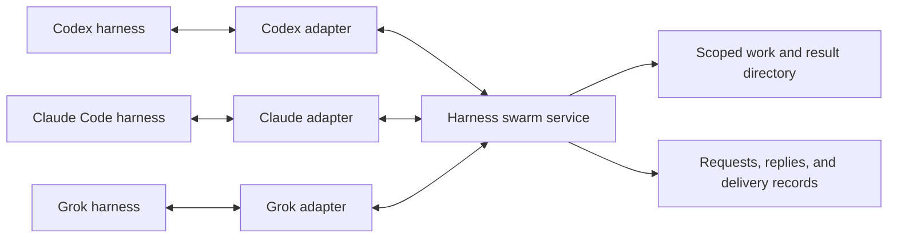

# Shared protocol and provider adapter contract

Status: proposed interfaces and invariants. No production API or adapter was
changed. Operation names below are conceptual, not commands available today.

## One collaboration layer



Provider adapters translate lifecycle observations and message delivery. They
do not choose a different collaboration policy for each model. The service owns
scope, stable identity, record versions, deduplication, subscriptions, and
continuation authorization. The model judges whether a dependency is necessary
and whether the returned evidence actually resolves it.

Keep a shell CLI over the service for portability. A narrowly scoped MCP/tool
surface can expose the same operations with fewer quoting errors and shorter
instructions. Neither route grants new filesystem, network, or account access.

### Keep peer content distinct from Harness instructions

The stable Harness policy and the content supplied by a peer are different
inputs. A provider hook may insert added context at a privileged message role;
that transport choice must not promote the peer's text into owner instructions.
Use a structured tool result where supported, or a clearly delimited serialized
data envelope under a fixed host explanation. Keep the explanation and routing
fields outside the peer-authored text. A peer cannot replace the envelope's
author, dependency, outcome version, target, or authority by writing matching
field names or instructions inside its answer.

For example, Codex documents prompt-hook additions as developer context. That
describes its delivery mechanism, not permission from the answer's author.
[Codex hook context](https://learn.chatgpt.com/docs/hooks#userpromptsubmit).

The service supplies authenticated provenance; the model still evaluates the
content. A qualified peer's factual answer can satisfy an already authorized
task without another confirmation question. Its suggestions for optional review,
extra delegation, deployment, or changed permissions do not enlarge that task.
Use the needed fact and continue the owner's work. Do not reject a useful fact
solely because the answer also contains an out-of-scope suggestion, or create a
new exchange just to tell the peer that its suggestion was ignored.

For example, a result can carry the following agent-visible data, while task
capabilities and delivery guards remain outside the rendered payload:

```json
{
  "kind": "peer_result",
  "dependency": "uploads-v8-recovery",
  "source": {"harness": "Beta", "record": "v8-choice@3"},
  "outcome": "answer",
  "complete": true,
  "data": {"answer": "Use the manual Retry button; do not retry automatically."}
}
```

`complete` describes whether the payload was omitted or excerpted in transport.
It does not certify factual truth, satisfaction of the consumer's criteria, or
completion of the owner's task.

Serialize text rather than splicing it into control syntax. Quotes, newlines,
delimiter-like text, or a quoted command inside `data` must remain data. Native
message role, delivery receipt, and a source signature do not prove the factual
claim or an alleged user approval. Preserve the original evidence and applicable
revision when reusing a result; a later copy must not look like a fresh original
decision merely because a different agent published it.

Keep complete short facts inline. If size limits require an excerpt, identify
it as incomplete and return a stable full-result reference. Do not silently cut
off material constraints while presenting the remaining text as the complete
answer. Prefer rejecting an oversized newly authored request before contacting
the peer over truncating its actual question or acceptance criteria. Chunking
or fetching an existing long artifact is a read, not a new question to its author.

This envelope supports correct interpretation and mechanical routing. It does
not prove that a model will resist every misleading instruction. Test the actual
provider representation and behavior; escaping alone is not semantic validation.

## Minimal records

| Record | Fields that affect correctness |
| --- | --- |
| Harness identity | Account, machine, stable harness ID, native session ID, session generation, engine/version. A reused pane or process ID is insufficient. |
| Task binding | Task ID, accepted-input generation, originating swarm, sender membership generation, authority provenance. Human input changes the generation even if the model later concludes the task continues. |
| Work/context record | Author, source task, exact subject/resource, kind and validity of claim, version, state, last semantic affirmation, runtime liveness, accessible artifact references. |
| Dependency | Owner task, exact required fact/artifact/operation, acceptance criteria, applicable revision/environment, selected evidence, deadline, state. |
| Consumer binding | An authenticated owner's admitted dependency, exact production/result contract, task/input and membership generations, active or suspended need, bounded expiry. A passive result watcher is not this work authority. |
| Owner wait cycle | Task/input generation, exact dependency steps, any/all readiness, optionally watched mutable record versions, one continuation grant, expiry, state. |
| Exchange | Stable request ID, dependency ID, exact recipient and membership/session generations, kind, current step/version, bounded payload, limits, optional prior exchange, outcome. |
| Delivery / continuation | Stable delivery ID, wait-cycle or contribution identity, exchange/result version, destination generation, allowed effect, expected task/input generation, expiry, durable receipt. |

Keep runtime heartbeat time separate from when an agent last affirmed a claim.
Keep native turn IDs separate from durable task IDs. Keep historical context
ownership separate from current edit responsibility.

### Historical evidence versus a current assertion

A record version identifies a statement; it does not make that statement the
current rule for every consumer. Use explicit validity rather than one generic
freshness timestamp:

| Record meaning | Reuse and invalidation |
| --- | --- |
| An observed fact/result for an immutable revision or event | Remains readable with its original scope after the author's task changes. It does not claim to describe a different revision or today's latest policy. |
| A current responsibility, mutable policy, or commitment | Carries the affirming task/input generation. New accepted human input suspends this current assertion until the author's current work reaffirms or replaces it. Its historical statement remains available. |
| An explicit replacement of an earlier decision/result | Identifies the exact superseded record and applicable authority/version. Independent records with later wall-clock timestamps do not silently supersede each other. |

The consumer chooses evidence for its actual requirement. A task pinned to a
published policy revision needs no confirmation merely because its author has
new work. A task requiring the current policy cannot treat an unconfirmed older
statement as current. Search returns that distinction; it does not hide the old
fact or wake the author to refresh it. Reaffirmation belongs in the author's
next relevant authorized work and can be coalesced with an existing update.

A new user instruction may change a mutable policy before its model publishes
the replacement. Suspending the input-bound current assertion closes that known
gap without invalidating every immutable artifact. The service cannot infer
arbitrary semantic equivalence or prove the truth of the replacement. Conflicting
sources remain a conflict until authoritative evidence resolves them; timestamps,
signatures, and heartbeat freshness alone cannot decide whose policy governs.

### Reuse replies without inventing a second publication

A reply can supply a searchable result through its existing exchange. Index the
already shared record within its original visibility and scope; do not require
another publish call or a model-generated summary of identical content.
Preserve the response's outcome, source, original question, and material request
context/version. A bare "No" is not a reusable fact without the question it
answers. Return the small complete pair together, or an explicitly incomplete
excerpt with a full-record reference.

Keep the roles of those texts visible. A request's premise is not a fact affirmed
by its recipient. A pending request proves that its author needs an answer, not
that the author knows it. An `unknown` reply is not evidence that no decision was
made; a qualified answer saying no decision was made is a different result.
Search can expose these records without promoting them into successful outcomes.

Indexing a reply does not reaffirm an input-bound current-policy claim, supersede
another decision, or mark the requester complete. Those require their actual
semantic/authority conditions. This keeps reuse cheap in logical operations
without hiding a new publication assertion inside a read or adding an online
summarization model. Storage, indexing, and extra returned context still cost
resources and remain part of the pilot accounting.

### Return relevant evidence with a shared-work update

When an agent already needs to publish a claim about a shared interface or
resource, the same response can return bounded existing records for that exact
subject and applicable version. This can expose an existing decision, compatible
production, or incompatible commitment before the agent starts changing it.
Declare the read in the publish tool's return contract. It neither contacts a
record's author nor requires a separate discovery call merely to retrieve the
small facts already returned.

Return the caller's update receipt separately from matching source records.
Preserve each record's author, kind, version, validity, and material context;
matching is not a claim that the author must be consulted. Keep the response
within a measured context bound and indicate omitted matches or incomplete
content with an appropriate read reference. An empty or bounded response is
not a guarantee that no concurrent work or private knowledge exists.

| Evidence returned during the update | Next decision |
| --- | --- |
| A complete applicable decision settles the required behavior. | Use that evidence without asking its author. |
| Another current owner is working on the same resource, with compatible responsibilities and no required missing input. | Continue independently. Shared subject alone does not require coordination. |
| The task's required change conflicts with an evidenced current commitment, and available authority does not settle it. | Resolve that particular conflict with the relevant owner; do not request a general plan review. |

This is a discovery opportunity during an already-needed operation, not a new
required check on every turn. Private scratch work does not acquire a publication
requirement just to receive hints. Record changes do not broadcast themselves,
create subscriptions, or grant a later wake. The existing explicit watch contract
still governs observation of a mutable record.

The response reports what the service knows at its recorded read/version
boundary. A concurrently arriving or delayed remote claim may be absent; a
published claim is not a filesystem lock or an atomic edit reservation. Revalidate
evidence under the normal admission rules, and retain the repository/resource's
own concurrency controls. This improves coverage only for identified shared
subjects with recorded evidence; it does not solve unrecorded knowledge or
unanticipated dependencies. Count the returned context and any mistaken extra
contact when comparing this response with a plain update receipt.

## Agent-facing operations

| Operation | Result and side effect |
| --- | --- |
| Discover | Scoped matching records with evidence and freshness; no peer wake. A valid response is no established source. |
| Read | Exact record/result and provenance; no peer wake or automatic checkout. |
| Publish / release | An authenticated work/context/result update during existing work, optionally returning bounded same-subject evidence; no conversational broadcast or author wake. |
| Ask | Creates or reuses one admitted exchange for a concrete dependency. Explicitly spends peer attention. |
| Subscribe | Watches an exact result/claim transition; does not start work in the producer. |
| Request work | Offers a bounded, already-authorized operation; requires recipient acceptance. |
| Reply / accept / decline | Correlated to an existing exchange. These cannot select another swarm or expand the request. |
| Adopt / resolve / cancel | Update the current task's dependency and continuation permission without resending the question. |
| Wait for result | Declare which dependency steps unblock current work and explicitly authorize one continuation for that wait cycle; return an already available outcome inline instead of scheduling a wake. |

Do not expose an unrestricted broadcast primitive. Do not combine a supposedly
read-only search with an implicit send. If a future resolve operation can contact
a peer, its tool contract must state that effect explicitly.

## Example request

This synthetic object illustrates information requirements, not a final schema:

```json
{
  "task": "task-41",
  "inputGeneration": 7,
  "dependency": "retry-policy-decision",
  "kind": "ask",
  "recipient": "harness-claude-api",
  "sourceRecord": {"id": "decision-context-12", "version": 3},
  "neededFor": "Choose the recovery action for an expired upload",
  "localCheck": "API schema v8 defines the error but no recovery policy",
  "question": "Did the user choose automatic retry or a manual Retry button for expired uploads?",
  "resultScope": {"interface": "uploads-v8"},
  "replyMode": "answer-or-unknown"
}
```

Task, generation, and authority fields come from a trusted binding/capability,
not an agent freely naming a swarm. A scoped tool adapter can supply them; the
portable CLI needs a pinned task capability bound to its originating invocation.
Looking up mutable current context when a delayed old command starts is not
sufficient. The adapter must establish the invocation's original authority.
Do not stamp an old in-flight shell command with whichever task happens to be
current when it reaches the daemon. A superseded capability should be refused,
not silently rebound to newer human work.

There are two candidate ways to establish that binding. A managed tool adapter
can attach authority from an immutable originating invocation, if the provider
exposes that relation. Alternatively, the host can place an opaque, authenticated
task capability into the particular task's native context; the model must pass
that exact capability, and the service checks its harness, task, input generation,
scope, and expiry. This is not a freely typed task ID. A superseded token fails
even when the same session is still running. Neither option is established for
every installed terminal route by the current evidence.

In the second design, token delivery is part of the adapter's provenance proof.
An unbound `get current context` command cannot mint a newer token for a delayed
older call. A pre-tool rewrite cannot attach the latest token merely because its
hook runs now. Keep capabilities out of shared records and peer payloads; other
harnesses cannot borrow them. Quietly delivering a token through an existing
tool result also requires knowing which originating task receives that result.
If that relationship is unknown, do not guess from the current process, focused
pane, wall-clock time, or last observed prompt. This addresses accidental stale
invocations through Harness; it is not isolation against arbitrary same-user
filesystem or native-provider access.

The current-source [invocation reproduction](reproduce_invocation_scope.mts)
demonstrates this distinction through the real directory/service/wire methods.
After accepted input changes from A to B, an A-pinned command is rejected, while
a delayed lookup returns B and admits a B request. An old request also remains
admissible after new human work within B. These are synthetic admission outcomes
with no native delivery; [source hashes and observations](invocation-scope-observations.json)
make the limited finding reproducible.

The [small agent contract](agent-contract.md) separates these stored envelope
fields from the compact arguments an agent actually supplies. Do not make the
model restate host identity or duplicate the selected source's recipient.

Owner-directed actions need provenance separate from agent arguments. On a
supported agent route, missing/invalid task or member credentials are an error,
not a fallback to owner authority. A legacy authenticated local-client request
may establish who connected without establishing which human instruction caused
it. Keep that distinction in storage, diagnostics, and evaluation. Pass an
actor/intent binding from the trusted host route; do not mint it from an omitted
field or an agent-authored `origin: owner`. Preserve legitimate explicit owner
handoffs through their real host action. This prevents accidental promotion on
Harness-mediated routes; it does not claim OS isolation from arbitrary processes
with the same user's credentials. The current wire default is documented in the
[baseline audit](baseline.md#what-is-enforced).

A response can say the decision was never made. That closes this question but
leaves the UI decision unresolved. The requester then follows its user-task
instructions; it does not count a peer's guess as a user decision.

References to code include repository identity, commit or immutable snapshot,
and relevant path. A branch name alone is mutable. For uncommitted work, use a
content hash/snapshot and mark it as uncommitted. Retrieving a result does not
authorize the receiver to merge it or claim tests passed on another revision.

## Admission and delivery are separate

Before admission, validate the requester's capability and dependency evidence.
Read/cache/subscription resolution happens before a new peer request. Revalidate
identity, relevant membership/claim versions, feature state, and expiry before
the eventual delivery. An unrelated third member joining does not invalidate
an otherwise valid exchange between two unchanged members.

Give the admitted need a stable service handle during the first ask, without
requiring a separate preparation call. Store its owner task, exact required fact,
applicable inputs/version, acceptance criteria, and lifetime. Relevant search
results can include the caller's existing pending/suspended need and its handle;
do not make the model discover it through a second mandatory history scan.

Keep these identities and guarantees separate:

| Mechanism | What it can guarantee |
| --- | --- |
| Operation identity | The same authenticated operation and payload return the recorded outcome; changed content under the same ID is a conflict. A lost response does not justify a new operation. |
| Existing dependency handle | Parameter updates, adoption, and an evidenced reroute remain attached to one need. A new operation or recipient cannot create another active contact under that handle, renew its deadline, or bypass uncertain dispatch. |
| Exact declared request/result contract | A mechanically identical contract can return its existing exchange or applicable result. Define the compared fields, including material version/context; do not call topic or text similarity equality. Matching text alone does not adopt suspended authority. |
| Related natural-language question | A candidate for the requester to inspect. Rephrasing an old question as a new need can still cause duplication if no exact relation is supplied; the service must not claim to solve that semantic judgment. |

For the first brief-ask API, exact new-request matching can conservatively compare
the same owner task and swarm, operation kind/schema version, source record ID
and version, all agent-supplied question/need/check text, and resolved material
constraints. Canonicalize structured field order/defaults without rewriting
natural-language or code strings. A new operation ID or transport retry counter
is not part of that contract. A changed body or source is a related candidate,
not proven equality. Handle-based follow-ups remain the stronger way to express
the same need across a recipient change. Matching never renews expiry, adopts a
suspended need, or bypasses current source/authority validation; an old negative
outcome is not a successful answer merely because the contract matches.

A reroute uses the existing need handle with new qualifying source evidence;
it does not invent a fresh dependency because the recipient changed. A genuinely
different required revision, fact, or acceptance criterion needs its own recorded
contract or explicit version change. If semantic equivalence is uncertain, expose
the relevant prior exchange for inspection rather than silently merging it or
claiming a hard duplicate-prevention guarantee. Do not suppress a necessary
question merely because a record shares its topic.

The policy must therefore prevent reworded repeat questions as well as the service
preventing exact retries. D19 covers the former choice; R2 tests the recorded
identity guarantees. Measure both layers, including duplicate attempts that an
exact-result cache intercepts. Neither a universal NLP equality rule nor an
additional online judge is required by this proposal.

A definitive rejection or closed negative outcome can make room for one newly
justified contact with matching evidence. An uncertain admission is not a definitive
failure and must not trigger automatic failover to another peer. First reconcile
the receipt or retain the explicit unresolved state. A fresh target or operation
ID cannot disguise an uncertain retry. The initial pilot permits at most one
clarification and one further evidenced contact per dependency, under its
original lifetime and attention budget. The latter covers either a qualified
reroute or the same source gaining the previously missing information; it is not
an extra allowance for each. These are provisional limits to evaluate, not
permission to use both routinely or walk through the whole member list.

A delivery receipt distinguishes queued, dispatch reserved, input observed,
consumed, rejected, and uncertain. An observed prompt does not prove the model
answered or the requester used its answer. For work requests, add explicit
acceptance and result validation; do not overload transport acknowledgments.

Distinguish the recipient's own task from an unread question addressed to it.
New recipient input changes delivery preconditions and priority; it need not
make an unconsumed, still-authorized question obsolete. That question may remain
queued until a safe opportunity or its expiry. The recipient can decline. Its
initial delivery creates a new exchange-bound contribution under current input
preconditions; it is not a continuation of an old recipient owner task.

This differs from replaying a consumed question or reviving its interrupted
contribution. Once work has begun, a later parameter/result continuation needs
the matching contribution authority. New human work revokes that old automatic
permission. Do not relabel a replay as a fresh initial delivery to bypass it.
The requester's new input separately revokes old answer-wake permission, even
if the recipient still owes a useful stored result.

## Recipient attention between contributions

Treat native input safety, owner readiness, and contribution capacity as separate
facts. An empty composer and one free contribution slot do not prove that another
automatic question is the best next work. The adapter/service must retain the
current owner binding and distinguish owner resumption from peer-only progress.

| Current condition | Next scheduling behavior |
| --- | --- |
| New human input or an input/permission gate needs handling. | Preserve that path and revalidate authority before any queued peer effect. |
| A current owner wait has a ready answer, clarification, failure, or tracked invalidation. | Return that owner outcome before unrelated inbox work. |
| A brief contribution just ended and current owner work is ready. | Yield an execution opportunity to the owner before another automatic initial question. |
| The owner is verifiably waiting without a ready outcome, or has explicitly finished. | A still-needed, eligible brief contribution may use the available slot. A new owner event preempts future dispatches. |
| The adapter cannot establish which work is resuming or whether the old owner binding applies. | Keep the question queued/deferred; do not infer permission from terminal idle or paste a generic owner-resume prompt as a workaround. |

For example, Q1 can finish, Q2 can start, Q2 can finish, and Q3 can start while
never exceeding one active contribution. Yet the source owner's runnable fix
receives no execution opportunity. The proposed policy must reject that drain
pattern. Fairness between requesters cannot repair starvation of the recipient's
own work; apply owner priority before ordering eligible requesters.

This does not require the recipient to finish its entire task before answering
a known fact. Supported natural owner boundaries remain opportunities for a
brief contribution. Nor does one native owner event prove substantive progress;
the task-backed pilot still measures its outputs and delay. These are adapter
and policy requirements, not a claim that current terminal-idle detection meets
them. No separate model should run just to decide whether the owner is ready.

Optimize batching only after these distinctions work. A bounded set of already
eligible questions may share a supported native execution window, but each keeps
its own authority, receipt, and outcome. Newly arriving requests must not extend
that batch indefinitely or create an implicit always-drain-inbox mode. Do not
hold an available answer merely to accumulate a batch. Measure context/owner
cost before promising that batching is cheaper on a particular provider.

## A bounded clarification

A missing indispensable parameter can be answered within the original exchange.
Represent it as `needs_parameter`, followed by a correlated parameter update and
the final answer. It does not create a new unrestricted peer request or let the
recipient choose another swarm. Keep the original deadline and attention budget;
the initial pilot permits one clarification round.

The clarification is a meaningful dependency event, not an acknowledgment. It
can return through an existing read/wait or supported passive delivery. Starting
an idle requester still requires its valid task-bound continuation grant. That
grant is consumed once; after supplying the parameter, the requester must
explicitly wait again if it needs a later answer to resume work. The recipient's
follow-up is similarly tied to the accepted contribution and current input
preconditions. New human work, cancellation, or an expired deadline prevents
stale parameter updates from silently restarting either side.

Each outcome/update carries a service-issued step handle. The parameter update
must name the clarification it answers, and advances the exchange to waiting
for the final answer. A subsequent wait applies to that new step; it cannot
return the old clarification as a new result. An identical retry returns the
existing step/receipt. It cannot create another parameter turn, reset the
deadline, or silently replace accepted parameters. Keep these identities out of
model-written prose: return opaque handles in tool results.

Allow explicit coalescing to avoid an extra tool round trip: a clarification
reply can request `wait_for_parameter`, and a parameter update can request
`wait_for_answer`. Each action declares that effect and registers at most one
current contribution/task-bound grant. A clarification or parameter update
alone creates no idle continuation. Repeating a pending wait for the same step
reuses its grant; a ready value returns inline. This does not promise that a
provider's native goal loop will wait correctly without adapter support.

The two-sided abstract check below covers a bounded clarification lifecycle.
Step-handle encoding, coalesced tool delivery, and real adapter behavior still
require implementation and conformance checks before shipping.

## After an answer or a closed question

Ending a question is not the same as satisfying the dependent work. Preserve the
outcome and the owner's still-needed input; do not turn every final reply into a
success badge, another question, or a permanent blacklist of its author.

| Observed outcome | Meaning and next action |
| --- | --- |
| A complete factual answer, including confirmation that no earlier choice was made | Use only what it establishes. If the implementation still needs a choice, exercise already-authorized judgment or preserve the need for owner direction. Do not ask others merely to obtain a more convenient answer. |
| `unknown` or `not_owner` | Close this ask and annotate the exact need/source version. Unknown is not proof that no decision exists; historical knowledge and current editing responsibility remain distinct. An evidenced referral can identify one candidate but does not contact it. |
| `requires_work` | The fact is not obtainable as a brief known-context answer. Do locally feasible work; otherwise use a supported bounded work offer with acceptance and existing authority. An unsupported work route stays an explicit gap, not an investigation disguised as another question. |
| `declined` | This contribution was refused. It does not promise a later answer or authorize status pings. An independently qualified alternative can use the remaining contact allowance. |
| A known result is still being produced | Return its exact stable result reference and accurate state. The owner can observe/wait on that existing production. The reference is not a passed test, a new commission, or permission to wake the producer. |
| Queued delivery or a tool-wait timeout | The original request can still be pending. Inspect or re-wait on its existing handle under current authority; do not resend the question. |
| Expired permission or uncertain dispatch | Stop effects no longer authorized and reconcile the existing receipt. Expiry alone does not prove that no native input/effect happened. Preserve late results; do not use a fresh ID to bypass uncertainty. |

A negative outcome is scoped evidence, not an eternal statement about a person
or subject. During subsequent authorized work, re-evaluate when new material
evidence addresses the earlier failure: for example, a verified source update
establishes that the peer has now received the missing choice. A heartbeat,
online indicator, renamed session, changed wording, or repeated assertion of the
same unsupported claim is insufficient. Read the new fact if it was published.
If only new evidence of its private holder is available, a further bounded
contact can be justified using the existing need and remaining allowance.

Do not reset the original lifetime/contact budget, erase the earlier outcome,
or create a new task identity merely to retry. An exhausted allowance remains
visible as unresolved; it is a pilot bound to evaluate against missed necessary
work, not proof that more evidence could never matter. Another ordinary model
turn does not create a new permission. A genuine later owner task is evaluated
under its own authority and can use historical evidence without inheriting a
blanket negative verdict.

There is no background promise to revisit a closed `unknown` reply. A real
ongoing production needs its own exact result handle and supported subscription.
Publishing a new fact during normal work is useful; neither negative-cache
expiry nor a newly online peer starts another model turn by itself.

## Bounded work beyond the brief-question pilot

The full design includes a peer doing necessary work, not only recalling facts.
It is a later implementation slice because an ask and an accepted operation
have different effects. A received question must not quietly become an unbounded
investigation.

An offer identifies the required output, exact inputs/revision/environment,
acceptance criteria, relevant permissions, and useful lifetime. Evidence must
connect the particular recipient to a necessary capability or current ownership.
An idle powerful model alone is insufficient. If the recipient is already
producing the exact result, subscribe to that work instead of commissioning it
again. Do locally feasible ordinary work in the requesting harness.

Acceptance is the recipient's protocol action during an authorized contribution,
not an extra human approval dialog. It records the accepted parameter version
and output contract. It neither expands native permissions nor obliges the
recipient to disrupt its owner's task. If its existing authority is insufficient,
the native permission process still applies; the sender cannot approve for it.

| State/event | Meaning and effect |
| --- | --- |
| Offered / delivered | The recipient has not accepted the work. No new operation is implied by a transport receipt. |
| Accepted | The recipient has committed to the specific versioned operation within its existing authority and task priorities. Acceptance updates state; it does not itself need to wake the requester. |
| Running | A bounded operation is executing. Record any independently owned tool/job handle and relevant effects; do not equate the whole native session with this contribution. |
| Result / failed / declined / unavailable | A terminal outcome is readable. Only a still-valid wait grant permits requester continuation. Failure is a result, not proof the dependency was satisfied. |
| Parameters changed | Revalidate and explicitly accept the changed operation before new effects. A follow-up message cannot silently widen the accepted task. |
| New recipient human work | Revoke stale unstarted authority and re-evaluate pending contributions during current authorized work. Do not keep executing them merely because they were delivered earlier. |

Before the first new effect, revalidate the accepted operation and relevant
lifetimes. After cancellation or changed input, stop unstarted steps at supported
checkpoints and report effects already observed. A native script already in
flight may not support immediate cancellation. Stop only a job the adapter can
identify as belonging to this accepted contribution; never kill the recipient's
entire terminal to enforce a contribution limit.

Cancellation removes the requesting task's need. It does not necessarily cancel
the producer's work: another admitted consumer or the recipient's independently
authorized owner task may still require that same result. Those relationships
must be recorded; the recipient cannot invent a new owner need solely to keep
running a canceled request. Stop an exclusively commissioned operation when no
valid consumer remains and its supported cancellation boundary is reached.

Within a swarm, exact compatible consumers can attach to an existing accepted
result handle. Reuse requires the same material inputs, environment, acceptance
criteria, and access scope. Similar prose is not a shared job identity. Requests
with different test coverage or incompatible versions must not collapse into one
apparently completed result. Re-check identity before creating duplicate work.

Completion includes the actual immutable output/revision, environment, performed
checks, and any partial or external effects. The consumer validates these against
its requirement. "Tests passed" for another commit is not success; an accepted
single test does not imply permission to repair unrelated failures or keep
retrying until green. Unknown admission/effect state is not automatically replayed.

This design deliberately leaves semantic feasibility with the recipient and
validation with the consumer. The daemon enforces the recorded operation and
life-cycle boundaries it can observe. It does not pretend to meter an arbitrary
provider turn or prove a free-form statement of competence.

## Reusing one result across owner tasks

Reading or waiting for an existing result and asking that it be produced have
different effects. Preserve that difference when several owners need the same
fact; reuse must not turn a passive watcher into work authority.

| Operation | Effect on the producer |
| --- | --- |
| Read a published answer | None. Reuse its actual source, applicability, and version. |
| Ordinary wait on an existing result | Observe its outcome under the caller's wait cycle. Do not keep commissioned work alive after its active consumers withdraw. |
| Ask for an exact compatible result already requested | Register the caller's own admitted need against that existing production. This may keep an undelivered valid request eligible, without another question prompt. |
| Cancel or suspend one admitted need | Remove that consumer's authority. Preserve work still required by another active admitted consumer or the producer's independently recorded owner task. |

An ask can join only the same declared subject/output, material inputs, source,
revision/environment, access scope, and acceptance contract. Its existing timing
must still fit the new consumer's need. Do not merge similar prose or silently
extend/tighten a deadline, revise accepted work, or add permissions. A new
consumer inherits the production's remaining lifetime; it cannot keep the
question alive indefinitely. A passive wait may return unavailable if the work's
only active requester withdraws. `wait(adopt=true)` reactivates the caller's own
previously admitted need; it does not silently take over another owner's request.

Record every active consumer with its own current capability and source evidence.
The original question's author remains its author. The service can state which
current owners still need the answer without forging the original sender's
authority or pretending a different user issued that question. Before an initial
delivery, verify that at least one compatible admitted need remains current.
If none does, suspend undispatched work. A new valid need can reactivate the
same undelivered record within its existing lifetime, but cannot reset consumed
or uncertain delivery, replay a question, or restore the recipient's revoked
contribution permission after its own human task changed.

Shared clarification needs one authorized responder for the request inputs,
not a broadcast asking every consumer to propose a parameter. A stored exact
parameter can be read directly. Otherwise route the indispensable question to
that input owner. Material parameter changes create a new contract version;
old consumers must not be assumed compatible. Preserve compatible bindings only
when their declared requirements establish the match; others need explicit
revalidation or a changed/unavailable outcome. The original clarification and
attention bounds still apply. Do not enable active request sharing before these
cases are implemented and checked.

The answer is stored once, with the producer's provenance. Each consumer validates
it against its own criteria and uses its own wait cycle; adding consumers does
not send acknowledgment prompts to the producer. Swarm conversation retains one
exchange and can show its additional consumers as state, rather than new chat
messages. A requester asking about a fact is not evidence that it knows the fact;
search results must distinguish consumers from the actual source/producer.

## Task origin and new input

The current worktree binds swarm origin by matching native prompt observations
to submitted input. It stores current swarm identity, not a full task/continuation
lifetime, and its submit-hook path needs separate acceptance evidence. Extend
that binding rather than deriving scope from focus, pane visibility, or the last
membership introduction. See `cli/src/teams/promptScope.ts` and `service.ts`.
The [first implementation brief](implementation-brief.md) includes a source-level
reproduction where Codex's automatic goal continuation clears that binding;
normalization must preserve trusted continuation provenance as well as display text.

On every accepted human input:

1. Advance the input generation and revoke old automatic continuation grants.
2. Bind the new input to its verified swarm origin, or to unknown when the
   input route cannot establish origin.
3. Keep old replies and outstanding requests as records. They are not lost and
   are not automatically re-sent.
4. During the current turn, the agent may adopt an existing dependency if still
   required and still authorized. Adoption binds that need to current authority;
   only an explicit wait issues a new continuation grant. Neither revives an
   old grant.

Suspend the old input's unconsumed outgoing requests until current work adopts
the still-needed dependency. This prevents a question the owner no longer needs
from starting a peer after newer input. Preserve its record and reuse it on
adoption; do not cancel and recreate it as a new conversation. Already consumed
brief questions can produce inert stored results, subject to cancellation and
the recipient's own contribution limits. Remote dispatch already in flight
retains the distributed-race limits described below.

Use explicit adoption, or coalesce it with `wait(adopt=true)` under the current
trusted capability. The latter's contract must disclose that it can reactivate
an existing queued request as well as permit one result continuation. A passive
read never adopts, reactivates contact, or issues wake permission. Reusing a fact
for a new task records that task's need and matching constraints. It cannot move
a private exchange into another swarm or silently change acceptance criteria.

This handles a steering message without claiming that every human message is a
new semantic task. It also prevents a delayed answer from reviving an old task
after the human has switched work. Compaction alone does not advance human input
generation; a session replacement does advance session generation.

Peer contributions use an exchange-bound capability: read this request, produce
this reply, and perform only its accepted bounded work. They do not overwrite
the origin of the recipient's owner task. A reply is not a new human input.
Classification comes from trusted delivery metadata, not a magic string that a
user or peer can copy into ordinary text.

### Preserve work across ordinary follow-ups

The logical task may continue through many accepted human inputs. A status
question in the same swarm advances authority generation just as other input
does; the host should not parse phrases such as "just checking" as permission
to retain an old capability. During the resulting authorized turn, the agent can
adopt only the exact still-needed dependencies. Keep their IDs, original useful
lifetime, recipient, and receipts. Do not create new asks or revive revoked wait
grants. A ready answer returns inline; a new explicit wait is needed only when
the owner actually pauses again.

Permit a bounded batch of explicitly selected adoptions and unchanged-claim
reaffirmations in one mutating owner operation. Reference existing records rather
than making the model repeat their contents. Coalesce with an already necessary
owner update or wait where the adapter supports it; ordinary read stays free of
those effects. This can still cost a tool round trip and must be measured. Do
not start an idle cleanup turn, automatically adopt every old need, or extend
expired work just to make the state look tidy.

Immutable facts/results need no reaffirmation after a status question. Input-
bound current commitments can be reaffirmed by reference, with new authority
provenance recorded. That state update is not a fresh peer announcement or an
excuse to send confirmation questions to all consumers. If the agent only answers
the status question and does not reaffirm a commitment, preserve the honest
suspended state; do not have the daemon invent semantic continuity.

Viewing progress or Swarm conversation in the UI is read-only and does not
advance the input generation. A continuation of the same owner task uses its
latest verified owner-input binding. An unchanged native goal ID or objective
must not restore an earlier swarm after newer accepted steering changed that
binding. When the relation between a native continuation and the current owner
task cannot be established, preserve the uncertainty.

### A submission hook is not an acceptance receipt

The provider may reject a prompt after its submission hooks run. The adapter
must distinguish a prepared/queued input, an input entering a gate, and an
accepted input. The current `hookServer.ts` calls `onPromptSubmitted` for
`UserPromptSubmit`; `cli.ts` immediately passes it to `SwarmPromptScopes.started`.
That observation alone does not prove the provider committed the prompt.

| Observed state | Authority handling |
| --- | --- |
| Draft or queued future input | No new task authority. Keep the existing verified binding; focus and queue order are not acceptance. |
| A correlated candidate input enters a prompt gate | Hold new task-scoped effects that could race the transition. Do not grant its prospective swarm or treat it as committed yet. |
| Acceptance is established through a supported native signal or verified originating-invocation relation | Advance input authority once, bind the verified origin, and revoke obsolete effects. Deduplicate hook/transcript observations of that same input. |
| That candidate is authoritatively rejected | Clear its hold only when the previous active binding is established and no newer input intervened. Do not resurrect a grant already revoked for another reason. |
| The outcome or correlation is unknown | Do not infer acceptance or rejection from silence, a timeout, or an idle event. Keep the uncertainty visible and avoid starting peer work to resolve it. |

The hold is a service state, not a new approval question or model conversation.
A late rejection must identify its own attempt; it cannot clear a newer input's
hold. Existing artifacts and human inspection remain available. The independent
native owner can continue according to its own runtime; Harness must not claim
new task authority until its adapter has the required evidence.

Claude and Codex document prompt-blocking behavior at `UserPromptSubmit`. The
pinned Grok turn implementation also dispatches the hook before applying its
gate verdict. These facts require an acceptance check; they do not prove which
installed routes already expose a usable receipt.
[Claude prompt hook](https://code.claude.com/docs/en/hooks#userpromptsubmit-decision-control),
[Codex prompt hook](https://learn.chatgpt.com/docs/hooks#userpromptsubmit),
[pinned Grok gate](https://github.com/xai-org/grok-build/blob/f0e3be1100ef5252488e3be8bb0e91cf68d8c305/crates/codegen/xai-grok-shell/src/session/acp_session_impl/turn.rs#L908).

## Continuation gate

Asking alone does not mean the requester should wake at any future idle moment.
While doing independent work it can consume results through a read or supported
passive delivery. When progress actually depends on the result, the agent uses
the wait operation to register a bounded continuation grant before yielding.
This is an agent operation, not a new user approval or setup step. It replaces
repeated short polling calls and distinguishes waiting from finishing the task.

### One blocked step, one owner continuation

An owner can have several necessary dependencies. Give its current wait one
grant over the declared set, rather than an independent wake grant for every
answer. The agent specifies `any` when one result enables useful work, or `all`
when the blocked step needs every listed result. An indispensable clarification,
decline, failure, or explicitly tracked invalidation returns promptly in either
mode: waiting for all answers cannot hide the intervention needed to obtain one.

At delivery, return the currently available relevant outcomes together and
consume the whole wait cycle once. Other answers remain readable; they cannot
start a second owner turn from the same wait. If the resumed owner still needs
to pause for another result, it registers a new wait. Already-ready results
return inline. An identical pending wait reuses its grant. A different concurrent
wait requires explicit replacement of the existing specification; the service
does not guess whether separate calls mean a union, `any`, or `all`.

When the same owner task resumes for another authoritatively observed reason,
retire its previous wait permission. An idle event alone cannot renew it. This
requires trusted task/wait lifecycle events or an explicit owner operation;
the adapter cannot infer semantic task completion from terminal idleness or
arbitrary prose. Unknown native scheduling behavior remains a conformance gap.

### Changes to facts already read

A read does not silently subscribe the owner to future model turns. If a mutable
assertion must remain current while the task waits on something else, the wait
may explicitly include that record/version. Its invalidation then belongs to
the same one-shot wait cycle; it is not a new blanket notification channel.
Directory names, heartbeats, unrelated publications, and changes to a different
revision do not satisfy that condition. A consumer pinned to an immutable fact
needs no current-policy watch merely because its author moves on.

During already-authorized active work, an adapter may supply a scoped invalidation
passively if it can preserve provenance. Otherwise the changed state remains
visible on the next relevant read. Neither path promises a globally current fact
forever: revalidate material mutable requirements at the appropriate dependent
step. Do not claim the daemon can infer every downstream use from ordinary code.

### Incoming contributions and native waiting

The wait path may surface an admitted incoming question at a supported safe
point while its own result remains pending. This lets peers exchange facts they
already hold during a reciprocal wait. Always return an already-ready owner
result first, and do not require a new investigation before returning to it.
Handling that incoming contribution does not consume the owner's unrelated
wait cycle. Returning an awaited outcome to the owner retires the cycle's unused
resume, including its other watched outcomes. The distinction comes from trusted
contribution metadata, not from assuming that every native turn is owner progress.

Here, an inline read means delivering the outcome to the waiting harness during
its current authorized work. A human opening Swarm conversation, a status query,
or a transport acknowledgment is not that delivery and must not consume the
agent's grant. Serialize actual tool-result delivery and automatic resume for
the same outcome so they cannot both start a continuation. If delivery is
uncertain, retain its receipt rather than inferring consumption from an HTTP
read or restarting the agent to find out.

One-shot Harness grants do not control a provider's independent goal loop or
scheduler. Verify pending waits under those native modes: an adapter may need a
supported blocking wait or native yield to avoid repeated model polling. Do not
silently pause or rewrite the user's native goal, and do not claim zero extra
turns from the Harness state machine alone. This remains an adapter acceptance
requirement, not a demonstrated installed capability.

An interruptible tool call held until a relevant event is one candidate for this
wait. The pinned Grok MCP client accepts configurable per-tool timeouts and sends
request cancellation when a pending call is dropped; this is useful source
evidence for testing an attached wait, not proof that native goal/steering modes
behave correctly. Its source also retries selected transport failures with the
same parameters. Preserve a stable service operation/wait ID across such retries;
do not use a new transport request ID to authorize another effect.
[MCP call and timeout path](https://github.com/xai-org/grok-build/blob/f0e3be1100ef5252488e3be8bb0e91cf68d8c305/crates/codegen/xai-grok-mcp/src/servers.rs#L1907),
[cancellation path](https://github.com/xai-org/grok-build/blob/f0e3be1100ef5252488e3be8bb0e91cf68d8c305/crates/codegen/xai-grok-mcp/src/servers.rs#L2083).

Bind a wait's allowed delivery effect to its actual route: returning the result
to a specific pending tool call and starting a later native turn are different
effects. If an attached call times out, is canceled, or loses its response
channel, do not silently promote it to an idle-turn grant. Retire or reconcile
that delivery route while keeping the dependency/result record. A current owner
can explicitly wait again. A native-yield route needs its own verified resumption
contract. An unknown response receipt is not permission to send the same result
through a second route just in case.

Transport replay may return a recorded result for the same invocation when
authorized, but must not create a fresh grant or renew its lifetime. A deliberate
new wait after a retired/canceled attachment is a current owner operation with
a new cycle; it does not revive the old attachment or resend the peer question.

Returning an admitted brief question while the owner waits is also a supported
route capability to test, not an instruction to poll the entire inbox on every
timer. Preserve the owner's unrelated wait, reply within the contribution, and
reattach through the current wait contract when needed. Human steering must
remain responsive. Do not rewrite the user's native goal or manufacture extra
user prompts to simulate suspension.

### Before dispatch

Store the result or indispensable clarification first. Before allowing that
outcome to initiate model work, atomically check
at the destination's serialized input boundary that:

- The exact destination session still exists with the expected generation.
- The owner task and input generation match the current binding.
- Its wait cycle is still active, its declared readiness condition is met, and
  each returned outcome belongs to an expected dependency step or explicitly
  watched mutable assertion. Unrelated events cannot acquire that purpose.
- A continuation grant exists, has not expired/been consumed, and applies to
  this wait cycle or contribution; enabling the feature again does not revive
  revoked grants.
- The requester membership and feature state allow this continuation, and the
  source authority required for each returned effect is still valid. A service
  outcome saying a departed source is unavailable does not revive that source's
  authority to send new content or work.
- Native delivery can preserve peer provenance and honor the required input
  preconditions, including human draft/approval protection.

Consume the grant and durably reserve delivery before attempting input. If a
crash leaves uncertainty about whether input reached the engine, retain that
uncertainty and do not repeat an automatic paste. Current mailbox behavior
already follows that important principle.

Passive context does not itself start a new turn, but can add model tokens,
latency, and cache effects. Its total cost is an empirical question, not a free
delivery assumption. A passive result must still be versioned and scoped;
dumping every swarm update into every active prompt defeats the selectivity
policy.

Apply task/input and dependency checks at the actual passive-context boundary
as well as at idle resume. A result for a suspended old need stays stored after
new human work; do not append it to the newer task merely because that task is
already running. Explicit current adoption or a deliberate authorized read can
reuse the result. Only a current relevant unseen outcome should be pushed into
the owner context, and a peer-contribution frame must not silently become an
owner-result frame. Defer to a supported owner boundary when that distinction
cannot be preserved.

Delivering an owner's ready outcome during its active work retires the matching
old wait permission; it cannot later produce another idle wake for the same
cycle. Deduplicate repeated hook opportunities by actual outcome/version and
recipient input binding, and handle uncertain context insertion without blind
replay. Human inspection still consumes no agent grant. Delivery is not proof
that the model used the answer or completed the task.

## Cancellation and distributed races

Question cancellation can race with delivery on another machine. Cancellation
before a destination's committed dispatch prevents the send when the revocation
is known there. Once dispatch or an external effect is in flight, report that
honestly; do not promise rollback or globally instantaneous cancellation.

Answer continuation is easier to guard: the requester is also the destination,
so its current input generation can be checked locally at the write boundary.
An adapter that cannot make that check must not advertise the same automatic
resume guarantee. Persisted receipts are essential across reconnects/restarts.

For accepted work, cancellation means stop unstarted steps at a supported
checkpoint and report effects already performed. Do not kill the recipient's
entire process or undo unrelated user work. A request cancellation is not
permission to revert the peer's branch.

On membership removal, session replacement, feature disable, or daemon restart,
default to no new automatic wake until current authority is re-established.
Existing results remain inspectable under their original access rules. Rejoining
with the same display name does not inherit an old membership capability.

The [abstract continuation check](check_continuation_model.py) explores 8,250
bounded event orderings under a serialized destination assumption. Its
[results](continuation-model-results.json) include counterexamples when dispatch
revalidation, revocation, or uncertain-delivery discipline is weakened. These
are checks of this proposal, not tests of current runtime code or provider
behavior. A real adapter must establish the serialization assumption.

The separate [two-sided exchange check](check_exchange_model.py) covers 6,807
bounded orderings in twelve event families, plus nine explicit positive paths.
Its [results](exchange-model-results.json) include seven weakened-rule
counterexamples and a liveness contrast showing why new recipient work should
not simply delete every unread valid question. It checks initial admission,
one clarification, step-aware waits, input changes at either endpoint, passive
human inspection, and preservation of recipient owner scope. It assumes the ask
was necessary and admitted, and current state is visible at serialized effect
boundaries. It does not test semantic routing, network revocation propagation,
actual step-handle validation, crash recovery, accepted work, or native adapters.

The [owner wait-set check](check_wait_set_model.py) adds two already-admitted
dependencies: 35,364 bounded orderings in eleven families and thirteen positive
paths. Its [results](wait-set-model-results.json) show counterexamples for one
grant per dependency, premature `all` resumes, stale staged outcomes, and old
input authority, plus three liveness contrasts for hidden interventions. It
assumes trusted dependency adoption, register-and-yield support, current state
at the write boundary, and distinguishable owner/contribution progress. It does
not establish those native primitives, semantic necessity, arbitrary dependency
graphs, source-removal behavior, distributed consistency, or token savings.

## Adapter evidence and capability matrix

“Documented” means a provider describes the primitive; it does not mean Harness
has integrated or exercised it. Current terminal delivery is the common path.

| Capability | Claude Code | Codex CLI | Grok Build |
| --- | --- | --- | --- |
| Existing Harness lifecycle/origin observation | Hooks plus transcript integration | Hooks plus transcript integration | Normalized hooks plus transcript integration |
| Context without a new prompt | Documented session/prompt hook output | Documented hook context; app-server context injection also exists | Prompt-hook added context is discarded; pinned public source describes tool-hook context. Installed-version verification remains necessary. |
| Current Harness inbound transport | Serialized terminal input at idle/empty composer | Same | Same |
| Native protocol opportunity | Provider hooks/native peer surfaces | App-server with task/turn identity | ACP documented for managed sessions |
| Adopting an arbitrary already-running terminal via a protocol | Not established by this investigation | Must verify daemon ownership and supported thread access | Not established merely because ACP can launch a session |
| Native cross-session scope control | Requires selective handling without disabling delegated peers | TUI task tools and CLI queue are separate from subagent tree | Inspected source tool is for owned children; independent-session inventory/enforcement remains unverified |
| Hard per-contribution token budget in existing terminal turn | Not established | Not established | Not established |

Sources for provider-specific context behavior:
[Claude hooks](https://code.claude.com/docs/en/hooks),
[Codex hooks](https://learn.chatgpt.com/docs/hooks),
[Grok hooks](https://docs.x.ai/build/features/hooks).
Grok's documented hook contract also fails open on malformed/failed hooks, so a
hook alone cannot be presented as a comprehensive fail-closed boundary.
Its [ACP integration](https://docs.x.ai/build/cli/headless-scripting) describes
managed protocol sessions, not proof of attaching to an arbitrary running TUI.
Installed Grok version checked read-only: 1.0.34.

### Grok source follow-up

The public repository at revision `f0e3be1100ef5252488e3be8bb0e91cf68d8c305`
records upstream source `036a5d8348cd744767cd0b08518ab17bf608fa7f`, which differs
from the installed binary's reported build `3736acbc8658`. Treat its documented
interfaces as candidates for verification, not tested installed capabilities.

That revision's hook guide describes context from settings-defined pre-tool
hooks and post-tool hooks. Its prompt hook still discards allowed output. Hook
reloading is an explicit runtime action; the inspected config reloader's MCP
watch path does not establish automatic hook reload. This supports testing a
one-time capability note at an existing tool boundary without starting a turn.
[Pinned hook guide](https://github.com/xai-org/grok-build/blob/f0e3be1100ef5252488e3be8bb0e91cf68d8c305/crates/codegen/xai-grok-pager/docs/user-guide/10-hooks.md),
[hook dispatch](https://github.com/xai-org/grok-build/blob/f0e3be1100ef5252488e3be8bb0e91cf68d8c305/crates/codegen/xai-grok-shell/src/session/acp_session_impl/hook_dispatch.rs).

A narrower source check finds that the schema's optional `promptId` is not
populated by the inspected pre-tool and post-tool constructors. The former
passes `None` while preserving the model's `toolUseId`; the latter also passes
`None`. The common envelope constructor copies that value rather than resolving
a prompt automatically. `UserPromptSubmit` is separately called with the prompt
ID, but it is a gate event, not proof that a human input was accepted or that a
later tool belongs to it. The guide's common-field description therefore does
not establish tool-to-task provenance on these paths.
[Pre-tool construction](https://github.com/xai-org/grok-build/blob/f0e3be1100ef5252488e3be8bb0e91cf68d8c305/crates/codegen/xai-grok-shell/src/session/acp_session_impl/tool_calls.rs#L2788),
[common envelope](https://github.com/xai-org/grok-build/blob/f0e3be1100ef5252488e3be8bb0e91cf68d8c305/crates/codegen/xai-grok-shell/src/session/acp_session/hooks.rs#L143),
[prompt gate](https://github.com/xai-org/grok-build/blob/f0e3be1100ef5252488e3be8bb0e91cf68d8c305/crates/codegen/xai-grok-shell/src/session/acp_session_impl/turn.rs#L908).

This does not prove that no other Grok route can correlate a tool with its task.
It rules out assuming that this hook's advertised field alone provides the
binding. Verify a supported immutable `toolUseId` correlation or a pinned
task-capability delivery path before claiming stale-invocation rejection. Do not
fill the absent ID with the daemon's latest prompt. The source revision still
differs from the installed build, and no native hook invocation was run here.

The source distinguishes project-scoped MCP configuration changes from global
ones. MCP registration is another discovery opportunity, but a project directory
is not a swarm and global installation would reach unrelated sessions. Preserve
per-session authentication and task scope at the service; verify live catalog
updates before using them as the activation path.
[Config reloader](https://github.com/xai-org/grok-build/blob/f0e3be1100ef5252488e3be8bb0e91cf68d8c305/crates/codegen/xai-grok-shell/src/config/reloader.rs),
[MCP guide](https://github.com/xai-org/grok-build/blob/f0e3be1100ef5252488e3be8bb0e91cf68d8c305/crates/codegen/xai-grok-pager/docs/user-guide/07-mcp-servers.md).

The inspected MCP dispatch paths do not supply the missing invocation binding
automatically. `McpErasedTool.run` ignores its `ToolCallContext`, and its request
constructor supplies the tool name and model arguments. The common workspace
bridge also ignores that context and forwards name/arguments to its transport.
Its HTTP wrapper delegates outgoing messages without adding a task identity.
The configured session-ID header identifies a session, not the accepted input
behind a delayed call. Internal `ToolCallOrigin` attribution exists, but these
inspected outgoing paths do not forward it as task authority.
[MCP tool dispatch](https://github.com/xai-org/grok-build/blob/f0e3be1100ef5252488e3be8bb0e91cf68d8c305/crates/codegen/xai-grok-mcp/src/servers.rs#L1584),
[workspace bridge](https://github.com/xai-org/grok-build/blob/f0e3be1100ef5252488e3be8bb0e91cf68d8c305/crates/common/xai-computer-hub-mcp-adapter/src/bridge.rs#L233),
[workspace request](https://github.com/xai-org/grok-build/blob/f0e3be1100ef5252488e3be8bb0e91cf68d8c305/crates/codegen/xai-grok-workspace/src/mcp.rs#L145).

MCP remains a candidate tool transport. A verified task capability in the
originating call, a supported native provenance extension, or a managed adapter
with proven input/call serialization is still required. Changing a shared MCP
header to the latest task is not sufficient: a delayed old call must not borrow
the new header. This source check does not rule out other supported extension
paths and does not test the installed build. Do not present an MCP connection
test as passing S4.

Persisted Grok updates offer another candidate correlation: pending tool-call
events carry a call ID and outer native prompt ID. The inspected source enqueues
them before its pre-tool gate, and the repository fixture preserves that pairing.
Current normalization drops the outer prompt metadata from its shared tool
events. Preserve and verify the native relation instead of assuming it is absent;
see the [source follow-up](native-session-comparison.md#grok-source-cross-check).
However, native human interjections can be admitted within that same prompt ID.
Prove the accepted-input boundary and handle delayed persistence, replay, and
session replacement before using this as invocation authority. An ID for the
outer prompt must not be rebound wholesale to the latest steering input.

For newly launched managed sessions, the installed CLI advertises `--rules` for
appending instructions. The published guide describes that option as scoped to
one session. It is a plausible small bootstrap with service-side feature gating;
it does not update an arbitrary existing process. Avoid replacing the provider's
system prompt or writing project instruction files just to teach one harness
about the feature.
[Rules guide](https://github.com/xai-org/grok-build/blob/f0e3be1100ef5252488e3be8bb0e91cf68d8c305/crates/codegen/xai-grok-pager/docs/user-guide/12-project-rules.md).

## Adapter requirements for rollout

Expose capability flags based on tested engine version and input route:
origin binding, passive context, scoped peer delivery, expected-generation
resume, cancellation evidence, native-tool policy coverage, and usage accounting.
Do not infer support from a provider name or advertise every capability because
one transport test passed.

For engines without passive hooks, use a verified session-local instruction/tool
registration path at launch or the next natural user turn. Do not create an idle
membership prompt as a hidden fallback. If an already-running session cannot be
updated quietly, show that availability limitation in the feature's diagnostics
and defer its participation; keep its owner work running normally.

Quiet activation also needs an instruction-lifetime contract. An introductory
message seen once is not evidence that the policy survives native compaction,
session resume, or tool-catalog changes. Prefer supported session instructions
and stable tool descriptions; verify their actual persistence and any required
refresh at an already occurring boundary. Do not add an idle teaching turn or
a changing roster as a recovery mechanism. If tools remain visible while the
feature is disabled, service authorization still rejects effects. Re-enabling
cannot restore obsolete task or continuation authority. Q2 covers these cases;
the semantic evaluator must check behavior after compaction as well as startup.

Provider-native messaging needs a separate compatibility check. Route independent
swarm communication through the shared service, and distinguish native delegated
children from unrelated sessions. Tool interception must cover the actual tool
name and recipient identity; plain instructions are not enforcement. Inspect
failure behavior as well as the success path. Avoid global provider setting
changes and preserve the user's subagent configuration.

Native delegated children do not automatically become separate swarm members.
The first version can have the owning harness mediate their external dependencies.
If direct child access is added, verify ancestry and share the owner's task scope
and attention budget; do not let spawning children multiply independent quotas.
An unverified parent claim is insufficient to inherit a task capability.

The practical first release can promise scoped Harness-mediated exchanges while
native-route enforcement is being verified. A stronger promise requires stronger
evidence; the application is not an OS isolation boundary between user processes.

## Mixed versions and upgrades

Advertise the policy/protocol capabilities at both ends. An old terminal adapter
that accepts text is not thereby capable of task-bound resume or quiet setup.
Keep the existing history readable, with explicit legacy provenance.

Quiet setup must cover already-queued membership introductions, not only stop
creating new ones. During upgrade, suppress/cancel unconsumed introduction
receipts in both the sending ledger and destination mailbox. Do not replay an
uncertain old notice, erase a consumed transcript item, stop an already-running
owner turn, or send a new apology/setup prompt. Reconcile what was already
observed and report that limit honestly.

An active session can still contain the older, more permissive instructions.
Track the adapter's policy/tool-contract version and verified delivery boundary;
this records what context was supplied, not proof the model obeyed it. Update at
a supported natural boundary before advertising the new policy for that route.
An old agent call must receive a supported migration/disabled result rather than
bypassing current task authority. Keeping readable history does not require
continuing the old automatic delivery behavior.

Queued legacy asks or answers without task generations must not silently acquire
new automatic wake permission during an upgrade. They remain inspectable and
can be adopted during an authorized current task if still relevant. Preserve
explicit human handoffs and already observed results; do not reinterpret them
as newly approved autonomous work.

Use additive records or a versioned sidecar so an older ledger reader does not
strip new authority fields and cause a later daemon to trust incomplete state.
A missing capability yields a clear unsupported/unavailable outcome. No silent
fallback may bypass scope, restart a working harness, or revive old deliveries.
Account disable, provider downgrade, and daemon rollback need conformance cases
alongside the normal cross-provider success path.

## Integration sequence

1. Add observability and preserve existing receipts/origin safeguards.
2. Add task/input generations and continuation grants before increasing delivery
   speed. Faster stale delivery would make the experience worse.
3. Replace active membership introductions with verified passive capability
   discovery per adapter. Keep the notice small and omit the full roster.
4. Add work/context records and exact evidence references; keep missing evidence
   visible instead of guessing ownership.
5. Admit brief dependency asks with reuse, deadlines, and clear outcomes.
6. Add artifact subscriptions and scoped passive delivery where verified.
7. Add accepted work requests only after cancellation/effect reporting and
   cross-provider conformance pass.

Production changes should remain isolated in the existing teams module and
small lifecycle/input seams. Account opt-in and prior working sessions remain
the rollout controls. No new account-wide summarization service is required.
