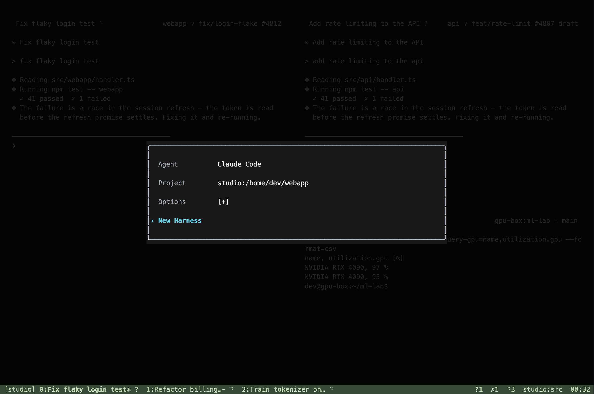
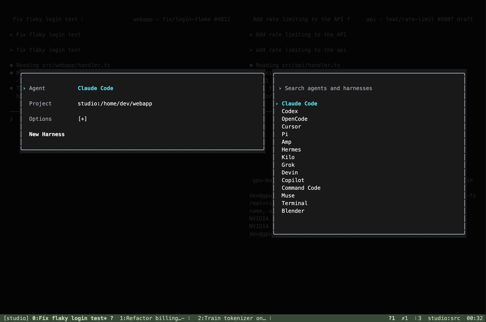
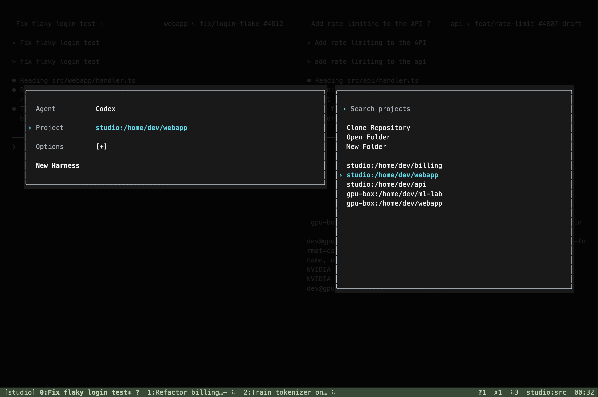
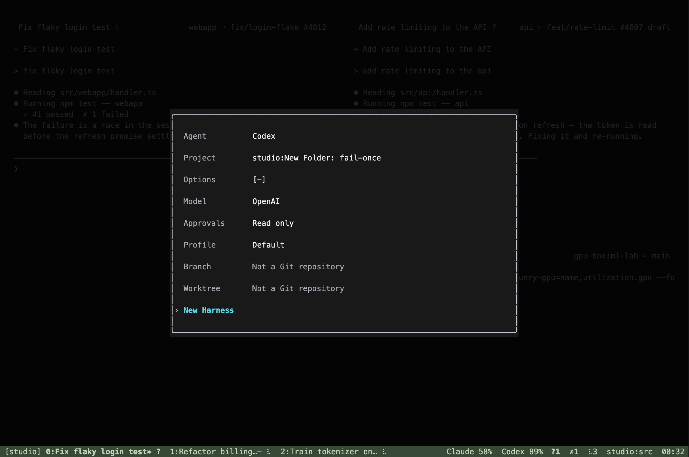
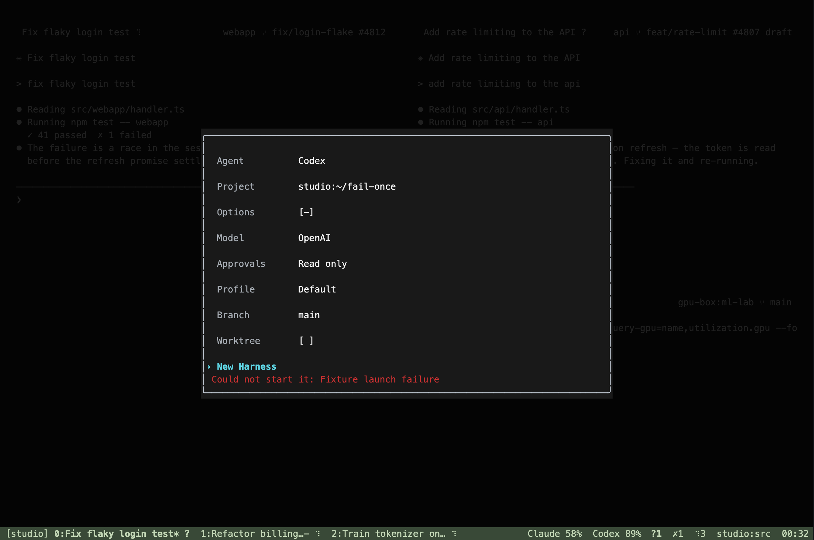
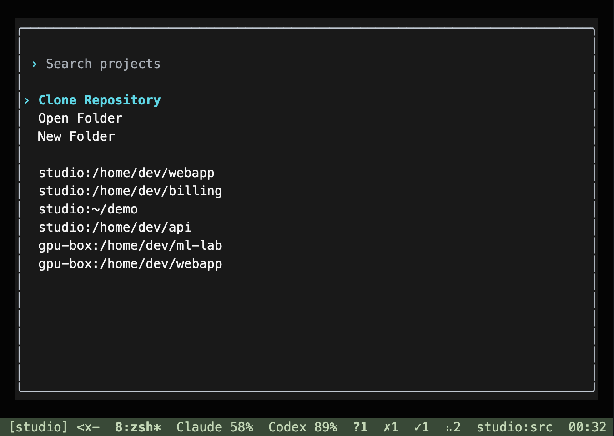
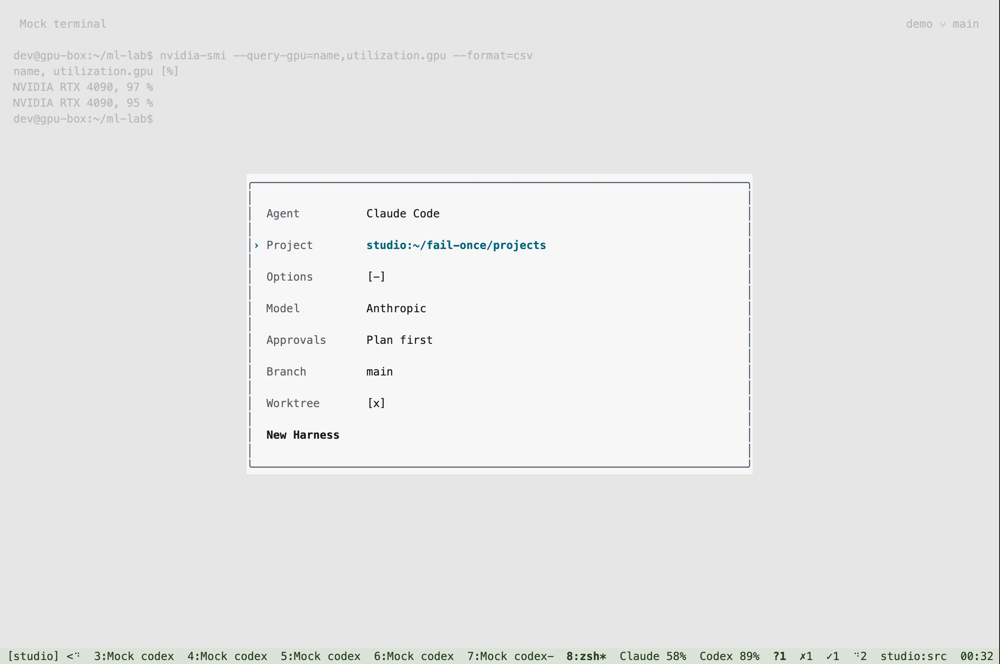

# New Harness popup in hn

`Ctrl-b N` now opens the desktop's compact Agent / Project / Options / New Harness
form instead of advancing through separate pickers. Lowercase `Ctrl-b n` remains
next window. The layout follows the desktop form and screenshots reviewed on
September 29, including side choosers and the collapsed Options row.

Options exposes Model, agent-specific Approvals, Codex Profile, Branch and Worktree.
Project owns machine selection. Installed Store harnesses ask for a compatible
coding agent. Git discovery canonicalizes linked worktrees to their repository;
fresh Git work defaults to a worktree from main. The form uses the existing daemon
RPCs and project/model payloads; it does not introduce a parallel launch protocol.

Arrows preview a field's choices. Enter, Right or typing enters the chooser; Tab
switches between form and chooser. Enter accepts a choice and returns to the launch
action. Escape retraces nested choices and retains a dismissed draft. Mouse input
uses the rendered row positions. Confirmed failures retain their choices and reuse
any prepared project folder with a fresh receipt on deliberate retry. Lost replies
retain the original receipt and offer Check status, so pending or unknown outcomes
cannot duplicate a launch. Explicit model routes, profiles and package compatibility
are rechecked on the destination machine.

The terminal version uses readable text and a selection marker without reverse
video. A narrow terminal shows the active chooser in the form's column.

## Validation

- 170 Rust release unit tests pass, including launch payloads, agent-specific modes,
  stale callbacks, draft retention and rendering bounds down to a one-cell terminal.
- The new private-terminal suite passes six groups covering keyboard/mouse input,
  paste isolation, persisted failure/retry receipts, lost replies, reconnect recovery,
  duplicate prevention, folder browsing, worktree branches, explicit models, Codex profiles, Store harnesses, Terminal,
  draft restoration and narrow/light presentation.
- The existing pane UI suite passes all 11 groups, and the existing end-to-end suite
  passes. The popup suite is also added to the manual CI workflow.

These captures use synthetic projects and conversations in disposable tmux sessions,
a temporary HOME, explicit private socket names and fixture ports. No real engine,
account, project checkout or existing user pane was launched or modified by the
interaction tests. Actual daemon payload names were checked against
`cli/src/lib/projectFolder.ts`, `cli/src/lib/newAgentModel.ts` and the desktop launch
controller. Native app launch, real model inference and Store installation are not
part of this validation.
