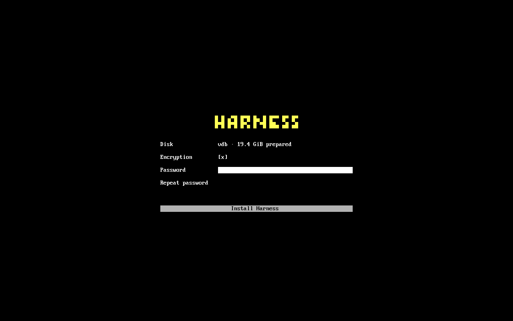
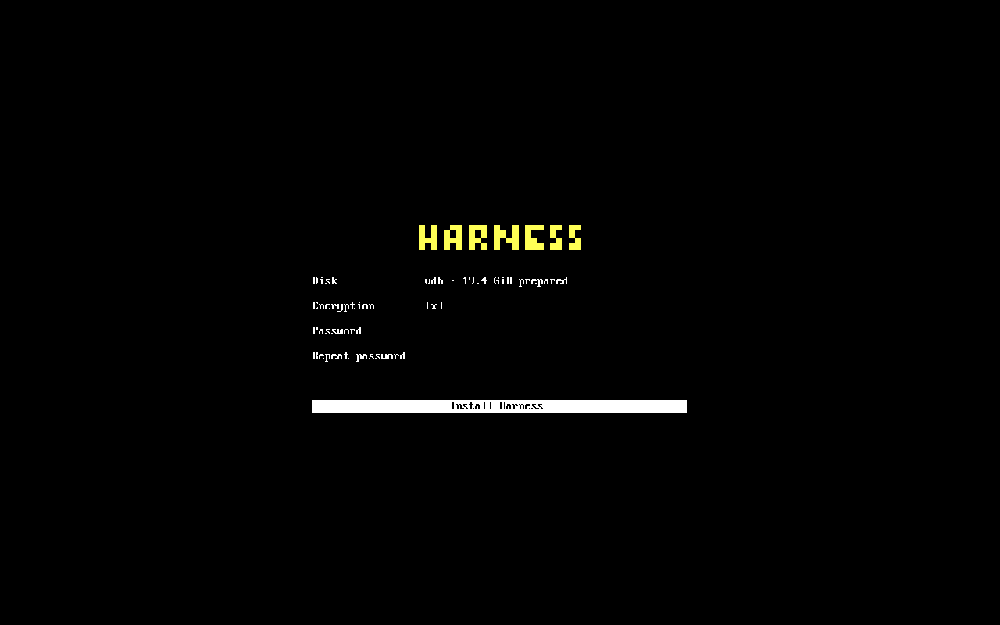

# Apple Silicon image work

The private image builder combines the pinned **Fedora Asahi Remix Minimal**
KIWI description with a separately verified Harness session RPM. It includes
hn, OpenCode with upstream defaults, terminal panes and the optional Chromium
browser. It selects no GNOME or KDE desktop profile.

This is private installation work, **not a public Harness release**. Bootable UEFI
media now joins the stages below into an offline encrypted installation. Fedora
base-system updates/recovery and physical Apple hardware acceptance remain required.
The source image contains no pre-created user or known login password. Never flash
that raw image over a Mac's disk or use the PC whole-disk installer on Apple Silicon.
No public installer metadata or download feed is generated.

## Maintained platform foundation

`source.lock.json` pins the upstream description commit/tree and native Fedora
builder image. Our `Harness` profile extends `Minimal`; it keeps Asahi's existing
4096-byte-sector EFI/ext4/Btrfs layout, kernel, m1n1, U-Boot, firmware integration,
first-boot platform services and SELinux policy. The small graphical session also
includes Asahi's audio configuration and speaker protection. Fedora package
signatures stay enabled. No Apple firmware is copied from a developer's Mac.

The Harness RPM is selected from a successful private package workflow by exact
source commit and SHA-256. Its dependencies are installed by KIWI from the signed
Fedora/Asahi repositories. A later, repository-disabled transaction installs only
that exact unsigned private RPM. No Desktop, TUI, CLI or daemon is built or
published by this workflow; the package carries its original runtime provenance.

Upstream image descriptions are GPL-3.0-or-later. Their `COPYING`, author metadata
and original platform files are retained in the generated recipe. The image keeps
Fedora's package identity for platform maintenance; this does not imply Fedora or
Asahi endorsement of Harness.

## Private build and evidence

Run **Harness OS private Apple Silicon image** with an existing successful
**Harness OS private Fedora package** run and its full producer commit. It builds
on native AArch64 Linux using Podman, then inspects the produced raw disk through
read-only loop mounts. Evidence includes the actual partition table, boot object
hashes, complete RPM inventory, exact Harness/OpenCode files, locked root account,
absence of fixture credentials/machine keys, and enforcing SELinux configuration.

The workflow retains a compressed private disk only after inspection passes.
That evidence proves image contents, not Apple boot, firmware extraction,
encryption, suspend, audio, Wi-Fi or recovery. Platform acceptance must use actual
hardware before a supported install is offered.

The intended installation must preserve macOS and Apple recovery, using the
space prepared by Asahi. The upstream prebuilt-image and UEFI-media paths are
described in the [distribution guidelines](https://asahilinux.org/docs/alt/policy/).
This build is the image foundation for that work; it does not invoke either
installer on the host.

## First boot of the raw development image

The image's first screen asks for **Password** and **Repeat password**, then
**Start Harness**. It creates `me@harness` through Fedora's account tools and
enables the existing Harness session through greetd. The new account belongs to
Fedora's `wheel` group; administrative commands and recovery-console login use
the chosen password. Root stays locked. No password or password hash is saved in
the setup receipt, command arguments or temporary files.

Account creation belongs only to this private image, not to installing or updating
the session RPM on an existing Fedora system. First boot refuses existing accounts,
homes and conflicting login settings. A private receipt lets interrupted account
creation or login configuration resume; it does not overwrite another account.
After setup, the normal OS networking page runs when needed, followed by the
existing agent workspace. Subsequent boots enter Harness directly.

This step does not encrypt the disk. It keeps the maintained Fedora/Asahi boot,
swap, extras, authentication and SELinux configuration. The stock account wizard
remains installed but is disabled in the Harness image.

## Private encrypted-root acceptance

`os/tests/asahi_encryption_vm.py` tests LUKS2 around a disposable copy of the
produced image on an Apple Silicon host. It requires that image's full source
commit and SHA-256, plus a verified native ARM maintenance fixture. It never
opens a host disk. The maintenance VM sees only its own root and the cloned
image, identified by a test-only device serial.

```sh
python3 os/tests/asahi_encryption_vm.py \
  --image /path/to/harness-asahi-private.raw --sha256 IMAGE_SHA256 \
  --image-source FULL_IMAGE_COMMIT \
  --fixture /path/to/verified-arm-fixture --fixture-source FULL_FIXTURE_COMMIT \
  --output os/test-results/asahi-encryption
```

The test shrinks the pristine Btrfs root and encrypts it with Fedora cryptsetup,
checks that every decrypted filesystem byte matches its baseline, and regenerates
the Fedora initramfs and boot entries. Mounts stay in a private namespace so
background services cannot retain the target after cleanup. The partition table,
EFI partition, Harness payload and Asahi keyboard modules must remain intact.
Only the clone gains QEMU console arguments and its virtio keyboard driver.

Acceptance covers graphical wrong/correct password entry, first account setup,
the initial OpenCode and two terminal panes, subsequent unlock, and offline
read-only recovery of a project. Each boot must have enforcing SELinux and no
failed system services. Receipts retain input hashes, screenshots, boot journals,
clean shutdown events, and a final check that the original image is unchanged.

This test establishes encrypted-root compatibility; the private installation
stages below separately cover fresh encryption enrollment, protected partitions
and interruption recovery. It uses a public fixture password: **never publish its
disk copies**. Physical Apple keyboard, storage and recovery acceptance remain
separate.

## Private installation target

`target.py` is the disk-preparation stage for an Asahi UEFI-media installation.
It reads Asahi's firmware-provided EFI partition identity and uses only the
unallocated space immediately after that partition. It never shrinks, moves,
formats or removes existing macOS, recovery or other operating-system partitions.
The prepared gap must hold a 1 GiB boot partition and at least 12 GiB for the
encrypted root. The private terminal installer and bootable media use this module.

Before either GPT entry is written, a plan is atomically saved in a private
directory on the owning FAT EFI partition. Mount that ESP with root ownership,
`fmask=0177,dmask=0077`, inside the installer's private mount namespace. On every
attempt the stage rechecks firmware ownership, disk identity, both GPT checksums,
all existing entries, and its exact planned additions. It can resume after the
first completed write; unrelated changes or damaged/disagreeing GPT copies stop
installation without attempting a repair. A disk lock excludes cooperating
partition tools and allows a brief bounded wait for udev probing.

Run the native disposable-disk acceptance check on an Apple Silicon Mac:

```sh
python3 os/tests/asahi_target_vm.py \
  --fixture /path/to/verified-arm-fixture --fixture-source FULL_FIXTURE_COMMIT \
  --output os/test-results/asahi-target
```

The test creates an owned 4096-byte-sector GPT disk, saves the actual plan on
FAT, interrupts after one partition write, reboots, and resumes offline. It
checks protected partition bytes, existing GPT entries, Asahi EFI fixture files,
kernel partition geometry, repeated execution, and refusal of changed or damaged
metadata. QEMU injects the firmware ESP identity; its protected partitions contain
sentinels, not macOS filesystems. These checks do not establish physical Apple
support or recovery from a torn GPT write. Fresh encryption, payload copying,
boot configuration and installer-media integration require their separate checks
below; partition preparation alone does not install an operating system.

## Private encrypted payload copy

`storage.py` continues from a completed target plan. It verifies the entire
read-only raw source image by SHA-256 before writing the destination, then checks
the image's Harness provenance, pristine account state and Fedora/Asahi layout.
The disk lock spans enrollment and copying; kernel device extents must match the
saved GPT plan before a filesystem can be created.

Every installation receives fresh LUKS2, Btrfs and ext4 identities. Cryptsetup
creates the volume key and an Argon2id password slot. The password is passed only
through stdin, never process arguments, temporary files or the EFI progress record.
The record is committed before formatting. A retry recognizes only its own
encryption/filesystem identities; a wrong password or foreign filesystem stops
the stage. It does not format a missing filesystem after copying has begun.

Root and home files are copied with Unix ownership, hard links, ACLs and extended
attributes preserved. Boot files retain the same metadata except for their
SELinux labels, which the startup stage regenerates using the installed policy.
An interrupted copy can resume from the same verified image. Once the copy is
complete, a retry does not copy or format again,
so later work stays intact. Existing Asahi EFI files and vendor firmware are left
in place. Cleanup unmounts only owned paths and never recursively deletes a mount
directory.

```sh
python3 os/tests/asahi_storage_vm.py \
  --image /path/to/harness-asahi-private.raw --sha256 IMAGE_SHA256 \
  --image-source FULL_IMAGE_COMMIT \
  --fixture /path/to/verified-arm-fixture --fixture-source FULL_FIXTURE_COMMIT \
  --output os/test-results/asahi-storage
```

The native test repeats partition interruption/reboot acceptance, exits after the
LUKS format but before its progress update, rejects a wrong password on retry,
kills a real rsync during its copy, and resumes offline after another reboot.
It compares every copied tree, checks the exact frozen runtime hashes and unchanged
LUKS header, then verifies that a completed retry preserves a new project. Its
source image is attached read-only and checked again afterwards.

This remains a private construction stage. `startup.py` performs the subsequent
boot configuration and account handoff; storage copying alone does not make the
target bootable. The native test uses a public fixture password; its resulting
disk must never be released.

## Private boot and account enrollment

`startup.py` follows a completed `storage.py` copy. It rechecks the verified source,
firmware-owned target, filesystem identities and frozen runtime before configuring
the new root, home, boot and EFI mounts. It uses a consistent `harness-root` mapping
in crypttab and the kernel command line, then regenerates Fedora's boot entries
and initramfs with encryption and Asahi modules.

The chosen installation password also provisions `me@harness`, using the image's
existing first-boot helper and Fedora account tools. This runs in an offline chroot
with private runtime mounts; it cannot contact the installer's systemd or D-Bus.
Normal account, login-policy and rollback checks still apply. Root remains locked,
and the installed system does not ask for a second account password at first boot.
The installed SELinux policy labels new files explicitly with `setfiles`, including
when the maintenance kernel has SELinux disabled; account and login labels are
verified before activation. No frozen RPM or first-boot helper file is changed.

A durable EFI receipt separates boot preparation, account enrollment and activation.
Retry resumes those stages, verifies completed files and never resets the account
or recopies user work. New ARM EFI files are installed only after the account is
ready; the fallback loader is written last. Foreign EFI files stop installation,
and a missing or changed completed loader cannot be reported as success. Existing
m1n1, vendor firmware and protected partitions remain untouched.

```sh
python3 os/tests/asahi_startup_vm.py \
  --image /path/to/harness-asahi-private.raw --sha256 IMAGE_SHA256 \
  --image-source FULL_IMAGE_COMMIT \
  --fixture /path/to/verified-arm-fixture --fixture-source FULL_FIXTURE_COMMIT \
  --output os/test-results/asahi-startup
```

The native test creates a fresh encrypted installation from the actual image,
interrupts after boot preparation and account enrollment, reboots offline between
stages, and retries the completed installation. It then uses UEFI and graphical
keyboard input to reject a wrong disk password, unlock with the chosen password,
and reach OpenCode plus two terminals without an account wizard. A second boot
must preserve the account and a project, with enforcing SELinux and no failed
services. The observer adds only QEMU console and keyboard configuration.

This does not validate Apple's boot policy, m1n1 handoff, physical hardware or
recovery from arbitrary power loss. The existing Apple boot chain still needs its
platform integration and hardware acceptance. The terminal installer below joins
these stages, and the private bootable media runs that installer. Never publish
the test disk, which contains a known fixture password.

## Private terminal installer

`install.py` presents the prepared storage, enabled encryption, **Password**,
**Repeat password**, and **Install Harness**. Password is focused initially; Tab,
Enter and ordinary field-editing keys work. Labels stay unhighlighted, entered
characters stay masked, and the install button gains emphasis when focused. The
same centered wordmark and status placement carry through progress and completion.

Actual private ARM VM console, with the password field focused and then the install
button focused. These are interface checks, not physical Apple hardware evidence.




Asahi firmware identifies the destination. There is no whole-disk picker or
macOS partition-resizing action. Opening or canceling the form mounts the owning
EFI partition read-only and creates no installation record. Pressing Install
first verifies the payload checksum, rechecks the target, and only then saves
the plan and runs partition preparation, encryption, copying, account enrollment
and boot setup. A mounted installation is refused. Existing progress resumes
through the stages' durable records; passwords are never written to them.

The command takes a read-only raw image block device, SHA-256 and producer commit
from private media. It enters a private mount namespace and takes an installer
lock. It accepts no password in arguments or configuration. Diagnostics go to
root-only `/var/log/harness-asahi-install.log`; a failed attempt returns to the
form. Completion unmounts the target before offering **Shut down**. A failed
shutdown stays on that completed screen and never reruns installation.

```sh
python3 os/tests/asahi_install_vm.py \
  --image /path/to/harness-asahi-private.raw --sha256 IMAGE_SHA256 \
  --image-source FULL_IMAGE_COMMIT \
  --fixture /path/to/verified-arm-fixture --fixture-source FULL_FIXTURE_COMMIT \
  --output os/test-results/asahi-install
```

The native observer drives the actual terminal with graphical keyboard input.
It checks cancellation, mismatched passwords and an invalid image checksum
against unchanged target metadata and full EFI bytes; then completes installation
offline, uses the screen's shutdown action, and unlocks the resulting target into
OpenCode and two terminals. Protected partition sentinels, image provenance,
frozen runtime files, SELinux and account configuration remain checked. Screenshots
and failed attempts are retained. This uses QEMU's firmware and console; physical
Apple boot, keyboard and pointer acceptance remain separate.

## Private bootable installer media

`os/tools/asahi_media.py` extends the pinned Fedora Asahi KIWI description with a
small `HarnessInstall` profile. The live system opens **Install Harness** directly.
It carries the verified raw image inside read-only, zstd-compressed SquashFS; the
payload is not expanded into RAM. The installed image and its packaged runtime
remain unchanged. The live system uses the installed image's exact SELinux policy
so that copying and account enrollment preserve its file labels.

Run **Harness OS private Apple Silicon installer media** with the successful
private image workflow's run ID and full source commit. The workflow verifies the
producer, payload, package identity and media contents before retaining the ISO
and inspection evidence. It does not publish a release or an update feed.

A physical Mac must first have the reference Asahi installer's **UEFI-only**
environment and reserved free space immediately after its EFI partition. Keep
macOS and Apple recovery in place. Harness uses only that prepared gap; it does
not resize APFS or offer the PC installer's whole-disk selection. Follow Asahi's
[distribution installation guidance](https://asahilinux.org/docs/alt/policy/#installation-procedure)
for preparation. This prerequisite is separate from the Harness installer and
remains subject to physical hardware acceptance.

The ISO verifies its payload before modifying the target, completes the encrypted
installation offline, and offers **Shut down**. The password enrolls both disk
unlock and `me@harness`; the installed system does not ask for another account
password. After restarting and unlocking, normal network setup runs when needed,
followed by the agent workspace.

Run the full native VM journey on Apple Silicon macOS with Homebrew QEMU,
`fdtput`, `zstd`, Tesseract and Python Pillow installed. Use a verified private ISO,
its matching inspection receipt and an installer source checkout whose file
hashes match that ISO:

```sh
python3 os/tests/asahi_live_vm.py \
  --iso /path/to/Harness-Asahi-Installer.aarch64-0.0.0.iso \
  --media-receipt /path/to/inspection/receipt.json \
  --image /path/to/harness-asahi-private.raw \
  --fixture /path/to/verified-arm-fixture --fixture-source FULL_FIXTURE_COMMIT \
  --output os/test-results/asahi-media
```

The observer boots the actual ISO, drives the installer by keyboard, verifies
protected partition and EFI bytes, then tests password rejection and successful
unlock into OpenCode and two terminals. It checks account setup, explicit SELinux
labels, enforcing policy, frozen runtime integrity and clean shutdowns. QEMU adds
console/input configuration and rebuilds the installed initramfs for that VM;
these checks do not establish physical Apple boot policy, m1n1 handoff, recovery,
or hardware-family support. Resulting test disks contain a public fixture
password and must not be published.
