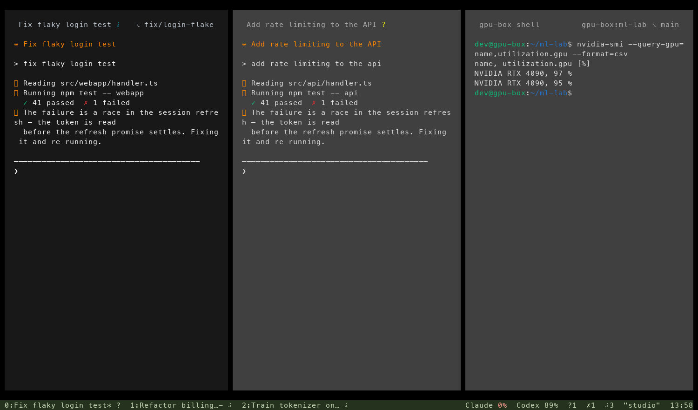
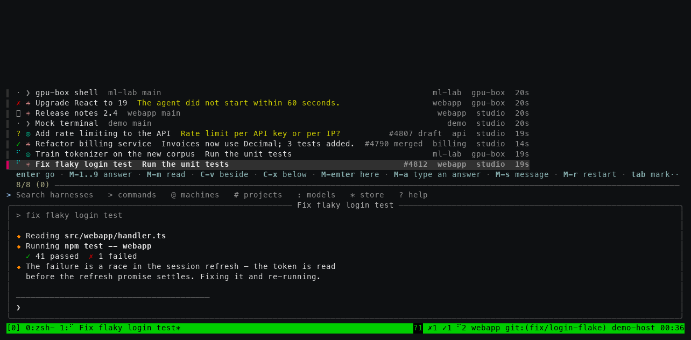

# hn — tmux improved

All of Harness in a terminal — every harness on every machine, in swarms and panes, from any
terminal you can type into: a laptop, a server over SSH, a tablet's SSH app.

```bash
curl -fsSL https://harness.autonomous.ai/cli/install.sh | bash    # installs harness and hn
hn                                                                 # or: harness tui
```

The installed CLI keeps hn up to date automatically: it checks at daemon startup and on the
same schedule as CLI updates, including when only hn has a new release. Reopen hn to use the
new version; running clients and panes keep working. `harness update` also checks hn when
the CLI is already current. `ADAPTER_UPDATE_DISABLE=true` disables automatic updates for both;
local CLI builds and `HARNESS_TUI_BIN` overrides stay untouched. The first hn launch downloads
it if missing; `harness tui --install` explicitly reinstalls the latest published build.

If `hn --version` stays old after an update, run `harness update` to check the launcher too.
Old manual or development installs can bypass automatic updates. `harness tui --install` or
`harness update --force` backs up a recognized old Harness launcher and switches it to managed
updates after verifying the download. Unrelated commands and explicit `HARNESS_TUI_BIN` overrides
are preserved; the update output explains any PATH conflict. A missing binary behind a managed
launcher is restored automatically.

hn follows tmux 3.5a's keys, commands, formats and `~/.tmux.conf`, with your harnesses on
every machine behind them. What tmux users have asked for over the years, and what hn does
about it: [docs/tmux-improved.md](docs/tmux-improved.md).





<sub>Rendered from demo-fleet terminal captures (`tests/mock-daemon.mjs`, `MOCK_DEMO=1`),
with animations off and a demo hostname.</sub>

It connects to the **same daemon the desktop app uses**: agents run on their own machines,
and each agent pane streams its terminal. Swarms connected to a daemon share the account's **desk**
with the desktop and phone. With no daemon available, hn opens local shells instead; a private
PTY supervisor keeps them running through detach, reconnect and a client crash. These local
sessions stay on this computer and remain intact when Harness reconnects.

On a fresh computer `hn` starts your local daemon and opens without requiring an account.
Sign in with `harness login` when you want your other machines and shared desk. If daemon startup
fails, hn still opens a local shell. Each OS user connects through their own private Unix socket;
hn never attaches to another user's daemon merely because it occupies the default TCP port.
Like `tmux new -A`, it restores your swarms if the desk has any,
else window 0 is a shell on this computer, in the folder you ran `hn` in. `C-b s` finds every
harness. Closing the last window ends `hn` (`[exited]`, as tmux says it); `C-b d` detaches.

**Sessions** are tmux's: `hn new -A -s main` (in a shell's rc, or a terminal profile) starts or
attaches, `hn attach -t work` goes back to one, and a plain `hn` returns to where you were.
From inside, `new -d -s api -c ~/src/api`, `switch-client -t api`, `C-b (` `C-b )` `C-b L`,
`C-b $`, `kill-session`, and any command's `-t work:2` reach every session (`C-b w` shows them all
as tmux's tree does; `C-b s` lists them after the harnesses, so typing a session's name finds it), so
tmux-sessionizer and tmuxinator-style scripts work. The first session is the desk's (named for
this computer unless you name it); the others are this computer's, kept between clients.

**More than one terminal** works as with one tmux server. Each `hn` is a client. `hn attach -t
main` from a second terminal (or over SSH) shows `main` in both, as tmux does: a split, a new
window or a window chosen in either shows in both, and either can type into its panes (typing
into a watcher takes control across that TUI's tabs). `attach -r` only watches; `attach -d` takes the session and
detaches the others. Commands from a shell reach every session, whichever terminal has it. `hn
ls`, `list-clients` and `detach-client -a` see them all, and nothing is lost when they detach in
any order: the last one showing a session keeps it. What tmux's server
holds is every terminal's: `set -g`, `bind`, `setenv -g` and `source-file` in one reach the
others, a copy in one pastes in another, and ids (`$1 @3 %7`) name the same thing everywhere.

**With no terminal open**, scripts still work. The first command that needs a server starts hn
without a terminal: tmux's server, holding the sessions until you attach. For example,
`hn new -d -s proj; hn new-window -t proj:1; hn send-keys -t proj:1 'npm run dev' Enter`, or
tmuxinator's own script. It exits when it has no sessions left. tmux's `-2 -u -l -v -N -D -T`
flags are accepted (hn already works that way) and `-c` runs a command in your shell.

## Keys

tmux's. The prefix is `C-b`; `C-b s` then Enter adds a harness to the current window, `C-t` opens
it in a new window, and `C-v` or `C-x` puts it beside or below. An already-open harness is focused.
A window is a swarm and a pane shows a harness. If you have a `~/.tmux.conf`, it is read: your prefix and
binds (copy-mode-vi's and vim-tmux-navigator's too), `source-file`, `if-shell`, `base-index`,
`renumber-windows`, `mouse`, `mode-keys`, `status-left`/`status-right` and the window formats
(`#[…]` styles, `#{?…}`, `%H:%M`), `pane-border-format`, `synchronize-panes` and your colours come
with you. It is read as tmux reads it (tmux's own parser, ported): quotes and escapes, `$VAR` and
`~`, `VAR=value` and `%hidden`, `%if`/`%elif`/`%else`, `{ }` blocks, `source-file` globs — the
whole file checked first, so a bad line is `file:line: why` and none of that file runs, as in
tmux. `run-shell` lines run too: a plugin's `tmux …` reaches hn (the `tmux` on its PATH is hn),
never a tmux server you have running.

Splits, `resize-pane`, the seven layouts, `swap-pane`, `rotate-window`, `join-pane`, `break-pane`
and `select-pane` are tmux 3.5a's own arithmetic (layout.c, window.c): the same split sizes, the same
pane numbers and the same active pane after each. hn draws these layouts as pane surfaces
with one-cell gaps and inset terminal content. Panes have no drawn borders: background
contrast identifies focus. The margins and gaps keep the terminal's native background. The focused
pane uses a subtly contrasting fill (`#181818` on a black terminal), while inactive dark panes use
`rgb(64, 64, 64)` with softer text. A lone or zoomed pane keeps the same focused surface. Light
terminals keep a light counterpart.
Explicit pane-border styles still customize the title; border line choices apply in classic and
tmux appearances.
Explicit program colors and user styles stay intact. The muted green status bar has a continuous
background, with tabs ordered `number:name* status` (previous window: `number:name- status`).
Subscription allowances read `Claude 0%  Codex 89%` **remaining**, with amber at 20% or less
and red at 0% only on the percentage. Padding
shrinks automatically in small panes. The space between panes remains a resize handle; mouse
coordinates, copy selection and PTY dimensions follow the inset content. `window_layout` keeps
the original split structure. Use `set -g @hn-animations off` to keep
working and loading indicators still. Some defaults differ, and your `.tmux.conf`
overrides each: `pane-border-status top` (each pane's title row: its harness's name and state, and
its project and branch where the pane has room; long names shorten in the middle to keep
the state and distinguishing suffix visible), `allow-set-title off` (a pane's title is its
harness's name, not what the program sets), `history-limit 10000` (agents print a lot; tmux keeps
2000), `mouse on`, `set-titles on` (the terminal's title: `?2 Fix flaky login test — Harness`, the
harnesses waiting on you and the one in front; `set-titles-string` changes it), and the status line:
each window's most urgent harness state follows its name and tmux marker; idle dots are hidden
in tabs and pane headers. Connection, quota,
fleet counts, the quoted local machine name and clock sit on the right. The git branch stays in its pane
header, aligned to the right with its PR and written `⎇ branch` without redundant punctuation.
Status-bar groups are separated by two spaces, with one space at each outer edge to align
with the pane surfaces. Window tabs start at the left, without a machine/session label.
Local and remote machines use their names from the app everywhere, such as `"office"`.
Local shell panes keep that same name across daemon disconnects and reconnects. Unnamed account
machines use `machine-<id8>`, as on desktop and phone; before this computer is known, it is
`This computer`. The status bar names the machine running hn, independent of the focused pane
or session name.
Custom status formats and the prefix cue remain supported.
Take Control (`C-b : take-control`, or `take`) reclaims all available local and remote panes
across the TUI's tabs, including hidden ones, without changing focus. Typing into a watched pane
does the same; the input goes only to that pane. Reconnects keep watching until a person asks
for control again, and read-only clients keep their read-only behavior.
One key differs on purpose: ⇧⏎
reaches the pane as `CSI 13;2u` (a new line in an agent's prompt; tmux, without `extended-keys`,
sends a plain Enter).

| tmux keys | |
|---|---|
| `C-b s` | every harness on every machine — an fzf list with a live preview |
| `C-b c` | new window, on the home page: your recent harnesses and the Claude Code and Codex conversations Harness did not start (last 30 days, every machine) — `1…9` opens one there (or `↑`/`↓` then `enter`; a conversation resumed as a harness). Anything you type starts a shell there with your keys in it, as after tmux's `C-b c`: `C-b c` then `claude⏎` runs `claude`. `new-window` from a script, or with options (`-c`, a command…), makes the shell at once, as tmux does; `set -g @hn-new-window shell` (or `@hn-look tmux`) makes the key tmux's too |
| `C-b %` `C-b "` (and `C-b \|` for `%`) | split right / below — a shell, at once, in this pane's machine and folder (`C-b -` is tmux's delete-buffer) |
| `C-b o` `C-b ;` `C-b ←↑→↓` `C-b q` | next pane, last pane, pane in a direction, pane numbers |
| `C-b z` `C-b space` `C-b M-1…7` `C-b { }` `C-b C-o` | zoom, next layout, a layout, swap, rotate |
| `C-b C-←↑→↓` `C-b M-←↑→↓` | resize (repeatable, like tmux's `-r`) |
| `C-b n` `C-b p` `C-b l` `C-b 0…9` `C-b w` `C-b ,` `C-b &` | windows |
| `C-b x` | close the pane (the harness keeps running) |
| `C-b [` `C-b ]` | copy mode (tmux's, vi or emacs keys as `mode-keys` says), paste |
| `C-b <` `C-b >` | the window and pane menus |
| `C-b /` | what a key does |
| `C-b :` | the command prompt — tmux commands, `Tab` completes |
| `C-b ?` | every key and what it does (`list-keys -N`) — or just pause after `C-b` and they show |
| `C-b d` | detach — everything keeps running |

Harness's own, only on keys tmux leaves unbound (every tmux key does what tmux does):

| | |
|---|---|
| `C-b a` / `C-b A` | the next harness that needs you (`next-harness`) / all those waiting on you (`M-1…9` answers from the list; `M-a` types an answer — an option's number, several for a multi-choice question, `1,3`, or your own words) |
| `C-b N` `C-b T` | New Harness popup / new terminal. The popup keeps Agent, Project and Options together, with searchable choices. Options match desktop: Model, Approvals, applicable Profile, Branch and Worktree. |
| `C-b I` `C-b @` `C-b S` | models, machines, the Harness Store |
| `C-b g` `C-b B` | send a task (Harness picks the harness) / broadcast to the window |
| `C-b R` `C-b P` `C-b K` | restart, pause, clone the harness |

`C-b N` opens the compact desktop-style New Harness form with Agent, Project, collapsed
Options and New Harness. The initial destination is the connected local Harness machine, with successful agent
and project choices remembered. Explicit project commands keep their destination. Enter starts
with the displayed choices; Up/Down moves between fields and previews their chooser. Enter,
Right or typing enters the chooser. Tab switches between the form and chooser; Enter accepts
an item and returns to New Harness. A second Enter starts it in the current window, splitting
beside the focused pane when needed. Lowercase `C-b n` remains next window.

Agent combines coding agents and installed Store harnesses; a Store harness then offers its
compatible coding agents. Project offers Clone Repository, Open Folder, New Folder and recent
machine/folder pairs. Folder actions choose a machine first. Ctrl-L in the folder browser edits
a path. Options contains Model, agent-specific Approvals, Codex Profile, Branch and Worktree.
Git projects default to a new worktree from main, as on desktop; missing main requires a branch
choice. Models and profiles are checked on the selected machine before starting.

Choosers sit beside the form, or occupy its column in narrow terminals. Escape returns through
nested choosers and preserves a dismissed draft. Confirmed failures keep the draft and reuse
any prepared project folder on retry. A lost reply offers Check status for the original launch;
repeated Enter cannot start another harness while its outcome is unknown. Input in the form
never reaches a working pane. No reverse-video selection is used.


In the harness and command lists, fzf's keys: `C-j/C-k` `C-n/C-p` move, `Tab` marks, `C-/` toggles the preview,
`S-↑/↓` scrolls it, `M-/` wraps long rows (`--wrap`), `C-a C-e C-w C-u` edit the query. In the harness
list, `enter` adds a pane in the current window, `C-t` opens in a new window, `C-v` beside, `C-x`
below; an already-open harness is focused. In the command list, `enter` runs the command. `esc`
leaves. fzf's search syntax works
(`'exact ^prefix suffix$ !not a | b`), and its colours follow `FZF_DEFAULT_OPTS` (`--color=light`,
`16`, `bw`). One key differs on purpose: fzf 0.67 binds `ctrl-/` to toggle-wrap as well as `alt-/`,
but hn keeps `C-/` for the preview, as fzf's own README binds `ctrl-/` in its preview examples and
most people's fingers already know it. Its layout options apply too (`--layout`, `--border` and
`--border-label`, `--margin`, `--padding`, `--info`, `--gap`, `--no-unicode`, `--preview-window`);
`--height` docks a list at the bottom of the window, that many rows tall with the panes still in
view above it, where fzf would draw it under a prompt at the bottom of a terminal. The preview is
hn's own text about the row, so two of its defaults are hn's: its label is the row's name (unless
`--preview-label` gives one), and it wraps its text at spaces (unless `--preview-window` says
`wrap`, fzf's way with `↳`, or `nowrap`). `C-b s` lays its preview out as
`right,50%,<90(down,40%)`, your `--preview-window` after it, and the narrow one below 180 columns
takes your look too — so `hidden` hides it at every width.

Colours are the terminal's 16, as tmux's are, so hn reads on dark, light and Solarized themes.

## At a glance

An agent already shows its own state in its pane: that it's working and for how long, each step, its
sub-agents. hn repeats none of that. It shows what no single pane can: which of all your harnesses
needs you, what each is doing or did, where, and for how long.

Every harness's state is one symbol, the same in its pane's title row, the window list and `C-b s`
(a plain shell has none). A window shows its most urgent pane's, and a window with a harness
waiting on you is reversed, as tmux shows a bell. A turn that ends while you are typing in another
pane counts as done and unread (`✓`) until you go to that pane.

| | |
|---|---|
| `⠹` (turning) | working |
| `?` | needs you: a question or a permission |
| `✓` | done, and you haven't looked yet |
| `·` | idle in lists; hidden in pane headers and tabs |
| `✗` | failed |
| `◌` `‖` `○` | starting, paused, offline |

- **The status line** counts the whole fleet: `?2 ✗1 ✓5 ⠹41` means two need you, one failed,
  five are done and unread, and 41 are working. Idle ones aren't counted, and a state with none
  drops out. The right side keeps the quoted local machine name and the clock, with two
  spaces between groups. Branch and pull request context stay in the pane header.
- **`C-b s`** lists every harness, the most urgent nearest the prompt: needs you, failed, done and
  unread, working, then the rest. Each row has one line: the question, what it is doing now
  (`Run the unit tests`, from its tool calls), what its last turn came to (the daemon's recap, else
  the first line of its final message), or why it failed (`The agent did not start within 60
  seconds.`). Each row also has its pull request (`#4812`, `#4807 draft`, `#4790 merged`), its
  project when there are several, and how long it has been that way. Enter adds it as a pane in
  the current window, or focuses it if already open (`C-t` in a new window, `C-v` / `C-x` beside or
  below, `M-Enter` in place of this pane). Typing
  filters as fzf does, by name, project, branch, machine, pull request (`'4812`) or state
  (`'waiting`, `'failed`, `'done`, `'working`, `'idle`). From the list, without opening it: `M-m`
  marks it read (`M-M` every row shown), `M-s` sends it a message, `M-r` restarts it, `M-1…9` /
  `M-a` answer it; Enter adds marked rows as panes, while `C-t` opens a window each. The list stays
  ranked while it is open. The preview adds its final message whole, what it was last asked, its plan (its to-do list,
  `✓` done, `▸` doing), the sub-agents it has running, and what it has used (`1.2M tokens · +340
  −52 · 1 PR`).
- **A session per project**: in `C-b s` then `#` (the projects, each with its counts), `C-t` makes
  a session named for the project with each of its harnesses in a window of its own (or goes to
  it and adds the ones it lacks).
- **Back after a while** (the terminal's focus gone three minutes or more), hn says what changed:
  `While you were away (12m): ✓5 finished · ?2 need you · ✗1 failed — C-b a goes through them`.
- **`C-b g`** sends a task to the harness it fits: at once when the router is sure (as the desktop
  does, 85% or more), else it lists the likely ones.
- **`C-b a`** (`next-harness`, `-p` the other way) goes to the next harness that needs you, in that
  order, each once. It shows each in the same window, so a run through the queue doesn't pile up
  windows. Going there reads it, and the counts go down.

All of this is in options, which `show -g`, `show -gw` and `C-b C` print as they are:
`status-left`, `status-right`, the window formats and each pane's title row
(`pane-border-format`). Set them in your `~/.tmux.conf` as you would for tmux; what you set
replaces hn's. The default is `set -g @hn-look panes`. `set -g @hn-look classic` restores hn's
previous line borders. `set -g @hn-look tmux` uses tmux's appearance and
content dimensions: no padding or title rows, and tmux's status line and window list. Changing
the look takes effect immediately and preserves pane identities and the split structure.

For your own formats: `#{fleet}` (the status line's counts, ready to drop into your theme) and
`#{fleet_needs}` `#{fleet_failed}` `#{fleet_done}` `#{fleet_working}` `#{fleet_idle}`, `#{spinner}`,
`#{pane_agent_icon}` and `#{pane_agent_state}` (needs, working, done, idle, starting, failed,
paused, offline), `#{pane_agent_mark}` (the icon in its colour, as the title row draws it),
`#{pane_heading}` (the name, state and watcher label fitted to the pane header; `#{pane_title}`
stays complete), `#{window_agent_icon}` and `#{window_agent_state}` (its most urgent pane's), `#{pane_project}`,
`#{pane_branch}`, `#{pane_where}` (`machine:project ⎇ branch #123` as far as it fits beside the title;
local and remote machine prefixes yield to project, branch and PR context in narrow panes),
`#{pane_pr}` `#{pane_pr_state}` `#{pane_pr_url}` (the pull request for its branch), `#{pane_tokens}`
and `#{fleet_tokens}` (what it, and all of them, have used: `1.2M`), `#{pane_lines}` (`+340 −52`),
`#{pane_asked}` and `#{pane_did}` (what it was last asked, and what its last turn came to),
`#{pane_todos}` (its plan's progress, `3/7`) and `#{pane_subagents}` (how many it has running),
`#{usage}` (the agent accounts' rate limits on the focused pane's machine: `claude 5h 42% week
18% · codex 5h 3%`) and `#{usage_high}` (the one nearest its limit, from 80% used).

The status line uses `#{usage_remaining_mark}`: `Claude 0%  Codex 89%`, showing **remaining**
allowance for every subscription with quota data, even when healthy. Each figure is the lowest
remaining percentage across that account's reported windows. Amber starts at 20% left, red at
0%; a nonzero allowance below 1% reads `<1%`. Shared account keys appear once across machines,
with the local reading preferred; different or unknown accounts stay separate. When a provider
has multiple accounts, extra remote accounts say `Claude@studio 20%` to distinguish them.
`#{usage_remaining}` provides the same figures without color. The daemon currently reads Claude
and Codex; Grok and other providers are not listed until a quota source is available. Existing
`usage`, `usage_high` and `usage_high_mark` formats retain their used-quota meaning for custom
configurations. Other formats:
`#{local_machine}` (this computer's name in the app),
`#{pane_machine}` (the focused pane's machine), `#{pane_far}` (another machine's), `#{pane_watched}` and `#{pane_watcher}`
(another window has the pane to type in, and who), and `#{waiting}` (the harnesses waiting on
you).

## Graphical viewers

For a Blender, CAD, video or other domain harness, run `view` from `C-b :` or choose
`open-viewer` in the command list. The harness preview shows when its viewer is ready.

```sh
hn view                          # current hn pane
hn view -t 'My Blender scene'     # by harness name or id, without opening a terminal pane
hn view -p -t 'My Blender scene'  # print its URL, without launching a browser
hn view -c                       # copy its browser-app link through the terminal clipboard
hn view -w                       # open in the authenticated browser app even on this machine
```

On a local desktop, the current machine's viewer opens directly in your default browser.
Over SSH, `hn` prints a link you open on your own computer; it never launches a browser on the
SSH host. A harness on another linked machine uses the same browser-app link. Sign in as its
owner and link the machine if this browser has not done so before. The URL contains machine
and harness identifiers, not credentials, and does not grant access or create a public share.

The browser companion opens only that viewer. It does not restore your desk, attach a terminal,
or take the keyboard from `hn`. Closing either view leaves the harness running. Browser-based
remote viewers use Harness's existing encrypted interactive-viewer transport, which requires
Chrome or Chromium on the harness machine for rendering. Local direct viewers do not need that
renderer. A missing renderer is reported in the viewer with a retry action.

`-p` also works for scripts and terminals without clipboard support. Browser launch failure
prints the link instead. No tmux key bindings are changed.

## From a shell

As `tmux` is: any tmux command, run in the client you have open, its output printed here.

```bash
hn display -p '#{pane_current_path}'
hn send-keys -t 1 'make test' Enter
hn capture-pane -p -t 0 | tail
hn list-panes -F '#{pane_index} #{pane_title}'
hn list-harnesses            # every harness on every machine and its state (hn ls is list-sessions, as in tmux)
hn lsh -f '#{==:#{harness_state},needs}' -F '#{harness_name}: #{harness_question}'   # who is waiting, and on what
hn send-message -t api 'run the tests'   # a message to a harness, as a turn (hn send is send-keys, as in tmux)
hn answer -t 'Add rate' 2    # answer its question: the second choice (1,3 several; or your own words)
hn open-harness -h -s billing   # a harness beside this pane (-v below; without either, a window of its own)
```

Harnesses have hooks as windows do: `harness-needs` runs when one asks, `harness-done` when one
ends a turn, `harness-failed` on an error — with `#{hook_harness_name}` `#{hook_harness_line}`
`#{hook_harness_question}` `#{hook_harness_machine}`. In a `~/.tmux.conf` tmux reads too, keep them
inside `%if` (tmux doesn't know these hooks, and skips the block), and quote what a shell is given
with `q:` (names hold spaces and brackets):

```tmux
%if "#{hn_version}"
set-hook -g harness-needs 'run-shell "notify #{q:hook_harness_name}"'
%endif
```

## Copy mode

tmux's own (window-copy.c, ported): `C-b [` takes a copy of the pane's screen and history, and
every key is looked up in the `copy-mode-vi` table (`mode-keys vi`) or `copy-mode` (emacs) and runs
tmux's command for it — so `v` `Space` `Enter`, `C-Space` `C-e` `M-w`, `/` `?` `n` `N`, `C-s`
`C-r` (incremental), `f` `t` `;` `,`, `5k`, `%`, `{` `}`, `X` `M-x`, the search marks and their
count, and your own `bind -T copy-mode-vi …` all do what they do in tmux. `r` takes the copy again
(output that arrived meanwhile is `#{pane_unseen_changes}`); `q` leaves.

What a command prints — `C-b ?`, `C-b ~`, `:show -g`, `:list-windows`, `run-shell` — opens in the
pane's view mode, as in tmux: the same keys move and search it, `q` closes it. The same list of
keys to search as you type, fzf-style, is `C-b :keys` (or `hn keys` from a shell).

## Mouse and clipboard

tmux's mouse: a click selects a pane or a window, a drag on a border (or a title row) resizes, a
drag in a pane selects and copies, a double-click copies a word and a triple-click a line, the
wheel scrolls back in copy mode, and the right button opens tmux's pane, window and session
menus. Each is a key binding you can change, as in tmux (`bind -n WheelUpPane …`, `bind -T
copy-mode-vi MouseDragEnd1Pane …`); a program that asks for the mouse gets it. Hold `⇧` to select
with your terminal instead. Copying uses OSC 52, so it lands on the clipboard of the computer you
are sitting at, over SSH too.

## Two windows, one harness

A terminal has one keyboard. Opening a harness another window is driving shows it read-only
("watching"); taking control here reclaims this TUI's panes across all tabs, and the other
window starts watching. The first key typed into a watcher also takes control, preserving that
key for its intended pane.

## The dial

The Harness device, plugged into this computer: the daemon holds it, and hn is the window it
talks to while the desktop app is not running. (With the app open, the app keeps the dial; hn
still follows it while hn's terminal is the one in front.)

- **Turn it** to a harness: its pane is selected, in its window. A zoomed window stays zoomed, so
  the dial flips through panes full size.
- **A finger on the glass** scrolls the active pane the way tmux's wheel does: a shell's history in
  copy mode (left again at the bottom), a full-screen program its wheel or arrow keys, an open
  list its rows. A flick keeps going and slows down.
- **Tap a notification**: that harness comes forward, or opens in a new window.
- **Pick a window** on the dial: it is selected here.
- **Speak** on a harness and the words go to it. Speak with none chosen and hn routes them as
  `send-task` does: sent at once when the router is sure, otherwise the list asks (Enter sends,
  Esc cancels).

The dial turns through the panes of the window you are on, in pane order, and its window list is
hn's windows.

## Speed

Each pane's header shows its measured keystroke → echo latency. On this machine that is about a
millisecond. On another machine it is the network: when a pane measures slow (≥20ms), typed
characters are echoed locally — underlined until the far side confirms them, the way mosh does.
`HARNESS_TUI_PREDICT=off` turns that off, `=always` forces it on.

## Your keys

`~/.tmux.conf` first (`HARNESS_TUI_TMUX_CONF=off` ignores it, `=path` reads another file); then
`~/.config/harness/tui.toml` for anything specific to Harness:

```toml
prefix = "C-a"
desk = "sync"              # sync | read | off
predict = "auto"           # auto | always | off
notify = true              # OS notifications through the terminal

[keys]                     # the root table: no prefix
"M-h" = "select-pane -L"
"M-x" = "none"
```

`hn --keys` lists every binding, tmux-style, and reports problems in either file.

## Environment

| Variable | |
|---|---|
| `HARNESS_TUI_DESK=read` | show the desk's tabs, never change them |
| `HARNESS_TUI_DESK=off` | keep tabs to this window |
| `HARNESS_TUI_PREDICT` | `off` / `always` (see Speed) |
| `HARNESS_TUI_BIN` | the binary `harness tui` runs |
| `PORT` | the configured daemon port naming this user's private socket (default 18473) |
| `ADAPTER_DATA_DIR` | daemon state directory (default `~/.harness/cli/data`); hn and the CLI must use the same one |
| `HN_DESKTOP=on` / `off` | whether the desktop app is running, instead of looking (see The dial) |

## Building

```bash
cd tui && cargo build --release        # target/release/harness-tui
cargo test
```

`harness tui` finds a dev build in `tui/target/` on its own. hn contains code translated from tmux and
fzf and links the crates in `Cargo.lock`; their notices are in `THIRD_PARTY_NOTICES.md`, which the binary
carries (`hn --licenses`). After changing dependencies, run `python3 scripts/notices.py` (`cargo test`
fails until you do). Releases are built by
`.github/workflows/release-tui.yml` — static binaries for macOS (arm64, x64) and Linux (x64,
arm64, musl) with a checksummed manifest that `harness tui --install` verifies.

## Layout of the code

| File | |
|---|---|
| `daemon.rs` | the private Unix-socket WebSocket per machine, requests, pushed frames |
| `proto.rs` | `HTRL` terminal frames (mirrors `cli/src/lib/terminalBinary.ts`) |
| `pane.rs` | one tile: `alacritty_terminal` grid, key/mouse encoding, selection, find, local echo |
| `app.rs` | all state: machines, streams, tabs, desk sync |
| `fleet.rs` | machines and harnesses, kept live from the daemon's frames |
| `input.rs` | keys, mouse, the launcher's modes and actions |
| `dial.rs` | the Harness device: the ring and windows it turns through, its focus, scroll, taps and spoken tasks |
| `modal.rs` / `picker.rs` | the launcher's rows and its fzf matching (fzf.rs, ported from fzf) |
| `ui.rs` | drawing |
| `layout.rs` | the split tree |
| `mouse.rs` | tmux's mouse: events as mouse keys, drags, what a program in a pane is sent |
