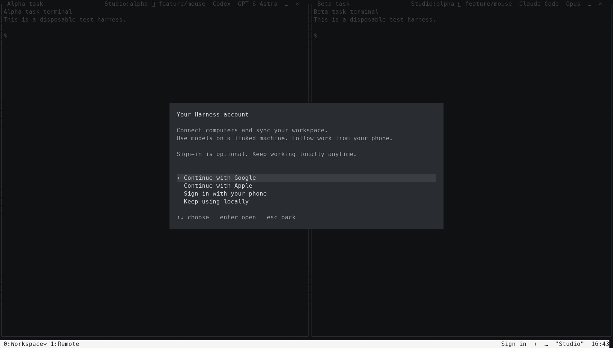
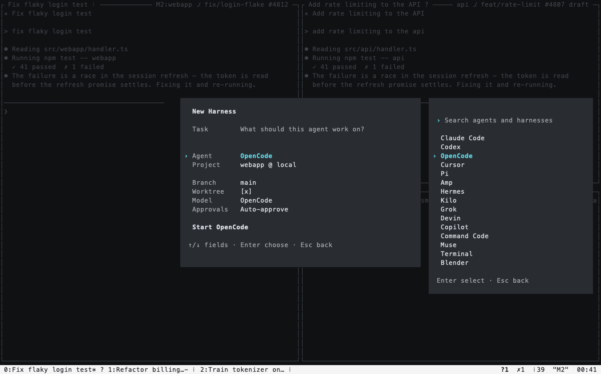

# hn — tmux improved

All of Harness in a terminal — every harness on every machine, in swarms and panes, from any
terminal you can type into: a laptop, a server over SSH, a tablet's SSH app.

```bash
curl -fsSL https://harness.autonomous.ai/cli/install.sh | bash    # installs harness and hn
hn                                                                 # or: harness tui
```

The installed CLI keeps hn up to date automatically: it checks at daemon startup and on the
same schedule as CLI updates, including when only hn has a new release. Reopen hn to use the
new version; running clients and panes keep working. `harness update` also checks hn when
the CLI is already current. `ADAPTER_UPDATE_DISABLE=true` disables automatic updates for both;
local CLI builds and `HARNESS_TUI_BIN` overrides stay untouched. The first hn launch downloads
it if missing; `harness tui --install` explicitly reinstalls the latest published build.

If `hn --version` stays old after an update, run `harness update` to check the launcher too.
Old manual or development installs can bypass automatic updates. `harness tui --install` or
`harness update --force` backs up a recognized old Harness launcher and switches it to managed
updates after verifying the download. Unrelated commands and explicit `HARNESS_TUI_BIN` overrides
are preserved; the update output explains any PATH conflict. A missing binary behind a managed
launcher is restored automatically.

hn follows tmux 3.5a's keys, commands, formats and `~/.tmux.conf`, with your harnesses on
every machine behind them. What tmux users have asked for over the years, and what hn does
about it: [docs/tmux-improved.md](docs/tmux-improved.md).

The [Harness OS image](../os/README.md) uses the same hn binary with an explicit OS session
mode. Its live USB offers Install and Try; an installed OS offers agents, terminals and Wi-Fi.
These screens and installation shortcuts are absent from ordinary hn on macOS and other Linux
systems. Installing or updating hn alone does not turn a computer into Harness OS.

The shell-first flow opens your usual shell. `Ctrl+B c` makes a local window;
`Ctrl+B Shift+N`, `%`, and `"` make shell panes. A split inherits its source
computer, current directory, and selected model route. A new window uses native
agent defaults and stays local, even when the focused pane is remote. It uses a
local pane's directory, or the directory hn was launched from when leaving a remote pane.
Keyboard New Tab (`Ctrl+B c`) and New Harness (`Ctrl+B Shift+N`, or
`Ctrl+Shift+N` in terminals supporting extended keys) open the new shell's agent
picker at its first prompt. Escape leaves a normal shell. Explicit terminal
actions, scripted/detached windows, and native `%`/`"` splits remain plain shells.

In these zsh/Bash shells, `ch` chooses a computer (`ch local`, `ch -`), and `cm`
chooses a model route (`cm default` restores the agent's settings). These pickers
open under the prompt, within the current terminal. Switching
computers keeps each shell and its jobs alive. A route lasts for that pane;
explicit native model/profile/resume options take precedence. Run `codex`, `claude`,
`pi`, or another supported agent normally, and exit back to the shell. Missing
agents use the CLI's shared installer in that terminal, then launch with the original
arguments. An installation error returns to the prompt. Existing aliases/functions
stay intact; `hn run <agent>` explicitly uses the integration in that case, and
`command <agent>` bypasses it. Model routing currently supports Codex and Claude;
other agents ask you to use `cm default` rather than silently ignoring the selection.

At a Zsh or Bash 4+ prompt, **Ctrl+P** opens a blank search with sessions already
listed. **Ctrl+N** opens a blank search with agents already listed; no `&` is
displayed or required. Plain text filters that default list. Both use `@` for
computers, `:` for project folders, and `%` for models. Removing the scope
character returns to the original list. Explicit `&` agent search remains
compatible. Agent and project choices compose the editable command; selecting
a session opens it. Only Enter at the shell prompt launches a composed command.
Choosing a different computer clears the old project folder and opens that
computer's folders. The agent, model, and native arguments stay selected. Escape
or Ctrl+C keeps the new computer without a folder; choosing the same computer
(including its name or `local` alias) keeps the existing folder.

Typing a fresh `@`, `:`, or `%` after an agent opens its suggestions automatically;
type to filter, Enter to insert, or Escape to keep editing. Bracketed paste,
quoted text, native option values, `--` passthrough, and unrelated commands do not
open suggestions. `HN_AUTOCOMPLETE=0` disables automatic opening while keeping
Ctrl+P and Ctrl+N available. Existing custom character bindings are respected.
Deleting an automatically opened scope closes suggestions and returns to the
composed command, preserving choices already made.
The computer and folder may also share one token:

```sh
claude @office:~/code/my-app %sonnet
claude %sonnet :~/code/my-app @office
codex :~/code/my-app %default
```

Each selection edits the line. Adding the agent after choosing a folder returns
the cursor to the end; deliberately editing a field in the middle stays there.
Escape preserves the draft and cursor. Only Enter
at the shell prompt launches. Fields replace earlier choices of the same kind;
their order after the agent does not matter. Folder lists and models come from the
selected computer. Remote paths use `/absolute/path` or `~/path`; local relative
paths are resolved against the current shell directory. Missing/offline/ambiguous
computers, missing folders, and conflicting selectors fail without falling back
to another destination. The directory and model choices apply to this invocation;
they do not change the shell's cwd or its `cm` route. `%default` uses native agent
settings. `%sonnet` becomes a native model argument; grid picks use
`%grid-name::model-id` (quoted automatically when needed). Native model names are
ultimately validated by the agent; a typed name does not prove account access.

In the `:` folder picker, fuzzy-search nested folders by name: from home,
`autonomous-harness` or `atnmhrns` can find `~/code/work/autonomous-harness`.
Candidates arrive as the selected computer's directory tree is scanned; typing
filters them immediately without restarting discovery. **Tab** or **Right**
searches inside the highlighted folder, **Alt+Up** goes to its parent, and
**Enter** inserts the full folder path in the command. `code/` searches below
that directory relative to the shell; `code/ap` fuzzy-matches its descendants.
Recent projects outside the tree also appear in the initial list. Escape restores
the original command without changing directory or starting an agent. Hidden
folders and symlinks follow the existing directory API's exclusion policy.
Dependency/build trees and macOS Library/app bundles are listed but not descended
into until explicitly entered. Discovery is bounded to 10 seconds, 10,000 paths,
and 1 MiB of path text, and refreshed after 30 seconds; narrow to a folder if a
large tree reaches a limit. No `find`, Python, or `fzf` subprocess is required.

Use `--` to pass everything after it literally to the agent, including tokens
beginning with `@`, `:`, or `%`. Ordinary commands, pipelines, native completion,
and user aliases/functions keep their behavior. Quotes around selector words
protect spaces and shell punctuation; they do not disable selectors. Use the
`--` boundary or `command claude` when those words are agent input.

The existing `ch`, `cm`, and `hn sessions` commands stay available. `hn pick`
keeps the context switcher (`@` computers, `%` model routes, with `:` as a legacy
alias). Ctrl+P in a non-agent draft uses the same `@`, `:`, `%` scopes as the
composer; picking a project inserts a quoted path, like file completion.
Stock macOS Bash 3.2 cannot expose its draft through `bind -x`;
it retains that switcher and accepts typed composed commands. The full editable
Ctrl+P composer and Ctrl+N agent picker use Zsh (macOS default) or Bash 4+ (Linux).
On Bash 3.2, Ctrl+N keeps its native history behavior.
When the chosen agent exits, its pane returns to that original shell, keeping
the working directory, model route, draft, and shortcuts. An exit in a background
pane does not move focus; the shell returns when you select that pane again.

On macOS, **Cmd+P** works when the terminal reports that key through the Kitty
keyboard protocol, or when its profile maps Cmd+P to Ctrl+P (hex `0x10`). A
terminal's own menu shortcut otherwise wins; hn cannot override it. No terminal
settings are changed automatically. Ctrl+P also works on macOS. This binding is
active only while the shell edits a command; agents and editors keep their own
Ctrl+P. Up still recalls previous history. Set `HN_PICKER_KEY=''` in your shell rc
to disable the binding, or e.g. `HN_PICKER_KEY='\C-g'` to choose another key. The
Zsh widget is `hn-picker-widget`; the Bash bind-x function is `_hn_picker_widget`.
Ctrl+N also belongs only to the shell prompt; running agents keep their own binding.
Set `HN_NEW_KEY=''` to disable it or another key sequence to rebind it. Its Zsh
widget is `hn-new-widget`, and its Bash function is `_hn_new_widget`.

For shell-line completion, type `ch `, `cm `, or `hn sessions ` and press Tab.
Search and press Enter to put the selection into the editable command; press Enter
again to run it. Escape preserves the draft. Ordinary completion and existing
fzf Ctrl+T, Ctrl+R, and Alt+C bindings stay in place. In Bash, an existing custom
completion for one of these commands takes precedence.

`hn sessions [query]` opens a compact inline finder in an integrated shell: fuzzy search through running
sessions and indexed saved conversations, with transcript search and previews. With no query,
they share one newest-first list by last activity; older conversations remain searchable. It reuses
Ctrl+B s's rows, fuzzy matcher, transcript search, previews, and open/resume actions.
Ctrl+/ toggles its preview; Alt+Up/Down scrolls it. Enter
focuses an existing session or resumes a saved conversation here; Escape leaves
the shell unchanged. Ctrl+B s remains the broader workspace browser. Saved history
and remote shell helpers need the matching CLI build; unsupported shells still work
as ordinary terminals.

The inline finder defaults to 45% height, reverse layout, a rounded border, and
inline counts. It uses supported layout, color, and key-binding options from
`FZF_DEFAULT_OPTS`, with conversation previews on the right and a compact list in
narrow panes. File-preview commands are not run on conversation IDs. Keep a `bat`
file preview in `FZF_CTRL_T_OPTS` rather than the global options so fzf's history
picker does not try to open a command as a filename.
Harness OS also has a file manager, only there: `hn files [folder]` (Super+E) fills a terminal of
its own with a folder as big tiles or a list (`v`), its folder tree to the left, and VS Code's
explorer menu on a right click: new files and folders, cut, copy, paste, duplicate, rename, and
delete to the Trash. A text file opens in its own editor (Ctrl+S saves, Esc closes; `e` uses
`$EDITOR`). `hn files --open [folder]` (Super+O) is an Open dialog in
the Mac's manner: places, folders as columns with a preview, Search, Cancel and Open. A folder
opens in an explorer of its own kept inside it (`hn files --root DIR`), a text file in the
editor alone (`hn files --edit FILE`), each through `$HARNESS_FILES_LAUNCH` when it is set. Inside hn on the OS, `choose-file [-t pane] [folder]` shows it over a pane.
Ordinary hn refuses both.


<sub>Rendered from demo-fleet terminal captures (`tests/mock-daemon.mjs`, `MOCK_DEMO=1`),
with animations off and a demo hostname.</sub>

It connects to the **same daemon the desktop app uses**: agents run on their own machines,
and each agent pane streams its terminal. Swarms connected to a daemon share the account's **desk**
with the desktop and phone. With no daemon available, hn opens local shells instead; a private
PTY supervisor keeps them running through detach, reconnect and a client crash. These local
sessions stay on this computer and remain intact when Harness reconnects.

On a fresh computer `hn` starts your local daemon and opens without requiring an account.
Choose **Sign in** in the status bar, or run `account` from `C-b :`, when you want your other
machines, shared desk and access from your phone. The Account panel explains these benefits and
offers browser sign-in or a phone QR code; you confirm the account before connecting it.
`harness login` remains available from a shell. Signing in keeps local work in place; changing
accounts removes the previous account's views without stopping its harnesses. If daemon startup
fails, hn still opens a local shell. Each OS user connects through their own private Unix socket;
hn never attaches to another user's daemon merely because it occupies the default TCP port.
Like `tmux new -A`, it restores your swarms if the desk has any,
else window 0 opens your shell in the folder you ran `hn` from. `C-b s` finds every
harness. Closing the last window ends `hn` (`[exited]`, as tmux says it); `C-b d` detaches.



<sub>Rendered from the isolated native fixture in `tests/workspace-controls.py`.</sub>

**Sessions** are tmux's: `hn new -A -s main` (in a shell's rc, or a terminal profile) starts or
attaches, `hn attach -t work` goes back to one, and a plain `hn` returns to where you were.
From inside, `new -d -s api -c ~/src/api`, `switch-client -t api`, `C-b (` `C-b )` `C-b L`,
`C-b $`, `kill-session`, and any command's `-t work:2` reach every session (`C-b w` shows them all
as tmux's tree does; `C-b s` lists them after the harnesses, so typing a session's name finds it), so
tmux-sessionizer and tmuxinator-style scripts work. The first session is the desk's (named for
this computer unless you name it); the others are this computer's, kept between clients.

**More than one terminal** works as with one tmux server. Each `hn` is a client. `hn attach -t
main` from a second terminal (or over SSH) shows `main` in both, as tmux does: a split, a new
window or a window chosen in either shows in both, and either can type into its panes (typing
into a watcher takes control across that TUI's tabs). `attach -r` only watches; `attach -d` takes the session and
detaches the others. Commands from a shell reach every session, whichever terminal has it. `hn
ls`, `list-clients` and `detach-client -a` see them all, and nothing is lost when they detach in
any order: the last one showing a session keeps it. What tmux's server
holds is every terminal's: `set -g`, `bind`, `setenv -g` and `source-file` in one reach the
others, a copy in one pastes in another, and ids (`$1 @3 %7`) name the same thing everywhere.

**With no terminal open**, scripts still work. The first command that needs a server starts hn
without a terminal: tmux's server, holding the sessions until you attach. For example,
`hn new -d -s proj; hn new-window -t proj:1; hn send-keys -t proj:1 'npm run dev' Enter`, or
tmuxinator's own script. It exits when it has no sessions left. tmux's `-2 -u -l -v -N -D -T`
flags are accepted (hn already works that way) and `-c` runs a command in your shell.

## Keys

tmux's. The prefix is `C-b`; `C-b s` then Enter adds a harness to the current window, `C-t` opens
it in a new window, and `C-v` or `C-x` puts it beside or below. An already-open harness is focused.
A window is a swarm and a pane shows a harness. If you have a `~/.tmux.conf`, it is read: your prefix and
binds (copy-mode-vi's and vim-tmux-navigator's too), `source-file`, `if-shell`, `base-index`,
`renumber-windows`, `mouse`, `mode-keys`, `status-left`/`status-right` and the window formats
(`#[…]` styles, `#{?…}`, `%H:%M`), `pane-border-format`, `synchronize-panes` and your colours come
with you. It is read as tmux reads it (tmux's own parser, ported): quotes and escapes, `$VAR` and
`~`, `VAR=value` and `%hidden`, `%if`/`%elif`/`%else`, `{ }` blocks, `source-file` globs — the
whole file checked first, so a bad line is `file:line: why` and none of that file runs, as in
tmux. `run-shell` lines run too: a plugin's `tmux …` reaches hn (the `tmux` on its PATH is hn),
never a tmux server you have running.

Shared tabs use the same ordered pane rectangles as desktop, including custom divider
proportions. The layout picker offers desktop's shapes for the current pane count;
`C-b Space` still cycles tmux's seven layouts and shares their exact geometry.
Window resizing scales the saved arrangement without rearranging panes or publishing
an edit. Selected tab, focus and zoom remain local to each client. Standalone tmux
sessions retain tmux's resize behavior.

Splits, `resize-pane`, the seven layouts, `swap-pane`, `rotate-window`, `join-pane`, `break-pane`
and `select-pane` are tmux 3.5a's own arithmetic (layout.c, window.c): the same split sizes, the same
pane numbers and the same active pane after each. The default classic appearance draws thin
pane borders. Choose **Appearance** from the workspace menu, or use `set -g @hn-look panes`,
for pane surfaces with one-cell gaps and inset terminal content. In that appearance, panes have no drawn borders: background
contrast identifies focus. The margins and gaps keep the terminal's native background. The focused
pane uses a subtly contrasting fill (`#181818` on a black terminal), while inactive dark panes use
`rgb(64, 64, 64)` with softer text. A lone or zoomed pane keeps the same focused surface. Light
terminals keep a light counterpart.
Explicit pane-border styles still customize the title; border line choices apply in classic and
tmux appearances.
Explicit program colors and user styles stay intact. The muted green status bar has a continuous
background, with tabs ordered `number:name* status` (previous window: `number:name- status`).
Subscription allowances read `Claude 0%  Codex 89%` **remaining**, with amber at 20% or less
and red at 0% only on the percentage. Padding
shrinks automatically in small panes. The space between panes remains a resize handle; mouse
coordinates, copy selection and PTY dimensions follow the inset content. `window_layout` keeps
the original split structure. Use `set -g @hn-animations off` to keep
working and loading indicators still. Some defaults differ, and your `.tmux.conf`
overrides each: `pane-border-status top` (each pane's title row: its harness's name and state, and
its project and branch where the pane has room; long names shorten in the middle to keep
the state and distinguishing suffix visible), `allow-set-title off` (a pane's title is its
harness's name, not what the program sets), `history-limit 10000` (agents print a lot; tmux keeps
2000), `mouse on`, `set-titles on` (the terminal's title: `?2 Fix flaky login test — Harness`, the
harnesses waiting on you and the one in front; `set-titles-string` changes it), and the status line:
each window's most urgent harness state follows its name and tmux marker; idle dots are hidden
in tabs and pane headers. Connection, quota,
fleet counts, the quoted local machine name and clock sit on the right. The git branch stays in its pane
header, aligned to the right with its PR and written `⎇ branch` without redundant punctuation.
Status-bar groups are separated by two spaces, with one space at each outer edge to align
with the pane surfaces. Window tabs start at the left, without a machine/session label.
Local and remote machines use their names from the app everywhere, such as `"office"`.
Local shell panes keep that same name across daemon disconnects and reconnects. Unnamed account
machines use `machine-<id8>`, as on desktop and phone; before this computer is known, it is
`This computer`. An integrated shell's status shows its current computer and persistent
`cm` model route, or **Agent default** when none is selected. Per-command `%model`
choices stay in the command and do not change that persistent route. Other panes
keep the local-machine label. Custom formats can include `#{shell_context}`.
Custom status formats and the prefix cue remain supported.
Take Control (`C-b : take-control`, or `take`) reclaims all available local and remote panes
across the TUI's tabs, including hidden ones, without changing focus. Typing into a watched pane
does the same; the input goes only to that pane. Reconnects keep watching until a person asks
for control again, and read-only clients keep their read-only behavior.
One key differs on purpose: ⇧⏎
reaches the pane as `CSI 13;2u` (a new line in an agent's prompt; tmux, without `extended-keys`,
sends a plain Enter).

| tmux keys | |
|---|---|
| `C-b s` | every harness on every machine — an fzf list with a live preview |
| `C-b c` | new local shell window, using the local source folder or the folder hn was started in; the model route resets to agent defaults |
| `C-b N` | new shell pane with the agent picker, inheriting its source computer, current folder, and model route |
| `C-b %` `C-b "` (and `C-b \|` for `%`) | split right / below — a shell, at once, in this pane's machine and folder (`C-b -` is tmux's delete-buffer) |
| `C-b o` `C-b ;` `C-b ←↑→↓` `C-b q` | next pane, last pane, pane in a direction, pane numbers |
| `C-b z` `C-b space` `C-b M-1…7` `C-b { }` `C-b C-o` | zoom, next layout, a layout, swap, rotate |
| `C-b C-←↑→↓` `C-b M-←↑→↓` | resize (repeatable, like tmux's `-r`) |
| `C-b n` `C-b p` `C-b l` `C-b 0…9` `C-b w` `C-b ,` | windows |
| `C-b x` / `C-b &` | Stop Harness / Close Tab. Owned harnesses are saved and stopped; idle ones stop directly, while working, unknown or draft sessions ask first with Cancel selected. A failed save keeps the pane. Plain terminals ask before closing; shared or already-stopped harnesses only close their view. |
| `C-b [` `C-b ]` | copy mode (tmux's, vi or emacs keys as `mode-keys` says), paste |
| `C-b <` `C-b >` | the window and pane menus |
| `C-b /` | what a key does |
| `C-b :` | the command prompt — tmux commands, `Tab` completes |
| `C-b ?` | every key and what it does (`list-keys -N`) — or just pause after `C-b` and they show |
| `C-b d` | detach — everything keeps running |

Harness's additional actions use keys tmux leaves unbound. The stock close bindings above use
Harness's save-and-stop behavior; custom bindings and explicit `kill-pane` / `kill-window`
commands keep their existing tmux behavior.
A confirmed Stop removes that harness's other views across tabs and sessions too. Switching
agents from another attached hn client updates both views, with one replacement process.

| | |
|---|---|
| `C-b a` / `C-b A` | the next harness that needs you (`next-harness`) / all those waiting on you (`M-1…9` answers from the list; `M-a` types an answer — an option's number, several for a multi-choice question, `1,3`, or your own words) |
| `C-b N` / `C-b T` | New shell pane with the agent picker / a plain shell, on the focused pane's computer and directory. |
| `C-b I` `C-b @` `C-b S` | models, machines, the Harness Store |
| `C-b g` `C-b B` | send a task (Harness picks the harness) / broadcast to the window |
| `C-b R` `C-b P` `C-b K` | restart, pause, clone the harness |

Clicking the footer `+` or a menu's **New Harness** opens a compact, centered form
with the task ready to type at the top. **New Tab** in the workspace menu opens the
GUI new-window screen, with the composer and recent sessions
below it. The tmux keyboard shortcuts continue opening shells.
Agent and Project follow, then Branch, Worktree, Model, Approvals and applicable Profile.
All settings are visible without expanding Options. Project reads `project @ local`, or
`project @ machine` for a remote destination; focusing it shows the full path below.
The initial destination is the connected local Harness machine, with successful agent
and project choices remembered. Explicit project commands keep their destination. Enter starts
with the displayed choices; the action names the selected agent (for example, Start Codex).
Tab/Shift-Tab moves between fields. Up/Down edits multiline tasks and moves to the previous/next
field at the first/last visual line. On other fields, it moves between fields and previews
their choices on the right. Enter, Right or typing enters a chooser; Enter accepts
an item and focuses Start. Enter in the task editor also focuses Start without launching.
Enter on Start launches. The harness opens in
the window that requested it, splitting beside the focused pane when needed. Switching windows
while it starts leaves your new window focused. Lowercase `C-b n` remains next window.
Escape backs out of a chooser or closes the popup without losing its draft. On New Window,
Escape leaves task editing; another Escape returns to the previous window and keeps the draft.

Agent combines coding agents and installed Store harnesses; a Store harness then offers its
compatible coding agents. Terminal is a separate action: `C-b T` opens a shell directly,
and Open Terminal on New Window is available by mouse. Neither sends task text to the shell.
Project offers Clone Repository, Open Folder, New Folder and recent
machine/folder pairs. Folder actions choose a machine first. Ctrl-L in the folder browser edits
a path. Project search includes the 50 most recently active distinct folders per machine;
duplicate sessions in one folder count once. Combine a machine name and folder, such as
`office harness` or `m2 harness`, in either order. The local machine's actual
name remains searchable when its label says `local`.
Task is edited directly in the form: Enter focuses Start, Alt-Enter inserts a newline, and pasted tasks
retain line breaks. Enhanced terminals can use Shift-Enter too. Arrow keys navigate wrapped
lines; Home/End, Ctrl-A/E, word movement/deletion, Ctrl-U/K and Ctrl-Y work in the editor.
On the welcome screen, `C-b ]` also pastes into the task, preserving its line breaks.
The popup keeps text-editor keys directly, as a tmux prompt does; Escape closes it with the draft kept.
Unicode graphemes stay intact. Escape preserves a dismissed dialog's task. Supported agents
receive it as their first message; an unavailable first task or one exceeding the daemon's
2,000-character limit is explained before launch. A blank task starts an ordinary session.
Git projects default to a new worktree from main, as on desktop; missing main requires a branch
choice. Models and profiles are checked on the selected machine before starting.



<sub>Rendered from the isolated terminal fixture in `tests/new-harness.py`.</sub>

The main form stays centered and fixed as agents, fields and choosers change. Choosers extend
to its right; in narrow terminals they temporarily occupy the form's place. Escape returns through
nested choosers and preserves a dismissed draft. Confirmed failures keep the draft and reuse
any prepared project folder on retry. A lost reply offers Check status for the original launch;
repeated Enter cannot start another harness while its outcome is unknown. Input in the form
never reaches a working pane.

Mouse New Tab keeps a separate composer draft per window. A fresh startup opens
a shell, and `C-b c` opens a local shell with its agent picker. Explicitly selecting
a remote project in the GUI keeps that destination until you choose another
project; starting an agent or terminal never silently falls back to a different machine.
Submitting while the initial project check runs starts once it finishes. Escape, further
editing, or leaving the form cancels that pending start and keeps the draft.
Up to nine recent sessions appear below the composer, with fewer visible in short
terminals; Browse All Sessions opens
the full launcher. Existing Claude Code, Codex and other supported histories are discovered on
connected machines. Loading, empty and unavailable history have distinct states; Ctrl-R retries
discovery. Digits and plain-key bindings belong to the task while you type. Your modified prefix
(for example Ctrl-B) still switches windows and opens commands. With a plain prefix such as a
backtick, Tab to a setting first to use it for navigation. Open Terminal is explicit and
never sends the task to a shell. With the daemon offline, a task can be prepared while the local
terminal remains available. Existing workspaces still restore as usual. Harness OS keeps its
dedicated installation, network and first-launch actions.


In the harness and command lists, fzf's keys: `C-j/C-k` `C-n/C-p` move, `Tab` marks, `C-/` toggles the preview,
`S-↑/↓` scrolls it, `M-/` wraps long rows (`--wrap`), `C-a C-e C-w C-u` edit the query. In the harness
list, `enter` adds a pane in the current window, `C-t` opens in a new window, `C-v` beside, `C-x`
below; an already-open harness is focused. In the command list, `enter` runs the command. `esc`
leaves. fzf's search syntax works
(`'exact ^prefix suffix$ !not a | b`), and its colours follow `FZF_DEFAULT_OPTS` (`--color=light`,
`16`, `bw`). One key differs on purpose: fzf 0.67 binds `ctrl-/` to toggle-wrap as well as `alt-/`,
but hn keeps `C-/` for the preview, as fzf's own README binds `ctrl-/` in its preview examples and
most people's fingers already know it. Its layout options apply too (`--layout`, `--border` and
`--border-label`, `--margin`, `--padding`, `--info`, `--gap`, `--no-unicode`, `--preview-window`);
`--height` docks a list at the bottom of the window, that many rows tall with the panes still in
view above it, where fzf would draw it under a prompt at the bottom of a terminal. The preview is
hn's own text about the row, so two of its defaults are hn's: its label is the row's name (unless
`--preview-label` gives one), and it wraps its text at spaces (unless `--preview-window` says
`wrap`, fzf's way with `↳`, or `nowrap`). `C-b s` lays its preview out as
`right,50%,<90(down,40%)`, your `--preview-window` after it, and the narrow one below 180 columns
takes your look too — so `hidden` hides it at every width.

Colours are the terminal's 16, as tmux's are, so hn reads on dark, light and Solarized themes.

## At a glance

An agent already shows its own state in its pane: that it's working and for how long, each step, its
sub-agents. hn repeats none of that. It shows what no single pane can: which of all your harnesses
needs you, what each is doing or did, where, and for how long.

Every harness's state is one symbol, the same in its pane's title row, the window list and `C-b s`
(a plain shell has none). A window shows its most urgent pane's, and a window with a harness
waiting on you is reversed, as tmux shows a bell. A turn that ends while you are typing in another
pane counts as done and unread (`✓`) until you go to that pane.

| | |
|---|---|
| `⠹` (turning) | working |
| `?` | needs you: a question or a permission |
| `✓` | done, and you haven't looked yet |
| `·` | idle in lists; hidden in pane headers and tabs |
| `✗` | failed |
| `◌` `‖` `○` | starting, paused, offline |

- **The status line** counts the whole fleet: `?2 ✗1 ✓5 ⠹41` means two need you, one failed,
  five are done and unread, and 41 are working. Idle ones aren't counted, and a state with none
  drops out. The right side keeps the quoted local machine name and the clock, with two
  spaces between groups. Branch and pull request context stay in the pane header.
- **`C-b s`** lists every harness, the most urgent nearest the prompt: needs you, failed, done and
  unread, working, then the rest. Each row has one line: the question, what it is doing now
  (`Run the unit tests`, from its tool calls), what its last turn came to (the daemon's recap, else
  the first line of its final message), or why it failed (`The agent did not start within 60
  seconds.`). Each row also has its pull request (`#4812`, `#4807 draft`, `#4790 merged`), its
  project when there are several, and how long it has been that way. Enter adds it as a pane in
  the current window, or focuses it if already open (`C-t` in a new window, `C-v` / `C-x` beside or
  below, `M-Enter` in place of this pane). Typing
  filters as fzf does, by name, project, branch, machine, pull request (`'4812`) or state
  (`'waiting`, `'failed`, `'done`, `'working`, `'idle`). From the list, without opening it: `M-m`
  marks it read (`M-M` every row shown), `M-s` sends it a message, `M-r` restarts it, `M-1…9` /
  `M-a` answer it; Enter adds marked rows as panes, while `C-t` opens a window each. The list stays
  ranked while it is open. The preview adds its final message whole, what it was last asked, its plan (its to-do list,
  `✓` done, `▸` doing), the sub-agents it has running, and what it has used (`1.2M tokens · +340
  −52 · 1 PR`).
- **A session per project**: in `C-b s` then `#` (the projects, each with its counts), `C-t` makes
  a session named for the project with each of its harnesses in a window of its own (or goes to
  it and adds the ones it lacks).
- **Back after a while** (the terminal's focus gone three minutes or more), hn says what changed:
  `While you were away (12m): ✓5 finished · ?2 need you · ✗1 failed — C-b a goes through them`.
- **`C-b g`** sends a task to the harness it fits: at once when the router is sure (as the desktop
  does, 85% or more), else it lists the likely ones.
- **`C-b a`** (`next-harness`, `-p` the other way) goes to the next harness that needs you, in that
  order, each once. It shows each in the same window, so a run through the queue doesn't pile up
  windows. Going there reads it, and the counts go down.

All of this is in options, which `show -g`, `show -gw` and `C-b C` print as they are:
`status-left`, `status-right`, the window formats and each pane's title row
(`pane-border-format`). Set them in your `~/.tmux.conf` as you would for tmux; what you set
replaces hn's. The default is `set -g @hn-look panes`. `set -g @hn-look classic` restores hn's
previous line borders. `set -g @hn-look tmux` uses tmux's appearance and
content dimensions: no padding or title rows, and tmux's status line and window list. Changing
the look takes effect immediately and preserves pane identities and the split structure.

For your own formats: `#{fleet}` (the status line's counts, ready to drop into your theme) and
`#{fleet_needs}` `#{fleet_failed}` `#{fleet_done}` `#{fleet_working}` `#{fleet_idle}`, `#{spinner}`,
`#{pane_agent_icon}` and `#{pane_agent_state}` (needs, working, done, idle, starting, failed,
paused, offline), `#{pane_agent_mark}` (the icon in its colour, as the title row draws it),
`#{pane_heading}` (the name, state and watcher label fitted to the pane header; `#{pane_title}`
stays complete), `#{window_agent_icon}` and `#{window_agent_state}` (its most urgent pane's), `#{pane_project}`,
`#{pane_branch}`, `#{pane_where}` (`machine:project ⎇ branch #123` as far as it fits beside the title;
local and remote machine prefixes yield to project, branch and PR context in narrow panes),
`#{pane_pr}` `#{pane_pr_state}` `#{pane_pr_url}` (the pull request for its branch), `#{pane_tokens}`
and `#{fleet_tokens}` (what it, and all of them, have used: `1.2M`), `#{pane_lines}` (`+340 −52`),
`#{pane_asked}` and `#{pane_did}` (what it was last asked, and what its last turn came to),
`#{pane_todos}` (its plan's progress, `3/7`) and `#{pane_subagents}` (how many it has running),
`#{usage}` (the agent accounts' rate limits on the focused pane's machine: `claude 5h 42% week
18% · codex 5h 3%`) and `#{usage_high}` (the one nearest its limit, from 80% used).

The status line uses `#{usage_remaining_mark}`: `Claude 0%  Codex 89%`, showing **remaining**
allowance for every subscription with quota data, even when healthy. Each figure is the lowest
remaining percentage across that account's reported windows. Amber starts at 20% left, red at
0%; a nonzero allowance below 1% reads `<1%`. Shared account keys appear once across machines,
with the local reading preferred; different or unknown accounts stay separate. When a provider
has multiple accounts, extra remote accounts say `Claude@studio 20%` to distinguish them.
`#{usage_remaining}` provides the same figures without color. The daemon currently reads Claude
and Codex; Grok and other providers are not listed until a quota source is available. Existing
`usage`, `usage_high` and `usage_high_mark` formats retain their used-quota meaning for custom
configurations. Other formats:
`#{local_machine}` (this computer's name in the app),
`#{pane_machine}` (the focused pane's machine), `#{pane_far}` (another machine's), `#{pane_watched}` and `#{pane_watcher}`
(another window has the pane to type in, and who), and `#{waiting}` (the harnesses waiting on
you).

## Graphical viewers

For a Blender, CAD, video or other domain harness, run `view` from `C-b :` or choose
`open-viewer` in the command list. The harness preview shows when its viewer is ready.

```sh
hn view                          # current hn pane
hn view -t 'My Blender scene'     # by harness name or id, without opening a terminal pane
hn view -p -t 'My Blender scene'  # print its URL, without launching a browser
hn view -c                       # copy its browser-app link through the terminal clipboard
hn view -w                       # open in the authenticated browser app even on this machine
```

On a local desktop, the current machine's viewer opens directly in your default browser.
Over SSH, `hn` prints a link you open on your own computer; it never launches a browser on the
SSH host. A harness on another linked machine uses the same browser-app link. Sign in as its
owner and link the machine if this browser has not done so before. The URL contains machine
and harness identifiers, not credentials, and does not grant access or create a public share.

The browser companion opens only that viewer. It does not restore your desk, attach a terminal,
or take the keyboard from `hn`. Closing either view leaves the harness running. Browser-based
remote viewers use Harness's existing encrypted interactive-viewer transport, which requires
Chrome or Chromium on the harness machine for rendering. Local direct viewers do not need that
renderer. A missing renderer is reported in the viewer with a retry action.

`-p` also works for scripts and terminals without clipboard support. Browser launch failure
prints the link instead. No tmux key bindings are changed.

## From a shell

As `tmux` is: any tmux command, run in the client you have open, its output printed here.

```bash
hn display -p '#{pane_current_path}'
hn send-keys -t 1 'make test' Enter
hn capture-pane -p -t 0 | tail
hn list-panes -F '#{pane_index} #{pane_title}'
hn list-harnesses            # every harness on every machine and its state (hn ls is list-sessions, as in tmux)
hn lsh -f '#{==:#{harness_state},needs}' -F '#{harness_name}: #{harness_question}'   # who is waiting, and on what
hn send-message -t api 'run the tests'   # a message to a harness, as a turn (hn send is send-keys, as in tmux)
hn answer -t 'Add rate' 2    # answer its question: the second choice (1,3 several; or your own words)
hn open-harness -h -s billing   # a harness beside this pane (-v below; without either, a window of its own)
```

Harnesses have hooks as windows do: `harness-needs` runs when one asks, `harness-done` when one
ends a turn, `harness-failed` on an error — with `#{hook_harness_name}` `#{hook_harness_line}`
`#{hook_harness_question}` `#{hook_harness_machine}`. In a `~/.tmux.conf` tmux reads too, keep them
inside `%if` (tmux doesn't know these hooks, and skips the block), and quote what a shell is given
with `q:` (names hold spaces and brackets):

```tmux
%if "#{hn_version}"
set-hook -g harness-needs 'run-shell "notify #{q:hook_harness_name}"'
%endif
```

## Copy mode

tmux's own (window-copy.c, ported): `C-b [` takes a copy of the pane's screen and history, and
every key is looked up in the `copy-mode-vi` table (`mode-keys vi`) or `copy-mode` (emacs) and runs
tmux's command for it — so `v` `Space` `Enter`, `C-Space` `C-e` `M-w`, `/` `?` `n` `N`, `C-s`
`C-r` (incremental), `f` `t` `;` `,`, `5k`, `%`, `{` `}`, `X` `M-x`, the search marks and their
count, and your own `bind -T copy-mode-vi …` all do what they do in tmux. `r` takes the copy again
(output that arrived meanwhile is `#{pane_unseen_changes}`); `q` leaves.

What a command prints — `C-b ?`, `C-b ~`, `:show -g`, `:list-windows`, `run-shell` — opens in the
pane's view mode, as in tmux: the same keys move and search it, `q` closes it. The same list of
keys to search as you type, fzf-style, is `C-b :keys` (or `hn keys` from a shell).

## Mouse and clipboard

The keyboard remains the primary path, and the same actions are reachable by mouse. Pane
headers show the agent and model as plain text controls, followed by `…` and `×` when there
is room. The menu keeps these actions available in narrow panes. Changing agents saves a
handoff and replaces the agent in the same pane; changing models targets the pane you chose,
even if focus moves while the picker is open. `×` uses the same safe Stop behavior as `C-b x`.
Right-click a pane header or window tab for its actions.

The status bar adds just `+` and `…`, plus **Sign in** when needed. `+` opens the GUI
New Harness composer. `…` opens New Harness, New Tab, the harness/machine/model counts and their lists,
Devices, Account, Appearance and Commands. Physical Harness devices are separate from machine
connections. Devices shows each owned host's connected devices and reported brightness, sound,
scrolling direction and voice language; settings are confirmed by the device before being shown
as saved. These settings use the existing firmware and CLI interfaces.

These controls follow `mouse on`, respect custom mouse bindings and leave custom status and
pane-title formats intact. Add `#{hn_controls}` to a custom status format to opt its footer into
the controls. `mouse off`, or the tmux appearance, keeps the keyboard-only presentation.
Commands such as `workspace-menu`, `change-agent`, `models`, `hardware-devices` and `account`
are also available from `C-b :`.

The terminal body keeps tmux's mouse: a click selects a pane or a window, a drag on a border (or a title row) resizes, a
drag in a pane selects and copies, a double-click copies a word and a triple-click a line, the
wheel scrolls back in copy mode, and the right button opens tmux's pane menu. Each is a key
binding you can change, as in tmux (`bind -n WheelUpPane …`, `bind -T
copy-mode-vi MouseDragEnd1Pane …`); a program that asks for the mouse gets it. Hold `⇧` to select
with your terminal instead. Copying uses OSC 52, so it lands on the clipboard of the computer you
are sitting at, over SSH too.

## Two windows, one harness

A terminal has one keyboard. Opening a harness another window is driving shows it read-only
("watching"); taking control here reclaims this TUI's panes across all tabs, and the other
window starts watching. The first key typed into a watcher also takes control, preserving that
key for its intended pane.

## The dial

The Harness device, plugged into this computer: the daemon holds it, and hn is the window it
talks to while the desktop app is not running. (With the app open, the app keeps the dial; hn
still follows it while hn's terminal is the one in front.)

- **Turn it** to a harness: its pane is selected, in its window. A zoomed window stays zoomed, so
  the dial flips through panes full size.
- **A finger on the glass** scrolls the active pane the way tmux's wheel does: a shell's history in
  copy mode (left again at the bottom), a full-screen program its wheel or arrow keys, an open
  list its rows. A flick keeps going and slows down.
- **Tap a notification**: that harness comes forward, or opens in a new window.
- **Pick a window** on the dial: it is selected here.
- **Speak** on a harness and the words go to it. Speak with none chosen and hn routes them as
  `send-task` does: sent at once when the router is sure, otherwise the list asks (Enter sends,
  Esc cancels).

The dial turns through the panes of the window you are on, in pane order, and its window list is
hn's windows.

## Speed

Each pane's header shows its measured keystroke → echo latency. On this machine that is about a
millisecond. On another machine it is the network: when a pane measures slow (≥20ms), typed
characters are echoed locally — underlined until the far side confirms them, the way mosh does.
`HARNESS_TUI_PREDICT=off` turns that off, `=always` forces it on.

## Your keys

`~/.tmux.conf` first (`HARNESS_TUI_TMUX_CONF=off` ignores it, `=path` reads another file); then
`~/.config/harness/tui.toml` for anything specific to Harness:

```toml
prefix = "C-a"
desk = "sync"              # sync | read | off
predict = "auto"           # auto | always | off
notify = true              # OS notifications through the terminal

[keys]                     # the root table: no prefix
"M-h" = "select-pane -L"
"M-x" = "none"
```

`hn --keys` lists every binding, tmux-style, and reports problems in either file.

## Environment

| Variable | |
|---|---|
| `HARNESS_TUI_DESK=read` | show the desk's tabs, never change them |
| `HARNESS_TUI_DESK=off` | keep tabs to this window |
| `HARNESS_TUI_PREDICT` | `off` / `always` (see Speed) |
| `HARNESS_TUI_BIN` | the binary `harness tui` runs |
| `PORT` | the configured daemon port naming this user's private socket (default 18473) |
| `ADAPTER_DATA_DIR` | daemon state directory (default `~/.harness/cli/data`); hn and the CLI must use the same one |
| `HN_DESKTOP=on` / `off` | whether the desktop app is running, instead of looking (see The dial) |

## Building

```bash
cd tui && cargo build --release        # target/release/harness-tui
cargo test
```

`harness tui` finds a dev build in `tui/target/` on its own. hn contains code translated from tmux and
fzf and links the crates in `Cargo.lock`; their notices are in `THIRD_PARTY_NOTICES.md`, which the binary
carries (`hn --licenses`). After changing dependencies, run `python3 scripts/notices.py` (`cargo test`
fails until you do). Releases are built by
`.github/workflows/release-tui.yml` — static binaries for macOS (arm64, x64) and Linux (x64,
arm64, musl) with a checksummed manifest that `harness tui --install` verifies.

## Layout of the code

| File | |
|---|---|
| `daemon.rs` | the private Unix-socket WebSocket per machine, requests, pushed frames |
| `proto.rs` | `HTRL` terminal frames (mirrors `cli/src/lib/terminalBinary.ts`) |
| `pane.rs` | one tile: `alacritty_terminal` grid, key/mouse encoding, selection, find, local echo |
| `app.rs` | all state: machines, streams, tabs, desk sync |
| `fleet.rs` | machines and harnesses, kept live from the daemon's frames |
| `input.rs` | keys, mouse, the launcher's modes and actions |
| `workspace_controls.rs` / `workspace_menu.rs` | pane and footer controls, stable action targets and compact menus |
| `session_close.rs` / `agent_switch.rs` / `workspace_events.rs` | save-and-stop lifecycle, agent handoff and view updates between local clients |
| `account.rs` / `account_scope.rs` | optional sign-in and account-aware workspace restoration |
| `hardware.rs` / `workspace_resources.rs` | physical device settings and workspace counts |
| `dial.rs` | the Harness device: the ring and windows it turns through, its focus, scroll, taps and spoken tasks |
| `modal.rs` / `picker.rs` | the launcher's rows and its fzf matching (fzf.rs, ported from fzf) |
| `ui.rs` | drawing |
| `layout.rs` | the split tree |
| `mouse.rs` | tmux's mouse: events as mouse keys, drags, what a program in a pane is sent |
